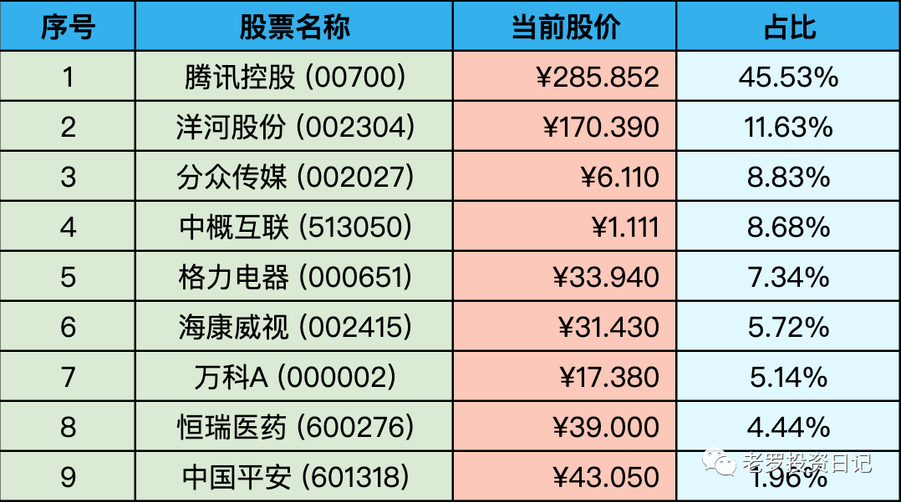
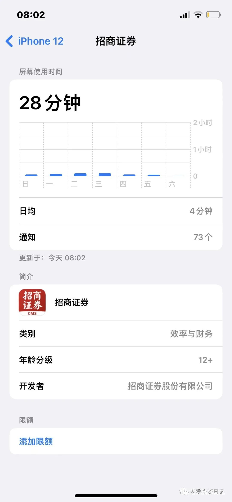

__微信公众号文章地址：[老罗实盘周记-20220724](https://mp.weixin.qq.com/s/V3GwVW2DcXnaYZov-XVYFw)__

```
老罗实盘周记，每周六更新。专注于股权投资、阅读、学习与个人成长，知行合一、日拱一卒、投资人生。微信公众号【老罗投资】，文章均首发于公众号。
```

### 1. 本周概述

本周操作：<span class="red">无</span>

本年度收益：<span class="green">-10.91%</span>

上周数据：<span class="green">-12.16%</span>

本周怒回血一个点！

### 2. 持仓股票明细



其他还有少量陕西煤业、永新股份、宋城演义，作为观察仓不记录。

### 3. 其他说明

今年大环境不好，目前还是亏损状态，不过当时股票的买入价格还算满意，继续躺平躺平(其实是没子弹了)。

假如有资金到位，海康威视(002415)和格力电器(000651)还会再补点，腾讯控股(00700)虽然很便宜，但仓位太高，不会再补了。

目前腾讯的价格真的很有吸引力了，确定性也较高。本周滴滴被罚80亿人民币，对互联网平台来说也算锤子落地，利空出尽了。后续互联网行业走势如何，拭目以待了。

本周又加深了两点认识：

+ 对于企业估值其实是有固定公式，在这个固定公式中只一个不明确的变量，那就是企业未来现金流折现，也就是对企业未来利润的预估。
+ 投资不需要择时，只需要选好的公司加上较厚的安全垫。

本周股市微涨，太忙也没时间看盘，当初选择做价值投资就是为了能躺着把钱给赚了。本周平均看盘时间为4分钟，如果不是为了打新股都不想打开APP。在合适的时间和价格买入好公司，然后该玩玩，该吃吃，这才是想要的生活。

具体看盘时间统计：



```
老罗实盘周记，每周六更新。专注于股权投资、阅读、学习与个人成长，知行合一、日拱一卒、投资人生。微信公众号【老罗投资】，文章均首发于公众号。
免责声明：本公众号只作为本人的投资日志记录，本文中提及的个股都有腰斩或血本无归的风险，本人不做任何投资建议，投资请坚持独立思考。
```

__微信公众号文章地址：[老罗实盘周记-20220724](https://mp.weixin.qq.com/s/V3GwVW2DcXnaYZov-XVYFw)__