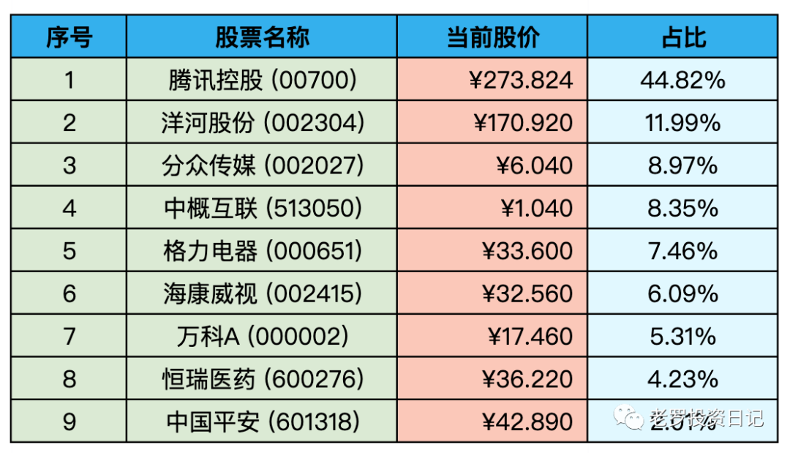

__微信公众号文章地址：[老罗实盘周记-20220730](https://mp.weixin.qq.com/s/T5XU2GCpG2WZwVkmdXf9MQ)__

```
老罗实盘周记，每周六更新。专注于股权投资、阅读、学习与个人成长，知行合一、日拱一卒、投资人生。微信公众号【老罗投资】，文章均首发于公众号。
```

### 1. 本周概述

本周操作：

+ 无

本年度收益：<span class="green">-15.98%</span>

上周数据：<span class="green">-10.91%</span>

本周回撤5个点。

### 2. 持仓股票明细



其他还有少量陕西煤业、永新股份、宋城演义，作为观察仓不记录。

### 3. 其他说明

本周回撤较多，主要是受短期情绪影响，这种情况属于不可抗力，只能默默接受。

目前腾讯控股(00700)，格力电器(000651)，海康威视(002415)属于特别便宜，分众传媒(002027)属于不贵的情况。

如果有子弹会考虑买入格力电器(000651)>海康威视(002415)>分众传媒(002027)，腾讯控股(00700)目前仓位过高，不会再考虑加仓。

**本周的一点心得，记录下：**

+ 提升自己，远离让自己不开心的人和事。
+ 和自己和解，原谅自己的焦虑。拒绝精神内耗。
+ 苦难不值得追求，磨炼意志是因为苦难无法躲开。
+ 人最大的遗憾，就是在不停遗憾过去的遗憾。
+ 通胀下表现最好的是能源，最差的是医疗。
+ 尽你所能，阅读一切。

```
老罗实盘周记，每周六更新。专注于股权投资、阅读、学习与个人成长，知行合一、日拱一卒、投资人生。微信公众号【老罗投资】，文章均首发于公众号。
免责声明：本公众号只作为本人的投资日志记录，本文中提及的个股都有腰斩或血本无归的风险，本人不做任何投资建议，投资请坚持独立思考。
```

__微信公众号文章地址：[老罗实盘周记-20220730](https://mp.weixin.qq.com/s/T5XU2GCpG2WZwVkmdXf9MQ)__