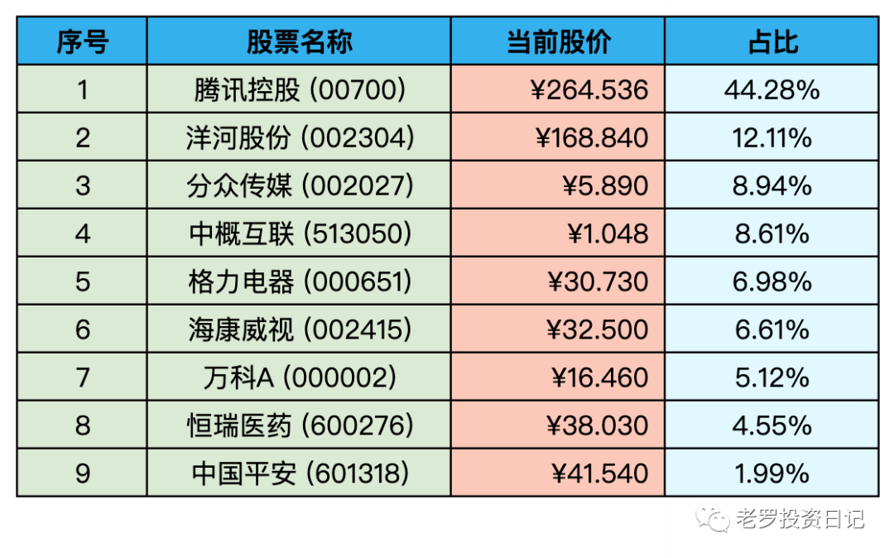

__微信公众号文章地址：[老罗实盘周记-20220806](https://mp.weixin.qq.com/s/542LDayu10LlqjBhmFPtvg)__

```
老罗实盘周记，每周六更新。专注于股权投资、阅读、学习与个人成长，知行合一、日拱一卒、投资人生。微信公众号【老罗投资】，文章均首发于公众号。
```

### 1. 本周概述

本周操作：

+ 买入少量观察仓京沪高铁(601816)，买入价格4.5元。
+ 周五格力的分红买入少量海康威视(002415)，买入价格31.25元。

本年度收益：<span class="green">-15.22%</span>

上周数据：<span class="green">-15.98%</span>

本周稍微回血一点点，今年依旧是血亏老国王。

### 2. 持仓股票明细



其他还有少量陕西煤业(601225)、永新股份(002014)、宋城演义(300144)、京沪高铁(601816)，作为观察仓不记录。

### 3. 持股说明

目前腾讯控股(00700)，格力电器(000651)，海康威视(002415)属于特别便宜，分众传媒(002027)属于不贵可入的情况。

本周热点事件对市场的影响基本结束，再次验证股市短期是投票器，长期来看是称重器。

不管外部有多坏的消息，总的来说对市场的影响也是有限的，所以投资并不需要关注消息、宏观等，这些是我们能力范围之外的事情(无法掌控)，我们只需要做好对公司的研究，陪伴好的公司共同成长(可掌控)。

### 4. 本周心得

① 选择复利职业，坚持下去，日拱一卒

有些职业天生带复利属性，比如：医生、老师、律师、人力资源等职业，随着年龄与经验的增长，收入会保证一个平稳的线性增长。

所以在选择职业时，一定要优先考虑复利职业，并且保持每天学习精进，肯定会有比较稳定的长期收益。

某些35岁就要被优化的职业尽量规避，不要因为短期热点而盲目跟进。

② 找到自己热爱的事业，跳着踢踏舞去上班

巴菲特做到了，选择自己喜欢的职业，真是一种莫大的幸运。

③ 做对的事，选好公司

巴菲特反复强调买股票其实就是买公司，在选择公司时，一定要关注公司长远的未来，才能保证较高概率的胜出。

投资其实是买入经济状况优秀，由诚信、有能力的人管理的公司，然后用有较厚安全垫的价格买入。

④ 公司基本面研究

公司基本面的研究属于很辛苦，见效也比较慢的事，但会让人越来越踏实本份。在平时的研究中，不断地观察与思考，日复一日地积累，必然会形成自己独有的投资体系。

这种经验才是最宝贵的个人财富，别人拿不去，也抢不走。

```
老罗实盘周记，每周六更新。专注于股权投资、阅读、学习与个人成长，知行合一、日拱一卒、投资人生。微信公众号【老罗投资】，文章均首发于公众号。
免责声明：本公众号只作为本人的投资日志记录，本文中提及的个股都有腰斩或血本无归的风险，本人不做任何投资建议，投资请坚持独立思考。
```

__微信公众号文章地址：[老罗实盘周记-20220806](https://mp.weixin.qq.com/s/542LDayu10LlqjBhmFPtvg)__