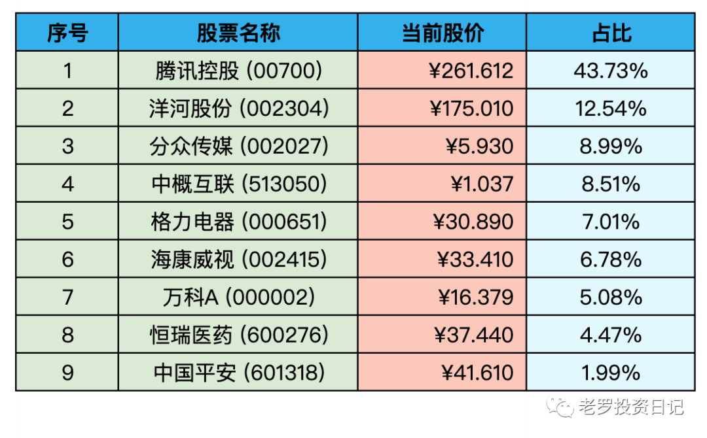

__微信公众号文章地址：[老罗实盘周记-20220813](https://mp.weixin.qq.com/s/vqqQttNgK9FQLdmbhjqedw)__

```
老罗实盘周记，每周六更新。专注于股权投资、阅读、学习与个人成长，知行合一、日拱一卒、投资人生。微信公众号【老罗投资】，文章均首发于公众号。
```

### 1. 本周概述

本周操作：

+ 本周买入少量分众传媒(002027)，买入价格5.7元。

本年度收益：<span class="green">-15.13%</span>

上周数据：<span class="green">-15.22%</span>

本周回血基本可以忽略不计。

### 2. 持仓股票明细



其他还有少量陕西煤业(601225)、永新股份(002014)、宋城演义(300144)、京沪高铁(601816)，作为观察仓不记录。

### 3. 持股说明

目前腾讯控股(00700)属于特别便宜，格力电器(000651)属于便宜，海康威视(002415)，分众传媒(002027)属于不贵可入的情况。

本周三公布了美国七月份的CPI数据，7月CPI同比增长8.5%，前值9.1%，预期为8.7%。因为美国通胀回落，美股在周三起表现不错，普遍认为本轮通胀已经在6月份触顶。

其实每次美国加息，对投资人都算是比较好的买入时机，通胀迟早会结束，但好公司的价值不会因为货币政策受到实质性的影响，加息周期反而可能拿到市场先生的错误报价。

上周六剥壳虾公布了中报，是近20年来最差业绩，亏损超过437.55亿美元（人民币近3000亿），剥壳虾在Q2股价下跌超过22%，也是近10年单Q的最大跌幅。

P.S. 巴神上半年回撤20%以上，今年居然跑赢巴神5%，飘了飘了。

### 4. 本周心得

① 现金就像氧气，当它存在的时候，从来不想它，但当缺了它的时候，却是心里唯一想要的东西。

近期买入机会很多，可惜没有现金了，所以说稳定的现金流(主动+被动)非常重要，当买入机会来临时，才能不断下注。

② 对股权思维投资者来说，股权是目的，现金是手段。对现金思维投资者来说，现金是目的，股权是手段。

正慢慢向股权思维转变，当股权优于现金时，尽可能地将现金换成股权，
All cash is equal，投资就是一个不断比较的过程。

③ 宁愿以合理价格买入优秀公司，也不要以便宜价格买入平庸公司。

时间是优秀公司的朋友 ，平庸公司的敌人，对于优秀的公司，在估值上也可以适当放宽安全边际。

比如1500的茅台，虽然不算安全，但确实值得买入。

④ 宁愿要模糊的正确，也不要精确的错误。

投资不是会计不需要那么精确，当一家好公司值得买入时，应该是五分钟就能分辨出来。(就像一眼能看出一个人是胖是瘦，现在小企鹅就是一个大胖子)

⑤ 永远不要自怜，永远不要妒忌。

自怜的人会觉得错的永远是别的人，永远在找借口。

在七宗罪中，妒忌是唯一不会让你从中感到快乐的。

这是最坏的两种情绪，不产生任何价值，所以要时时反省自查。

⑥ 金钱的作用是有限的，它能买来物质性的东西，但买不来幸福、友情、见识。我们如果把投资本身作为一种目的，把投资看作终身热爱的一种事业和兴趣，看作洞察世界的一个窗口，看作普世智慧的一个分支，把财富当作这个过程的副产品，结果将大不相同。

投资是一件有趣的事，研究企业的运转，研究整个世界的商业规律，从中得到乐趣可能比得到财富更有成就感，财富只是这一过程中的副产品。

功利性太强，缺乏热爱，事情肯定做不好。

```
老罗实盘周记，每周六更新。专注于股权投资、阅读、学习与个人成长，知行合一、日拱一卒、投资人生。微信公众号【老罗投资】，文章均首发于公众号。
免责声明：本公众号只作为本人的投资日志记录，本文中提及的个股都有腰斩或血本无归的风险，本人不做任何投资建议，投资请坚持独立思考。
```

__微信公众号文章地址：[老罗实盘周记-20220813](https://mp.weixin.qq.com/s/vqqQttNgK9FQLdmbhjqedw)__