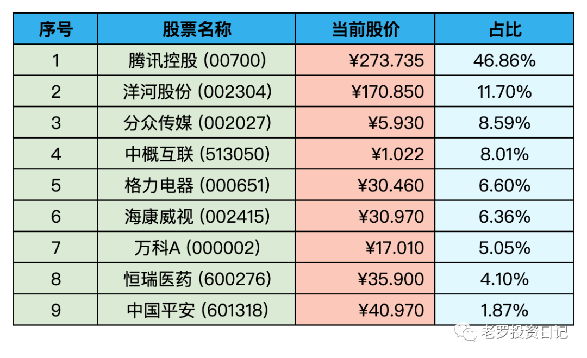

__微信公众号文章地址：[老罗实盘周记-20220820](https://mp.weixin.qq.com/s/24beTmdfiL6a83oojwdtEw)__

```
老罗实盘周记，每周六更新。专注于股权投资、阅读、学习与个人成长，知行合一、日拱一卒、投资人生。微信公众号【老罗投资】，文章均首发于公众号。
```

### 1. 本周概述

本周操作：

+ 买入腾讯控股(002027)，买入价格295港币(255人民币左右)。
+ 买入少量海康威视(002415)，买入价格31.3元。

本年度收益：<span class="green">-12.06%</span>

上周数据：<span class="green">-14.06%</span>

本周稍稍回血1个点。

### 2. 持仓股票明细



其他还有少量陕西煤业(601225)、永新股份(002014)、宋城演义(300144)、京沪高铁(601816)，作为观察仓不记录。

### 3. 持股说明

目前腾讯控股(00700)，格力电器(000651)属于特别便宜，海康威视(002415)属于便宜，分众传媒(002027)属于不贵可入的情况。

说好的腾讯仓位过高，不再加仓的，但290多的价格实在太诱人，没忍住进行了买入，啪啪打脸了。

腾讯本周发布中报，净利润下降严重，网络一片腾讯药丸的呼声。

微博上更有好事者，根据腾讯不再给外包提供免费早晚餐，打包盒收费，类比当年的房利美不提供营业部的免费咖啡，两年后凉凉的案例。

房利美的问题根源是次贷问题，杠杆过高加上垃圾贷违约，房利美收回大量房产却在市面上卖不出相应价格，最终被迫破产。

企鹅目前债务规模可控，在45%左右，手上也持有大量现金(接近2800亿)，虽然净利润腰斩，现金流还是有所增长。总的来说，企鹅还是一眼可见的大胖子，现在买入安全垫足够的厚。

本周还传言腾讯要出售持有的美团全部股票(占股17%)，后来腾讯进行了否认。投资美团已经有六倍的收益，已经算很不错的成绩。是否出售美团股票，个人认为对我们这种非控股股东来说，毫无影响。

8月19日腾讯回购了111万股股票，耗资3.5亿港币，中报之前的腾三亿变成今天的腾三五，说明管理层也认为股价过低。希望企鹅继续保持，后面再出现腾四亿，腾五亿。

### 4. 本周心得

① 无论处于人生的哪个阶段，努力的目标都是不断提高自己的独立性，而不是升职加薪。拥有独立性，为自己独特的产出成果负责（而不是像打工一样为投入的时间负责），这才是最理想的状态。

**老罗：**升职加薪都是资本家给打工人设置的诱饵，投入产出比严重失衡。职场打工人更应该提高的是自己随时离开的能力，而不是为了月底的薪水，不断出卖自己的时间。

② 要想获得财富，你就必须知道做什么、和谁一起做、什么时候做。与埋头苦干相比，更重要的是理解和思考。当然，努力非常重要，不能吝啬自己的努力，但必须选择正确的方式。

**老罗：**正确的方向比努力更重要。内卷，焦虑源于方向的不确定，只有像无头苍蝇一样不断的试错，并且最终的结果可能并不好。多理解世界运转的规律，做一个独立思考的人。

③ 普通人把时间浪费在短期思考上，浪费在毫无价值的繁重工作上。而巴菲特会用一年斟酌判断，然后用一天采取行动。他一天的行动可以影响未来几十年。

**老罗：**多思考，并果断地行动。

④ 如果你想要更好的结果，那就别再设定目标，转而全力关注你的体系。不求拔高你的目标，但求落实你的体系。

**老罗：**不用设定太过具体的目标，比如五年内我要赚1000万之类的。要打造投资体系，如何对企业进行估值，如何控制风险，不断地学习，不断进步。财富只是你投资体系的副产品。

⑤ 幸福是已得到满足的欲望与酝酿中的欲望之间的空当。同样，痛苦则是渴望改变现状与改变得以实现那一刻之间的空当。

**老罗：**降低欲望，会获得更多的幸福感。

⑥ 最大化你的成功概率的秘诀是选择合适的领域，这适用于体育和商业，同样也适用于习惯的转变。如果习惯与你的天性和能力相一致，它更容易培养，你也更乐意保持。就像游泳池里的迈克尔·菲尔普斯或者跑道上的希查姆·艾尔·奎罗伊一样，你想玩一个自己胜算更大的游戏。

**老罗：**找到自己所擅长的领域，并且不要挑战过高的难度。我们只找一英尺的跨栏，并且轻松地跨过它。

```
老罗实盘周记，每周六更新。专注于股权投资、阅读、学习与个人成长，知行合一、日拱一卒、投资人生。微信公众号【老罗投资】，文章均首发于公众号。
免责声明：本公众号只作为本人的投资日志记录，本文中提及的个股都有腰斩或血本无归的风险，本人不做任何投资建议，投资请坚持独立思考。
```

__微信公众号文章地址：[老罗实盘周记-20220820](https://mp.weixin.qq.com/s/24beTmdfiL6a83oojwdtEw)__