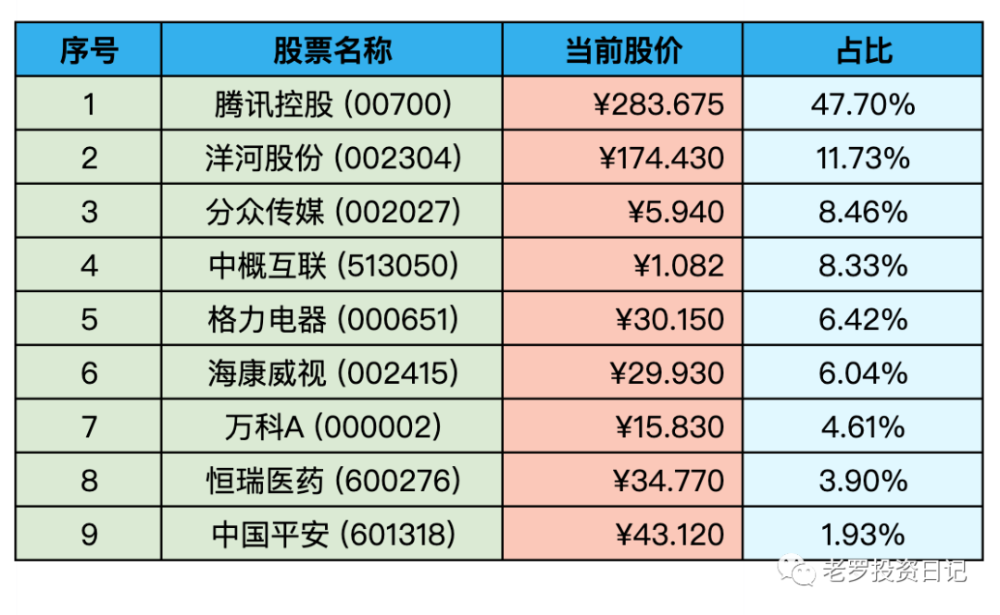
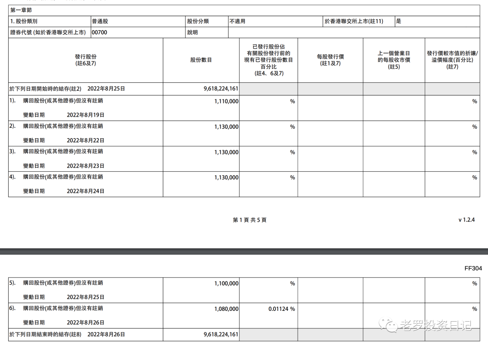

__微信公众号文章地址：[老罗实盘周记-20220827](https://mp.weixin.qq.com/s/ec81Qui0lgwtuSOjG0vVXQ)__

```
老罗实盘周记，每周六更新。专注于股权投资、阅读、学习与个人成长，知行合一、日拱一卒、投资人生。微信公众号【老罗投资】，文章均首发于公众号。
```

### 1. 本周概述

本周操作：

+ 无

年度收益：<span class="green">-12.06%</span>

上周数据：<span class="green">-14.06%</span>

本周回血2个点。

### 2. 持仓股票明细



其他还有少量陕西煤业(601225)、永新股份(002014)、宋城演义(300144)、京沪高铁(601816)，作为观察仓不记录。

### 3. 持股说明

目前腾讯控股(00700)，格力电器(000651)，海康威视(002415)属于特别便宜，分众传媒(002027)属于不贵可入的情况。

#### 3.1 周一LPR下调15个基点

近期经济大环境不好，各个公司都开始降本(cai)增效(yuan)，很多人对未来失去了信心，纷纷开始存钱，提前还房贷。

目前五年期以上房贷4.3%的利率，把准备还贷的钱买宽指数(长期年化10%)或债券基金(长期年化5-6%)，也是能有较大的概率跑赢。

长期来看贷款利率必然下行，真的没有必要扎堆提前还贷。温和通胀+利率下降，这是经济发达国家的发展规律。

#### 3.2 讲讲腾讯回购

企鹅本周继续回购，买满五天天天腾三五，期待企鹅下周继续买买买。



企鹅是个好胖鹅，继续躺平持有。

### 4. 本周心得

① 对企业的估值，是正常的年度自由现金流的某个倍数，而不是账面资产数字。

**老罗：**这也是企业估值唯一的不确定因素，未来现金流折现的估算不是一个精确值而是一个大概的区间，需要投资者对企业进行深入的理解，大A唯一好计算的也只有茅台一家了。

② 蜗牛虽然不能像雄鹰一样一下飞到金字塔顶，但是它的坚韧，照样可以带它看到更高的风景。

**老罗：**每个人都有所擅长的，扬长避短找到自己的优势所在，然后不断打磨。

③ 朋友的忠告是非常重要的，这也是我思维的局限所产生的严重后果。

**老罗：**俞敏洪在新东方创立早期，因为收款都走的现金，周五银行下班后有大笔现金没法转到银行，所以每周五都会提个大口袋把现金拎回家，结果被人盯上绑了票，差一点丢了性命。

在此之前曾有朋友提醒他这事的风险，他却不以为然，造成的后果差点不可挽回。

老话说得好，听人劝吃饱饭，特别是家人、朋友的忠告。

④ 无论人在什么岗位上，在任何困境中，都要让自己保持进步。

**老罗：**每天进步一点，五年后回头再看，今天遇到的困难可能都不算事。

⑤ 在这个世界上，只有时间是你自己的，身体是你自己的，如何使用时间和生命也是由你来决定的。如果你的时间被别人支配了，你的身体因为各种消耗倒下了，对你来说，这才是最悲伤的事情。

**老罗：**所以拥有财富最大的好处，就是自己能选择得多了，有了说不的权力，不需要再透支自己的时间和身体健康。

⑥ 一个人心甘情愿地干事情和被动地干事情，是两种完全不同的心理状态，其驱动力大小也完全不同。

**老罗：**找到能心甘情愿干的事业，才有可能做好。

⑦ 世界上有两种人，一种人要把所有时间和精力耗费在解决自己所创造的麻烦和问题上，比如跟别人的纠葛、吵架，内讧等。有的人就是这样生活的，天天吵架，天天在解决矛盾。而另一种人就活得非常明白，把自己的时间、精力和资源用在对自己的人生最重要的事情上面，把那些琐碎的事情想办法排除掉。

而要排除琐碎的事情，最好的方法就是有一个博大、坦诚、诚恳的胸怀，这是我们每一个创业者和做事业的人，包括懂得生活的人都应该记住的最重要的原则。

**老罗：**抓大放小，把精力放在重要的事上，生活中的琐碎尽量放下，以宽怀的心态处理，自勉。

```
老罗实盘周记，每周六更新。专注于股权投资、阅读、学习与个人成长，知行合一、日拱一卒、投资人生。微信公众号【老罗投资】，文章均首发于公众号。
免责声明：本公众号只作为本人的投资日志记录，本文中提及的个股都有腰斩或血本无归的风险，本人不做任何投资建议，投资请坚持独立思考。
```

__微信公众号文章地址：[老罗实盘周记-20220827](https://mp.weixin.qq.com/s/ec81Qui0lgwtuSOjG0vVXQ)__