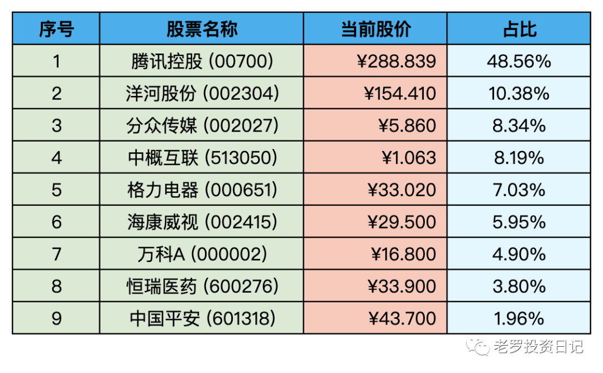

__微信公众号文章地址：[老罗实盘周记-20220903](https://mp.weixin.qq.com/s/Qi9EgUfwiYEKtK2cZaa_jg)__

```
老罗实盘周记，每周六更新。专注于股权投资、阅读、学习与个人成长，知行合一、日拱一卒、投资人生。微信公众号【老罗投资】，文章均首发于公众号。
```

### 1. 本周概述

本周操作：

+ 无

年度收益：<span class="green">-11.95%</span>

上周数据：<span class="green">-12.06%</span>

本周继续缓慢回血。

### 2. 持仓股票明细



其他还有少量陕西煤业(601225)、永新股份(002014)、宋城演义(300144)、京沪高铁(601816)，作为观察仓不记录。

### 3. 持股说明

目前腾讯控股(00700)，格力电器(000651)，海康威视(002415)属于特别便宜，分众传媒(002027)属于不贵可入的情况。

#### 3.1 国常会

8月31号的国常会要求稳经济实施细则9月上旬应出尽出，近半个月预计会有密集的稳定经济政策。

宏观对股市的影响短期有效，长期还是得看企业的盈利能力，这种信息了解就好。

#### 3.2 中美监管机构签署合作协议

闹了好久的中概股审计底稿问题，在8月26日总算是有了实质性的进展。该退市的退市，该配合上市国法律的配合。

中概股现在属于价值洼地，公司的赚钱能力大多不错，就耐心地等待中概股价值回归了。

#### 3.3 腾讯回购

发布中报之后，从8月19号开始腾讯已经连续11个交易日回购股票了，日均3.5亿。

腾三五估计还会持续一段时间，目前企鹅现金充足+股价严重低估，确实适合回购注销操作。

### 4. 本周心得

① 最危险的是毒品和月薪，两样都使人上瘾。

**老罗：**每个月的薪水像温水煮青蛙，让人慢慢上瘾沉沦，慢慢的失去了斗志，变成了碌碌无为的路人。

② 当你抱怨没有鞋的时候，有的人还没有脚。

**老罗：**抱怨自怜是最没有用的，无法解决任何问题，没有必要抱怨遭到不公平的对待。

③ 当你不够聪明，你要做的就是如何用时间换取你的智慧和才能。

**老罗：**像我这种笨人只有用笨办法，慢慢学习，每天早上醒来时比昨天更好一点即可。

④ 当你真正专注于金钱的时候，金钱不一定会来到你身边。

**老罗：**投资真正的目的是理解投资，理解商业，金钱只是打造的投资体系的副产品。

⑤ 很多被封为传奇人物的人，没有觉得他们有什么传奇的地方。

很多人只是认认真真比别人多做了一点事情，或者做事的方式独特了一些，就被叫作传奇人物了。其实，他们只是比常人更加努力和用心一点，做出了一般人认为自己做不了的事情。

**老罗：**比一般人更努力，更专注，再加上时间的不断打磨，一定能做出一番了不起的成就。

⑥ 当我们选择和别人和睦相处、互相帮助、精诚合作时，生活就变成了天堂；当我们选择贪婪、掠夺、霸道和自私时，生活就变成了地狱。

**老罗：**以善意去思考、理解这个世界，自己也会收获更多的善意。

⑦ 作为普通人，我们最想改变的是我们的现状，不管是生活还是工作。中国有句话叫作“人挪活，树挪死”，说明变通的人常常容易获得新的机会。

很多人在接受一份工作后，觉得工作不错，开始贷款买房、买车，最后舍不得房子和车，却舍得自己一辈子待在同一个地方。

我一直鼓励大家创业，鼓励大家换换环境，尽管放弃了眼前稳定的工作，但对于丰富人生经历却大有裨益，而且还可能把握住更好的机会。

“人生30岁之前不犹豫，30岁之后不后悔”，这是值得大家借鉴的一句话。

**老罗：**厌倦了每天的两点一线，每天繁杂的事务，对现状的不满，是良好的第一步。

⑧ 人生不是百米赛跑，而是看不到头的马拉松，这一路至少是几十年。

如果我们活100年，拼的是什么呢？我们拼的是耐力，拼的是专注，拼的是持久。

**老罗：**保护好自己的身体，每天坚持学习，慢慢跑好这场马拉松。

⑨ “在绝望中寻找希望”这句话。跟美国著名的民权运动家马丁路德金所说的话是一模一样的，他在I have a dream演讲词中说过：“We will hew out of the mountain of despair a stone of hope.”（我们从绝望的大山中砍出一块希望的石头）请记住，绝望是大山，但是只要你能砍出一块希望的石头，你就有了希望。

**老罗：**在绝望中寻找希望，人身处逆境的时候成长是最快的，应该高兴又迎来了一次改变进步的机会。逆境四法则：觉知、不要灾难化、分析、行动。

一件事情难不难，在于这些事对你重不重要。

```
老罗实盘周记，每周六更新。专注于股权投资、阅读、学习与个人成长，知行合一、日拱一卒、投资人生。微信公众号【老罗投资】，文章均首发于公众号。
免责声明：本公众号只作为本人的投资日志记录，本文中提及的个股都有腰斩或血本无归的风险，本人不做任何投资建议，投资请坚持独立思考。
```

__微信公众号文章地址：[老罗实盘周记-20220903](https://mp.weixin.qq.com/s/Qi9EgUfwiYEKtK2cZaa_jg)__