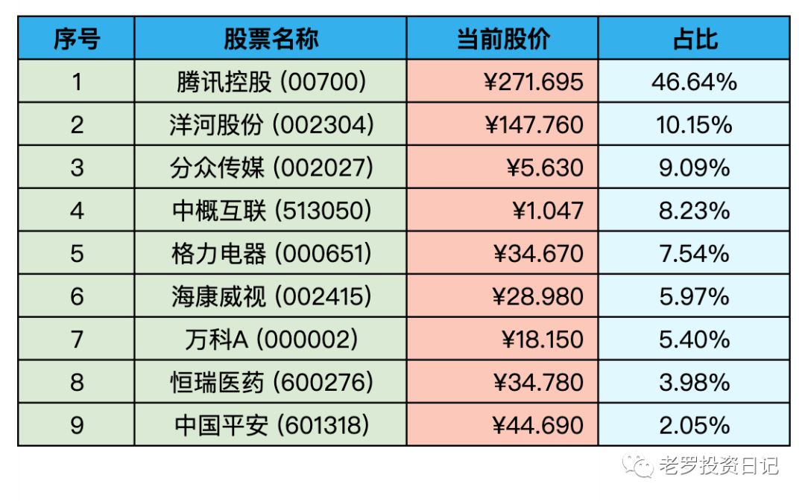

__微信公众号文章地址：[老罗实盘周记-20220909](https://mp.weixin.qq.com/s/zKZg_BT3_X5Ewgq-unyg3g)__

```
老罗实盘周记，每周六更新。专注于股权投资、阅读、学习与个人成长，知行合一、日拱一卒、投资人生。微信公众号【老罗投资】，文章均首发于公众号。
```

### 1. 本周概述

本周操作：

+ 两批买入少量分众传媒(002027)，买入价格分别为5.63元与5.58元。

年度收益：<span class="green">-14.65%</span>。

上周数据：<span class="green">-11.95%</span>。

本周继续血亏老国王。

### 2. 持仓股票明细



其他还有少量陕西煤业(601225)、永新股份(002014)、宋城演义(300144)、京沪高铁(601816)，作为观察仓不记录。

### 3. 持股说明

目前腾讯控股(00700)，海康威视(002415)属于特别便宜，格力电器(000651)，分众传媒(002027)属于便宜，洋河股份(002304)属于不贵可入的情况。

#### 3.1 腾讯大股东减持
腾讯最大股东南非报业9月8日减持111.5万股，持股比例降到28%以下。并将其持有的额外1.92亿股腾讯股票以凭证形式存入香港中央结算及交收系统，这部分股票的最新市值接近600亿港币。看来大股东是铁了心要减持了，所以这周腾讯有较大的回撤。不过大股东减持丝毫不影响腾讯的企业价值，依然是一只肉眼可辨的大胖鹅。

#### 3.2 陕西煤业

陕西煤业作为观察仓，在今年2月15日分别以13.7元，13.8元买入，经过140多天，上涨了100%+，成了今年持仓中表现最好的股票。可惜没来得及加注就一路涨上去了，这也说明了市场先生的疯癫，买入的时机可能转瞬即逝。

### 4. 本周心得

① 芒格在思考事情时，会先从相反方向开始。想要了解如何过上幸福的生活，芒格就会先去研究可能使生活惨不忍睹的做法。想要调查企业如何做大做强，芒格就会首先研究企业的衰败和倒闭。大多数人更关心如何在股市中取得成功，而芒格最关心的问题是为什么大部分人没有在股市里赚到钱。

**老罗：**怎样使生活惨不忍睹：不要锻炼、多吃垃圾食品、不要正常作息、喝酒抽烟、沉迷手机、想买就买、通晓天下事、放弃生活目标、坚持自私自利、贪婪、愤世嫉俗。

怎样使企业倒闭：多举债、多元化、疯狂扩张、依赖某一个客户、忽略客户、打价格战、固步自封。

怎样在股市赚不到钱：高频交易、追热点、听消息、买专家推荐的股票、上杠杆、追涨杀跌、买票不买股、零和游戏。

② 从他人的成败中吸取经验教训是最快的学习方式之一，可以让自己变得更加聪明，却不必忍受很大的痛苦。

**老罗：**有些坑没必要亲自跳进去，不需要亲自往电线上撒尿才知道这样会被电到。

③ 创建核查清单的部分好处在于它有一个写下自己想法的过程。巴菲特曾经强调过设法把自己的想法写下来的重要性，我一直喜欢他的这一解释。在巴菲特看来，如果你不能写下来，说明你还没有想好。

**老罗：**在买入股票之前，把买入、买出价格写到纸上或表格里，并且说明推导过程及原因，如果写不出来，那就不要买入。

④ 价值投资看上去很简单，但显然大多数投资者都难以领会或照做。正如巴菲特经常观察到的那样，价值投资不是一个会随着时间的推移逐渐被学会和应用的概念。要么它被立刻接受或应用，要么永远也无法被真正领会。

**老罗：**买股票就是买公司、安全边际、市场先生、能力圈。价值投资的核心就这四点，有的人一看就懂，有的人一辈子也看不懂。

⑤ 当投机者花时间试图猜测其他投机者正在试图猜测什么时，这个过程很快就变得荒谬起来，并且周而复始。

**老罗：**比赛时不要看记分牌，要考虑的是打好下一球。

⑥ 拥有安全边际意味着即使你犯了错，也仍然可以赢。如果你没有犯错，那你的胜算就会更大。

**老罗：**即使买入的公司有非常大的把握，也要有一定的安全边际，这样即使出现黑天鹅事件(一定会出)，也能将风险控制在可控范围之内。

⑦ 毁人者有三：毒品、酒和财务杠杆。

**老罗：**其实还应该加上一条：月薪。

⑧ 了解了复利的力量和获得它的困难，也就掌握了很多事情的核心和灵魂。

**老罗：**时间+复利，这就需要长长的坡，厚厚的雪，还有不断地学习。

⑨ 股票市场旨在实现将钱“从活跃之人到有耐心之人”之间的转移。

**老罗：**做T生成的多巴胺与赌博类似，短期内能获得巨大的满足感，所以股市里大多数人对短线交易乐此不疲。而能耐得住寂寞的人属于市场的少数，他们耐心，出手果断，得到的是类似运动之后生成的内啡肽，是一种长期的满足感。

```
老罗实盘周记，每周六更新。专注于股权投资、阅读、学习与个人成长，知行合一、日拱一卒、投资人生。微信公众号【老罗投资】，文章均首发于公众号。
免责声明：本公众号只作为本人的投资日志记录，本文中提及的个股都有腰斩或血本无归的风险，本人不做任何投资建议，投资请坚持独立思考。
```

__微信公众号文章地址：[老罗实盘周记-20220909](https://mp.weixin.qq.com/s/zKZg_BT3_X5Ewgq-unyg3g)__