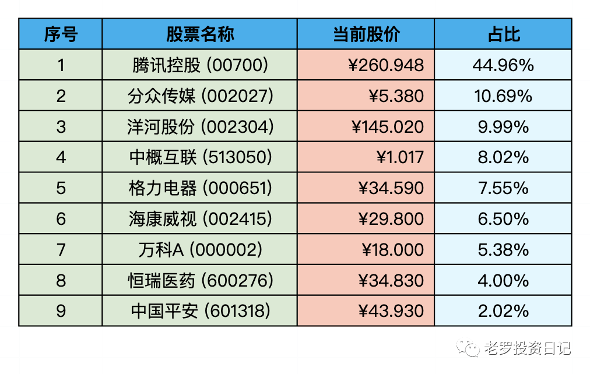

__微信公众号文章地址：[老罗实盘周记-20220917](https://mp.weixin.qq.com/s/8bGM-haXOZ4x-GSydHrzGQ)__

```
老罗实盘周记，每周六更新。专注于股权投资、阅读、学习与个人成长，知行合一、日拱一卒、投资人生。微信公众号【老罗投资】，文章均首发于公众号。
```

### 1. 本周概述

本周操作：

+ 买入少量分众传媒(002027)，买入价格分别为5.60元、5.55元、5.48元和5.45元。
+ 买入少量海康威视(002415)，买入价格为29.24元。

年度收益：<span class="green">-17.16%</span>

上周数据：<span class="green">-14.65%</span>

没什么好说的，创造了今年的最大回撤。

### 2. 持仓股票明细



其他还有少量陕西煤业(601225)、永新股份(002014)、宋城演义(300144)、京沪高铁(601816)，作为观察仓不记录。

### 3. 持股说明

目前腾讯控股(00700)，海康威视(002415)，分众传媒(002027)属于特别便宜，格力电器(000651)属于便宜，洋河股份(002304)属于不贵可入的情况。

#### 3.1 国办发广鼓励金融机构降低服务收费

15号国办发文之后，今天东方财富(300059)等券商股应声下跌，盘中最大跌幅达到了-13.9%。

政府本意是让利于民，降低市场交易成本。其实这对股市长期来说算是利好，能降低交易成本，提高市场活跃度，现在不缺钱，缺少的是信心。

#### 3.2 人民币汇率破7
人民币贬值利好出口，利空股市。汇率属于无法预测和控制的事，默默承受就好(企鹅成本进一步降低)。

#### 3.3 A股大跌

今天大盘跌得比较多，很久没有关心过指数，今天看了眼上证3126.40点，大A果然是原地踏步十年。

大A不涨主要是权重股这十年来涨幅有限，好公司的回报还是相当不错的。市场先生疯癫的时候，正是买入的好时机，我近期如果有富余资金还会慢慢买入。

### 4. 本周心得

① 巴菲特身上尤其值得今天我们借鉴的，应该是他的爱国情怀，他曾说“从未做空”自己的国家，这一点对我们也应该具有很大的启发。

**老罗：**不做空自己的祖国，这也是作为投资者的基本要求与底线。

② 喜马拉雅资本创始人李录先生2019年在北京大学做关于价值投资的演讲时，提到“市场参与者可能只有不到5%是真正的价值投资者”。可见，价值投资的大道笔直宽阔且车马稀少，但践行起来是有难度的，做到理性、克服人性弱点是最难的。

**老罗：**价值投资者是稀有的，大部分人还是喜欢做T，短线的刺激，把股市当做赌场。正是因为这些人，造成市场不总是有效的，价值投资者才有可能从中赚到更多的钱。

③ 最常被问到的问题来自那些年轻的观众。这个问题就是：“我该怎么做才能成为一个伟大的投资者？”第一次问这个问题的，是一位来自旧金山的17岁少年，他非常认真，并说这是他连续第十次参加股东大会。巴菲特的回答既简单又直接：“尽你所能，阅读一切。”他的语气里透露出几分坚定。这是巴菲特多年来一直给出的建议。

**老罗：**阅读是投入产出比很高的事情，尽可能阅读一切书籍，每天醒来都比昨天聪明一点点。

④ 巴菲特还建议，除了读书，还可以做些别的事情：“尝试开始小规模的投资，不要只是读书。”

**老罗：**除了理论之外必须结合实际，投资越早越好。越年轻资本越少，犯错造成的影响也就越小。

⑤ 通过投资净资产收益率低的公司来致富，是极其困难的。

**老罗：**长期投资公司的收益率约等于ROE，只关注长期ROE大于15%的公司。

⑥ 在历年的伯克希尔股东大会上，巴菲特多次谈到了他基于价值投资的基本方法和原则。他经常提到一个基本概念，即对任何企业或投资的估值，都是基于对永续现金流的估计，再以适当的利率贴现，然后在合理的安全边际以一定的折扣价格买入。

**老罗：**利率贴现可以使用无风险收益率的倒数，而永续现金流的估计是价值投资中的唯一变量，也是其中最难的部分，足够学一辈子。

⑦ 任时光飞逝，岁月改变，有些事物依旧如初（Plus ca change，plus ca la meme chose）

**老罗：**正确的事总是很简单，不会轻易改变。

⑧ 最后分享这周看到的特别好的一段话，在人生的低谷阶段，坚持学习，投资自己，经营好自己的人生，共勉：

近几年大环境不好，有人生意不好做，有人失去了工作，有人欠了债，有人离散，各有各的难。但越是不顺的时候，越要沉住气。艰难的路不是谁都有资格走，扛得住涅槃之痛，才配得上重生之美。

如果在一段时间暂时赚不到钱，你可以健身，运动，学习，把自己照顾好，多陪伴孩子，把孩子教育好，处理好家庭关系，何尝不是一种收获。

我们可以允许自己一时的不顺和失败，但咱们在跌倒爬起来的时候含着微笑，从挫折中采回胜利的花朵，是一件很酷的事。人生是一条螺旋上升式的曲线，要努力但不要着急，繁花锦簇，硕果累累，都需要一个过程。

```
老罗实盘周记，每周六更新。专注于股权投资、阅读、学习与个人成长，知行合一、日拱一卒、投资人生。微信公众号【老罗投资】，文章均首发于公众号。
免责声明：本公众号只作为本人的投资日志记录，本文中提及的个股都有腰斩或血本无归的风险，本人不做任何投资建议，投资请坚持独立思考。
```

__微信公众号文章地址：[老罗实盘周记-20220917](https://mp.weixin.qq.com/s/8bGM-haXOZ4x-GSydHrzGQ)__