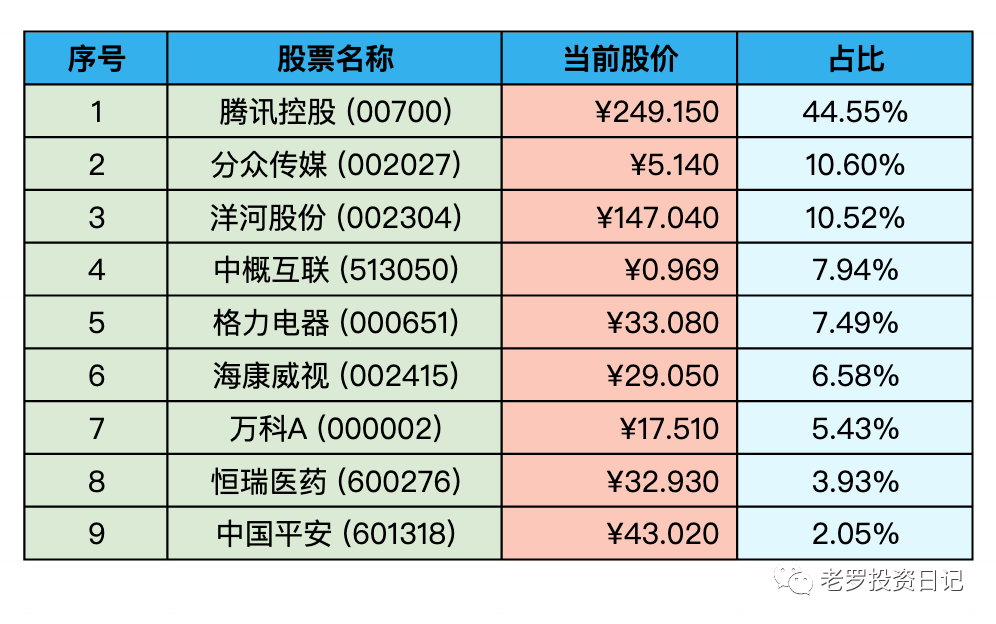

__微信公众号文章地址：[老罗实盘周记-20220924](https://mp.weixin.qq.com/s/BFxxogSCE2OJ0aWrF1i-TA)__

```
老罗实盘周记，每周六更新。专注于股权投资、阅读、学习与个人成长，知行合一、日拱一卒、投资人生。微信公众号【老罗投资】，文章均首发于公众号。
```

### 1. 本周概述

+ 本周操作：<span class="red">无</span>
+ 年度收益：<span class="green">-20.66%</span>。
+ 上周数据：<span class="green">-17.16%</span>。

本周亏麻了。

### 2. 持仓股票明细



其他还有少量陕西煤业(601225)、永新股份(002014)、宋城演义(300144)、京沪高铁(601816)，作为观察仓不记录。

### 3. 持股说明

目前腾讯控股(00700)，海康威视(002415)，分众传媒(002027)，格力电器(000651)属于特别便宜，洋河股份(002304)属于不贵可入的情况。

#### 3.1 美国加息
9月22日美联储加息75个基点，也是这周全球资产下跌的主因。从3月份开始，美联储已经加息300个基点。基本符合预期，接下来就看9月份的美国CPI情况了。

#### 3.2 俄乌冲突加剧

9月21日，俄罗斯宣布了部分动员，这是二战后的首次军事动员。感觉这场冲突结束时间遥遥无期。

加息与冲突，都属于外部不可抗拒因素，只有默默接受。如果有资金，有合适机会，将会继续买入。

#### 3.3 腾讯回购

讲完外部因素，说说腾讯的回购。腾讯目前已经连续25个交易日回购股票，累计耗资88亿港币，但本周股价还是一路下跌，如果跌到250元，估计还会有少量买入操作。

### 4. 本周心得

① 如果有一天，你不再寻求爱情，只是去爱；你不再渴望成功，只是去做；你不再追求空泛的成长，只是修养自己的性情，那么，你人生的一切，才真正开始。

**老罗：**不再只追求一个结果，而只是做当前应该做的，专注于当下，一切才刚刚开始。

② 身弱之人应懂得，不提家业，不透露收入情况，不谈未来之事，闷声发大财，若反之，往往好事，有希望办成之事，都会落空。

**老罗：**老罗也希望能闷声发大财图片，公众号更像是私人日记，记录自己的投资历程，分享给志同道合的朋友 。

③ 过去未来事，思至何益？徒放心耳。

**老罗：**过去和将来的事，想了又有什么用处？只会徒增烦恼。我们唯一能把握的只有当下。

④ 知命者不怨天，知己者不怨人。

**老罗：**类似芒格说的，最坏的两件事就是自怜和嫉妒。东西方的智慧基本相通。

⑤ 不贵于无过，而贵于能改过。

**老罗：**人都会犯错误，但一定要“不二过”。

⑥ 一只股票的真正价值，其实来自于它背后的公司的价值；而一家公司的价值，并不能仅仅看它账面上有多少钱、它的厂房设备值多少钱，而是来源于它未来预期能产生的所有现金流的折现。

**老罗：**投资唯一未知因素，也是决定性因素。

⑦ 经济周期就像潮水起起落落，在水中嬉戏的人们时而贪婪，时而恐惧，而为了对抗经济的波动起伏，货币政策时而加息，时而降息，这些都是无法预测的噪音。拉长时间来看，利率和大众的情绪都是中性的，只有长期持有，才能过滤掉、摆脱掉这些市场噪声的干扰，让市场价格最终向由利润决定的公司价值靠拢。

**老罗：**加息、战争、疫情，这些都是噪声，继续坚定持有优秀公司的股权。

⑧ 作为一个投资者，控制情绪，严守纪律，可能是一项入门的基本功和必修课。

**老罗：**老罗目前还做不到完全的自律，股票跌了也会郁闷，涨了也会得意，还是俗人一个。所以只能在买入卖出前制定好规则，并严格执行。

```
老罗实盘周记，每周六更新。专注于股权投资、阅读、学习与个人成长，知行合一、日拱一卒、投资人生。微信公众号【老罗投资】，文章均首发于公众号。
免责声明：本公众号只作为本人的投资日志记录，本文中提及的个股都有腰斩或血本无归的风险，本人不做任何投资建议，投资请坚持独立思考。
```

__微信公众号文章地址：[老罗实盘周记-20220924](https://mp.weixin.qq.com/s/BFxxogSCE2OJ0aWrF1i-TA)__