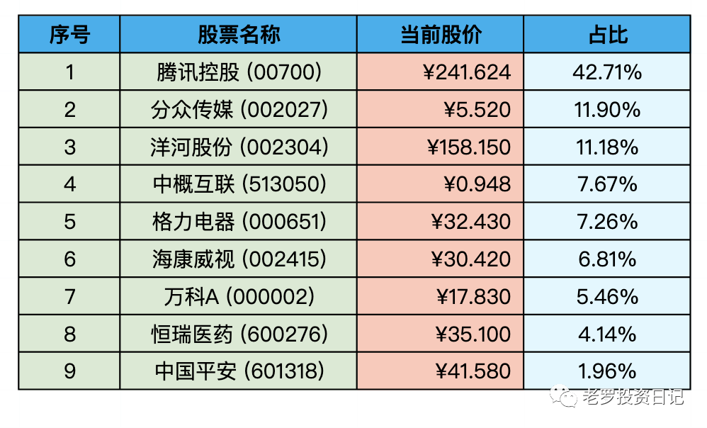
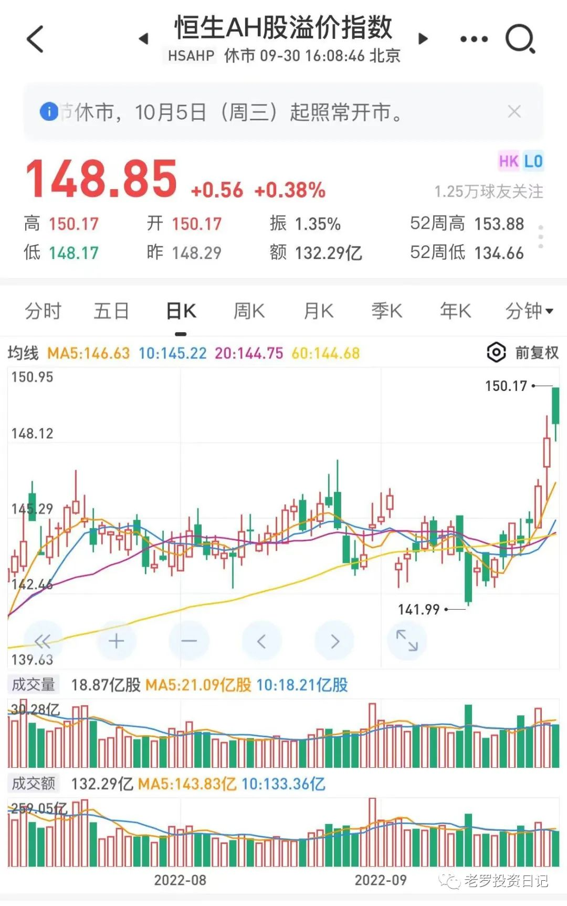

__微信公众号文章地址：[老罗实盘周记-20221001 国庆节快乐！](https://mp.weixin.qq.com/s/NSrxX_sJK_Gr5ywBTDUQBA)__

```
老罗实盘周记，每周六更新。专注于股权投资、阅读、学习与个人成长，知行合一、日拱一卒、投资人生。微信公众号【老罗投资】，文章均首发于公众号。
```

### 1. 本周概述

本周操作：

+ 买入少量分众传媒(002027)，买入价格为5.45元。

年度收益：<span class="green">-19.67%</span>

上周数据：<span class="green">-20.66%</span>

### 2. 持仓股票明细



其他还有少量陕西煤业(601225)、永新股份(002014)、宋城演义(300144)、京沪高铁(601816)，作为观察仓不记录。

### 3. 持股说明

目前腾讯控股(00700)，格力电器(000651)，海康威视(002415)，分众传媒(002027)属于特别便宜，洋河股份(002304)属于不贵可入的情况。

本周有少量资金入账，按计划会分给分众和企鹅。企鹅目前仓位超过4成，但企鹅如果跌到250港币左右，还会进行少量的买入。

#### 3.1 香港入境新规

香港26日起入境检疫由3+4改为0+3，取消3天的强制酒店检疫，改为3天居家或酒店隔离。

三年的疫情对香港的影响是显而易见的，恒生指数17000点明显偏低，恒生AH股溢价指数达到了148，这个指数追踪的是在内地和香港两地同时上市的股票的价格差异，也就是说在两地上市的同一家公司，内地股比香港贵了48%。



但港股就是没什么成交量，再一次说明了市场先生的疯癫，明显的错误定价。

#### 3.2 俄乌冲突

本周顿涅茨克等四地入俄公投结果公布，结果在意料之中。乌克兰签署加入北约申请，还有北溪输气管道被破坏，俄乌冲突升级的变数增多。

如果真的爆发核战，持有股票与持有现金房产没有区别；如果不爆发核战，股票长期表现肯定优于现金。

#### 3.3 公积金利率下调

30号晚上央行宣布下调首套个人住房公积金贷款利率15个基点，5年以下（含5年）和5年以上利率分别调整为2.6%和3.1%。

如果贷款30年120万，可以少还两万多。虽然不算很多，但相当于国家借出了3.1%年利率120万低息贷款，用这120万进行投资，拿到高于3.1%收益还是比较容易的(最简单的就是定投宽指数基金)。

感谢国家！坚决作多中国。

### 4. 本周心得

① 财富就如同一棵树，是从一粒小种子发芽而成的。你的第一个铜板就是将来长成财富之树的种子。这种子你种得越早，它就能越早地长成大树。你越浇灌它，给它施肥，它就能长得越快，不久你就能在树荫下乘凉了。

**老罗：**投资理财要越早越好，不要认为资金量少就放弃投资，复利加时间的力量，超乎想象。

② 比尔·盖茨曾说过：“人性中有两大力量：自利和关心他人。”这两大力量可以并存，人可以同时自利并关心他人。将这两者都做得很好的人往往是成功的人。我们中国人也常说，“有舍有得，不舍不得，大舍大得，小舍小得。”

**老罗：**得道多助失道寡助，在保证自己利益的前提下关心他人利益，行好事，做好人。

③ 人应该学会远离自己不懂的东西。借用芒格的话：“每个人都有他的能力圈，如果你们要玩那些别人玩得很好而你们一窍不通的游戏，那么你们注定会一败涂地。那是必定无疑的事情。你们必须弄清楚自己的优势在哪里，必须在自己的能力圈之内竞争。”

**老罗：**投资最怕的就是不懂装懂，如果没完全弄清楚自己投资的公司，迟早一天它会让你付出相应的代价。

④ 这些知识的积累是建立在终生学习的基础之上的。套用巴菲特的话，你需要“建立你的数据库，这样你就能在一生中积累知识”。

**老罗：**终身学习是巴菲特最推荐的事，老罗也在尽力身体力行，每天醒来都要比昨天聪明一点点。

⑤ 比较优势理论认为：无论是企业还是个人都应专注在自身有比较优势的事上。比尔·盖茨和巴菲特首次会面时，盖茨的母亲请在座的每个人分享他们成功的一个最重要的因素。盖茨和巴菲特都给出了同样的答案：“专注。”

**老罗：**老罗投资也尽量避免分散，只专注于自己有把握的那几家公司，贪多嚼不烂。

⑥ 问到投资，多数人的第一反应就是股票和房地产。如果对金融领域比较熟悉的话，可能还会提到债券、外汇、艺术品、比特币等。我估计不少人不会想到，一生中最重要的投资其实是投资我们自己。

**老罗：**使用正确的方法投资自己，可以大方一点，ROI最高的投资，没有之一。

⑦ 反思一个人的言行，往往是因为他说话太多而把自己逼上了绝路，与其如此，倒不如保持自己内心的平静，把话放在心里，反而能得到更多。

**老罗：**每日反思，少言，慎言，远离麻烦事，远离垃圾人。老罗在碰到麻烦事与垃圾人时，就会想想如果是巴菲特、芒格，会怎么应对这种事/人？效果明显。

⑧ 想要踮起脚尖站得更高的人，反而会站不稳；不想稳步前进，而想着跳跃式前进的人，反而无法走得又快又远；常常炫耀自己高明的人，反而让别人无法看到他的高明所在；总是自以为是的人，他的优点反而无法真正地得到彰显；自吹自擂的人，反而没有人会承认他的功绩；自我膨胀的人，也难以成为领袖。

**老罗：**越是谷粒饱满的稻穗，越往下垂；越是走得稳健，越是长远。时时反思，避免犯类似错误。

⑨ 凡事争强好胜，永不低头，往往容易受到伤害；凡事谦和忍让，看似柔弱、低下，实则符合“道”的理念，也是能够长生久存的原因。

**老罗：**水是最柔弱的，同时它的力量也是最强大的。

```
老罗实盘周记，每周六更新。专注于股权投资、阅读、学习与个人成长，知行合一、日拱一卒、投资人生。微信公众号【老罗投资】，文章均首发于公众号。
免责声明：本公众号只作为本人的投资日志记录，本文中提及的个股都有腰斩或血本无归的风险，本人不做任何投资建议，投资请坚持独立思考。
```

__微信公众号文章地址：[老罗实盘周记-20221001 国庆节快乐！](https://mp.weixin.qq.com/s/NSrxX_sJK_Gr5ywBTDUQBA)__