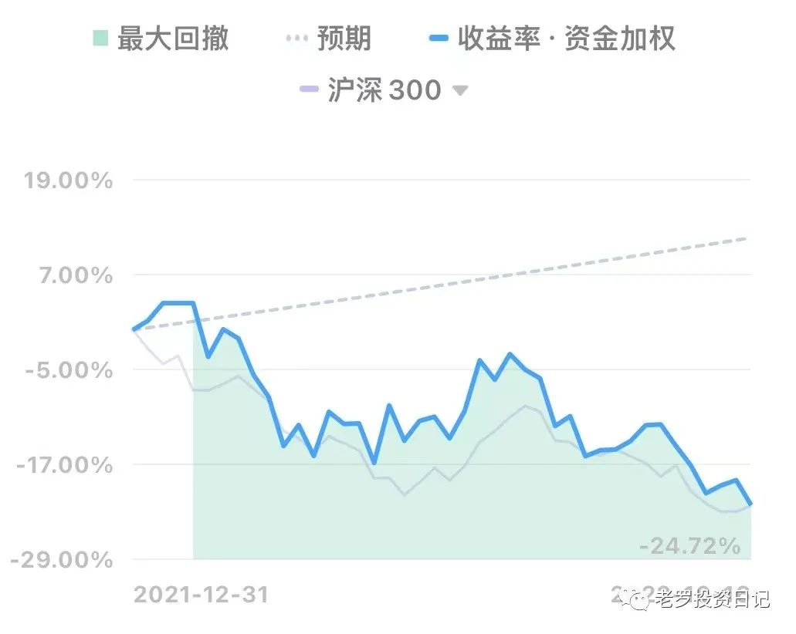
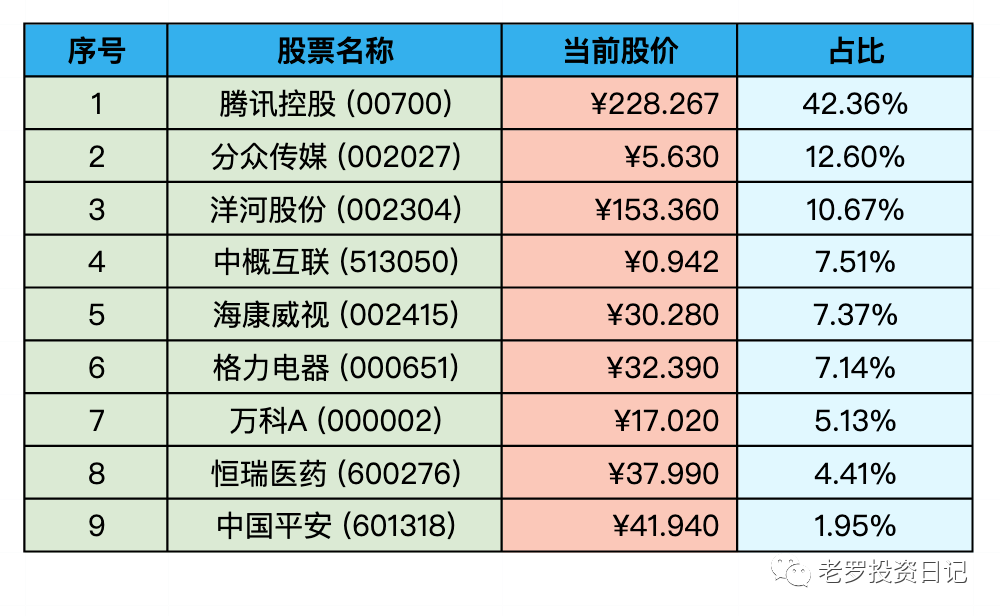
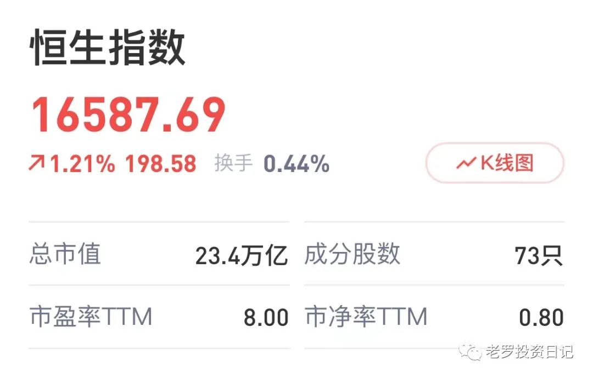
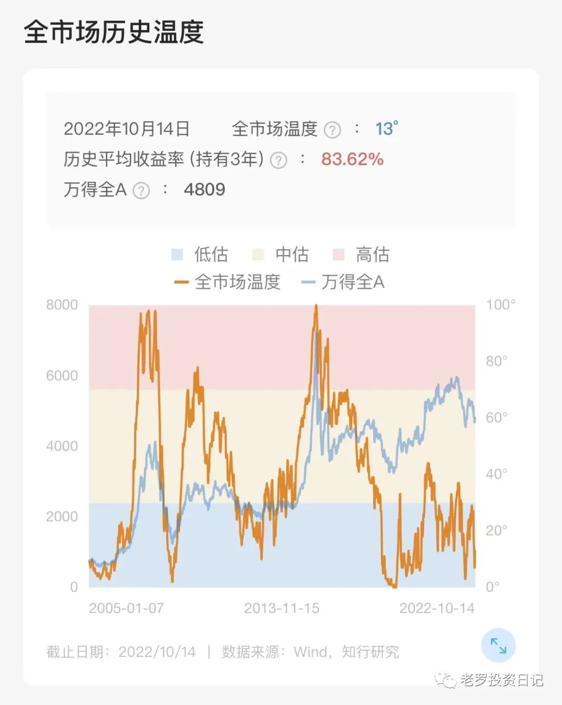

__微信公众号文章地址：[老罗实盘周记-20221015](https://mp.weixin.qq.com/s/K9BL2y81AFLcTn-uVWXaug)__

```
老罗实盘周记，每周六更新。专注于股权投资、阅读、学习与个人成长，知行合一、日拱一卒、投资人生。微信公众号【老罗投资】，文章均首发于公众号。
```

### 1. 本周概述

本周操作：

+ 买入腾讯控股(00700)，买入价格265.00港币。
+ 买入分众传媒(002027)，买入价格分别为5.45、5.35人民币。
+ 买入海康威视(002415)，买入价格分别为29.20、29.00人民币。

年度收益：<span class="green">-22.18%</span>
上周数据：<span class="green">-19.00%</span>



继续创造年内最大回撤纪录，请叫老罗人菜瘾大。

### 2. 持仓股票明细



其他还有少量陕西煤业(601225)、永新股份(002014)、宋城演义(300144)、京沪高铁(601816)，作为观察仓不记录。

### 3. 持股说明

目前腾讯控股(00700)、海康威视(002415)、格力电器(000651)属于特别便宜，分众传媒(002027)属于不贵可入的情况。

#### 3.1 腾讯控股(00700)

十一前计划是250.00港币时再购入腾讯控股，但没控制住265.00港币时就下了一单并顺利成交，成交后继续一路下跌，最低时达到246.20港币，严格按计划进行操作还是对人性有很大的考验，市场先生癫狂时机会多多，不能因为害怕买不到而放弃严格执行买入计划。

老罗毕竟没有无限资金，价格跌到买入价时却没有资金买入了，这次买入需要反思。

同时也说明了稳定的现金流是多么重要，除了工资收入这条主“管道”不能轻易放弃外，还需要打造多条副业作为“管道”。在出现这种市场好机会时，才可能以更好的价格买到更多优质公司的股权。

#### 3.2 分众传媒(002027)

分众传媒受疫情影响非常大，对电梯广告、影院广告的影响是巨大的。

人民币5.40元左右的价格安全垫已经非常之厚，剩下的就是慢慢的等待了。

#### 3.3 海康威视(002415)

海康威视最大的问题就是美国的制裁风险，我给它的仓位最高会到10%，即使黑天鹅事件发生，也不会造成太大的后果。

#### 3.4 恒生指数

恒生指数PE在本周曾经跌破了8，周五涨了1个多点才回到8倍PE的水平。

历史数据表明恒生指数一般是在8-20倍PE之间，现在已经是非常的低估了，本周还买了一点恒生指数基金，大概率会有不错的收益。



#### 3.5 A股市场温度

在A的市场温度也在一个非常低的位置，在周中跌到了7度左右。巴菲特指标目前是66.24/55.39，也是非常的低估了。

这种遍地都是便宜货可捡的时候，老罗没有资金也只能是干瞪眼。



```
老罗实盘周记，每周六更新。专注于股权投资、阅读、学习与个人成长，知行合一、日拱一卒、投资人生。微信公众号【老罗投资】，文章均首发于公众号。
免责声明：本公众号只作为本人的投资日志记录，本文中提及的个股都有腰斩或血本无归的风险，本人不做任何投资建议，投资请坚持独立思考。
```

__微信公众号文章地址：[老罗实盘周记-20221015](https://mp.weixin.qq.com/s/K9BL2y81AFLcTn-uVWXaug)__