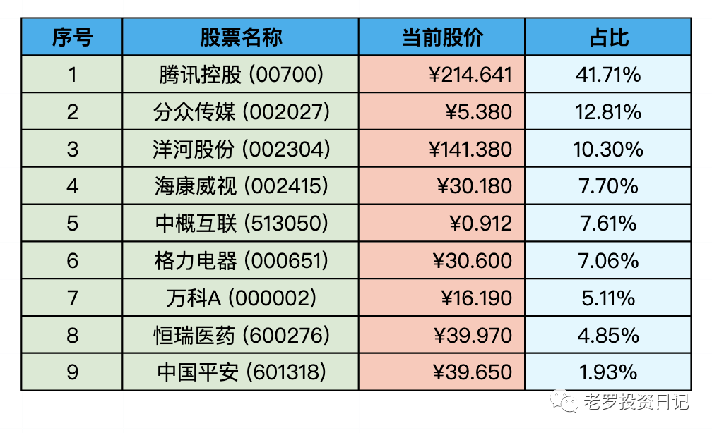

__微信公众号文章地址：[老罗实盘周记-20221022](https://mp.weixin.qq.com/s/ZyDQ0KmPpgG_542IL-RN5A)__

```
老罗实盘周记，每周六更新。专注于股权投资、阅读、学习与个人成长，知行合一、日拱一卒、投资人生。微信公众号【老罗投资】，文章均首发于公众号。
```

### 1. 本周概述

本周操作：

+ 买入少量分众传媒(002027)，买入价格5.40人民币。

年度收益：<span class="green">-26.15%</span>
上周数据：<span class="green">-22.18%</span>

继续创造历史最大回撤纪录。


### 2. 持仓股票明细



其他还有少量陕西煤业(601225)、永新股份(002014)、宋城演义(300144)、京沪高铁(601816)，作为观察仓不记录。

### 3. 持股说明

目前：

+ 腾讯控股(00700)属于严重低估。
+ 格力电器(000651)，海康威视(002415)，分众传媒(002027)属于特别便宜。
+ 洋河股份(002304)属于不算贵可入的情况。

#### 3.1 腾讯回购

腾讯近半年累计回购了6039万股，消耗了181亿港币的资金，回购股份占总股本的0.63%。

特别是10月12日-10月14日，每日回购的金额达到了6亿港币，“腾六亿”都出现了，股价真是严重的低估。

因为近期要披露三季报，从10月17日腾讯停止了回购，再回购需要等到三季报发布之后了，如果到时股价还是这么低，“腾六亿”再次出现也不是不可能。

如果下月还有新进资金，可能会在230-240港币时再次买入，市值2万亿人民币的企鹅，已经拥有足够厚的安全垫了。

#### 3.2 人民币贬值

本周美元兑人民币达到了1兑7.2438，近半年的时间，从6.3跌到7.2，但相较于欧元、日元，人民币的贬值幅度还不算很大。

人民币贬值对老罗的影响就是腾讯的成本下降了不少，因为港币与美元实行联系汇率制度，汇率波动很小，基本保持在1美元兑7.8港币。

所以老罗持有腾讯成本实际下降了10%左右，从年初至今腾讯下跌了47%，但老罗的亏损并没有那么多，一是中间有逢低加仓，第二个原因就是因为人民币贬值了。

#### 3.3 市场下行如何保持良好心态

进入10月以来，港股与A股的波动比较剧烈，老罗的持仓下跌了6%左右，本周也正式跑输了沪深300指数(-24.24%)。

市场波动不可避免，作为投资者在漫长的投资生涯中必然会碰到较大幅度的回撤，腰斩、膝盖斩老罗也碰到过，最后也有惊无险的渡过了，回过头来看，也只不过是大海里的一个小波浪罢了。

如果实在影响心情，这种情况下可以远离市场，少看盘或不看盘，看看书，做做喜欢的事。

稳定的心态，是投资能获得成功的重要因素。

```
老罗实盘周记，每周六更新。专注于股权投资、阅读、学习与个人成长，知行合一、日拱一卒、投资人生。微信公众号【老罗投资】，文章均首发于公众号。
免责声明：本公众号只作为本人的投资日志记录，本文中提及的个股都有腰斩或血本无归的风险，本人不做任何投资建议，投资请坚持独立思考。
```

__微信公众号文章地址：[老罗实盘周记-20221022](https://mp.weixin.qq.com/s/ZyDQ0KmPpgG_542IL-RN5A)__