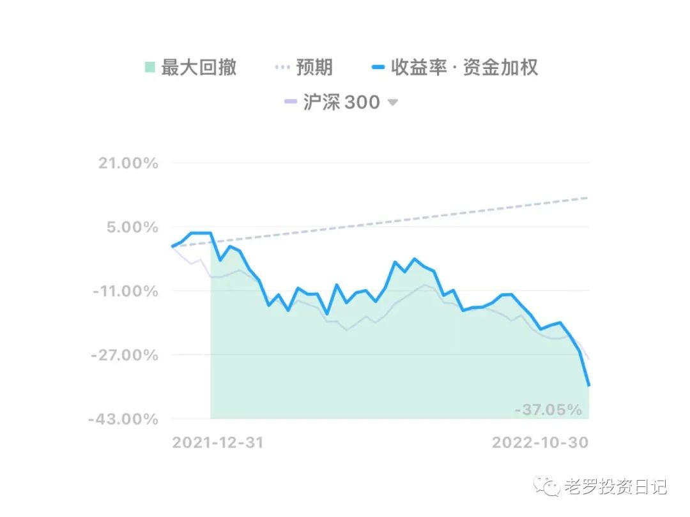
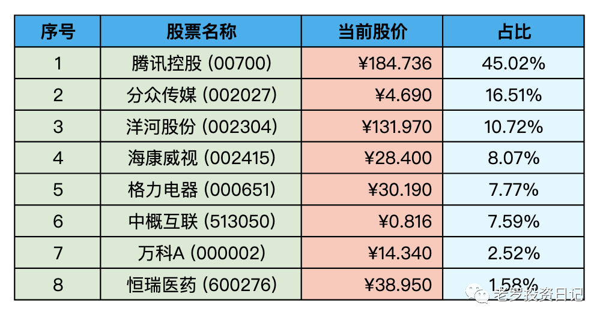
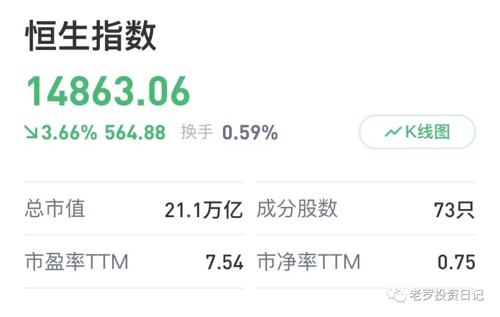

__微信公众号文章地址：[老罗实盘周记-20221029](https://mp.weixin.qq.com/s/juCopd88mVmOxQr0PMZrOA)__

```
老罗实盘周记，每周六更新。专注于股权投资、阅读、学习与个人成长，知行合一、日拱一卒、投资人生。微信公众号【老罗投资】，文章均首发于公众号。
```

### 1. 本周概述

本周操作：

+ 卖出部分恒瑞医药(600276)，卖出价格为39.47元。
+ 卖出部分万科A(000002)，卖出价格为15.51元。
+ 清仓了中国平安(601318)，卖出价格为37.47元。
+ 清仓了永新股份(002014)，卖出价格为7.97元。
+ 清仓了陕西煤业(601225)，卖出价格为21.3元。
+ 买入腾讯控股(00700)，买入价格分别为215.60港币、199.80港币。
+ 余下的资金买入了分众传媒(002027)，买入价格分别为5.16元、5.08元、5.05元、5.02元、4.72元。

年度收益：<span class="green">-34.92%</span>
上周数据：<span class="green">-26.15%</span>

本周回撤比较大，一周亏损了8个多点，但市场越跌风险就越小，老罗有资金还会继续买买买。



### 2. 持仓股票明细



其他还有少量宋城演义(300144)、京沪高铁(601816)，作为观察仓不记录。

### 3. 持股说明

目前估值：

+ 腾讯控股(00700)属于严重低估。
+ 分众传媒(002027)，格力电器(000651)，海康威视(002415)，洋河股份(002304)属于特别便宜。
+ 就连贵州茅台(600519)也接近了不贵可入的区间。

本周操作较多，主要是在市场充满恐慌情绪的情况下，诱人的机会实在是太多，在200左右买入了一些腾讯，剩余的零散资金买入了分众传媒。

目前腾讯、分众的仓位基本达到上限，后续的操作可能是提高洋河股份(002304)的仓位，如果顺利的话会将洋河的仓位提到15%以上。

如果贵州茅台(600519)跌到老罗觉得合适的区间，也会考虑买入。如果到时还有资金的话，一是茅台的门槛比较高，二是近期便宜的公司实在是太多了，实在无法保证不出手。

恒生指数本周跌到了97年回归之前，PE只有7.54，PB只有0.75。



最近也买了一点恒生指数基金，耐心等待，应该也会有不错的收益。

```
老罗实盘周记，每周六更新。专注于股权投资、阅读、学习与个人成长，知行合一、日拱一卒、投资人生。微信公众号【老罗投资】，文章均首发于公众号。
免责声明：本公众号只作为本人的投资日志记录，本文中提及的个股都有腰斩或血本无归的风险，本人不做任何投资建议，投资请坚持独立思考。
```

__微信公众号文章地址：[老罗实盘周记-20221029](https://mp.weixin.qq.com/s/juCopd88mVmOxQr0PMZrOA)__