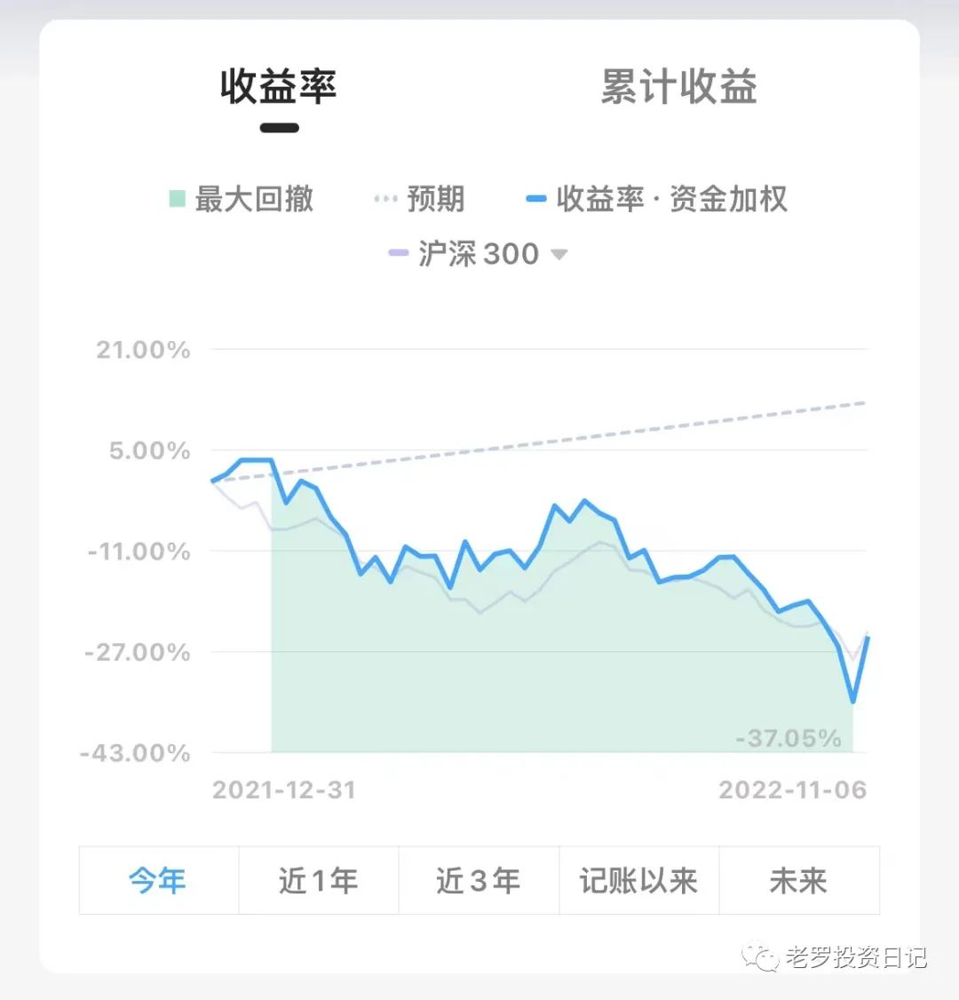
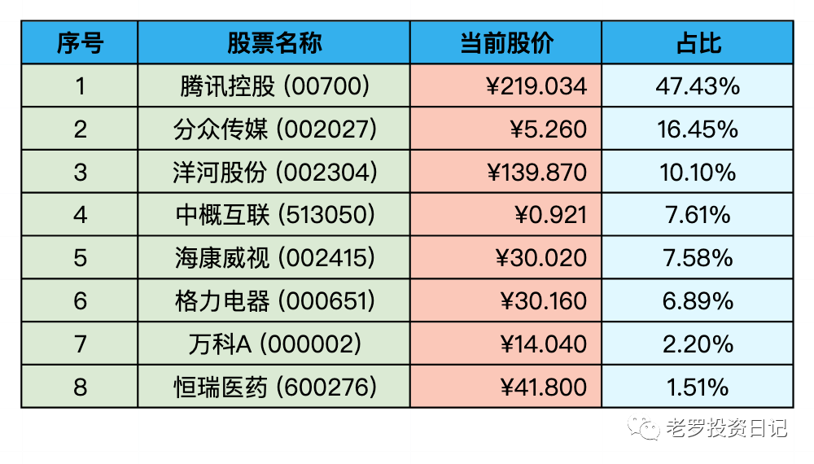

__微信公众号文章地址：[老罗实盘周记-20221105](https://mp.weixin.qq.com/s/fQWc86HJJAWiNy83YoXlXg)__

```
老罗实盘周记，每周六更新。专注于股权投资、阅读、学习与个人成长，知行合一、日拱一卒、投资人生。微信公众号【老罗投资】，文章均首发于公众号。
```

### 1. 本周概述

+ 本周操作：<span class="red">无</span>
+ 年度收益：<span class="green">-24.60%</span>
+ 上周数据：<span class="green">-34.92%</span>



本周持仓上涨10%，因为上涨较多，本周也没有任何操作，保持呆坐不动。

### 2. 持仓股票明细



其他还有少量宋城演义(300144)、京沪高铁(601816)，作为观察仓不记录。

### 3. 持股说明

目前估值：

+ 腾讯控股(00700)属于严重低估。
+ 格力电器(000651)，海康威视(002415)，分众传媒(002027)属于特别便宜。
+ 洋河股份(002304)属于不算贵可以入的区间。

本周上证指数上涨5.31%、深成指数上涨7.55%，沪深300上涨6.38%，恒生指数上涨8.73%，恒生科技上涨超15%，应该是今年最大的单周反弹。

上周还阴云密布，市场信心崩溃，这周就180度大转变，微博上还有人喊出了“牛市回来了”的口号，认识的朋友也有好几个摩拳擦掌，纷纷表示要出资“抄底”。老罗觉得还是不要过于乐观了，市场先生疯疯癫癫，一会儿极度悲观，一会儿又极度乐观，保不准下周又跌得一塌糊涂。到时怕又有一大批人哀嚎：“中国股市十年还是3000点，就是个骗人、割韭菜的韭菜地。“

总之市场先生不可预测，只能利用，在市场先生悲观时(出价低)时买入，正常时呆坐不动，乐观时(出价高)时卖出，老罗的投资策略就是这么简单。

包括老罗投资宽指数基金，也是按照这个铁律执行。当然宽指数基金投资比投资个股更加简单，只需要看指数的盈利收益率、ROE与PE，基本就可以判断当前是否贵了。在便宜时慢慢定投，正常估值时停止定投，高估时卖出即可，就可以保障较高的胜率。

老罗下一步的计划：买入洋河股份(002304)，上限是提到20%的持仓。如果之后洋河有比较好的价格，可能会卖出万科A(000002)或恒瑞医药(600276)来换洋河。

目前市场中机会多多，就是没有太多的富余资金，这算是一种幸福的“痛苦”了。而股市行情较好时，便宜的好公司几乎找不到，这又是另一种痛苦了。

```
老罗实盘周记，每周六更新。专注于股权投资、阅读、学习与个人成长，知行合一、日拱一卒、投资人生。微信公众号【老罗投资】，文章均首发于公众号。
免责声明：本公众号只作为本人的投资日志记录，本文中提及的个股都有腰斩或血本无归的风险，本人不做任何投资建议，投资请坚持独立思考。
```

__微信公众号文章地址：[老罗实盘周记-20221105](https://mp.weixin.qq.com/s/fQWc86HJJAWiNy83YoXlXg)__