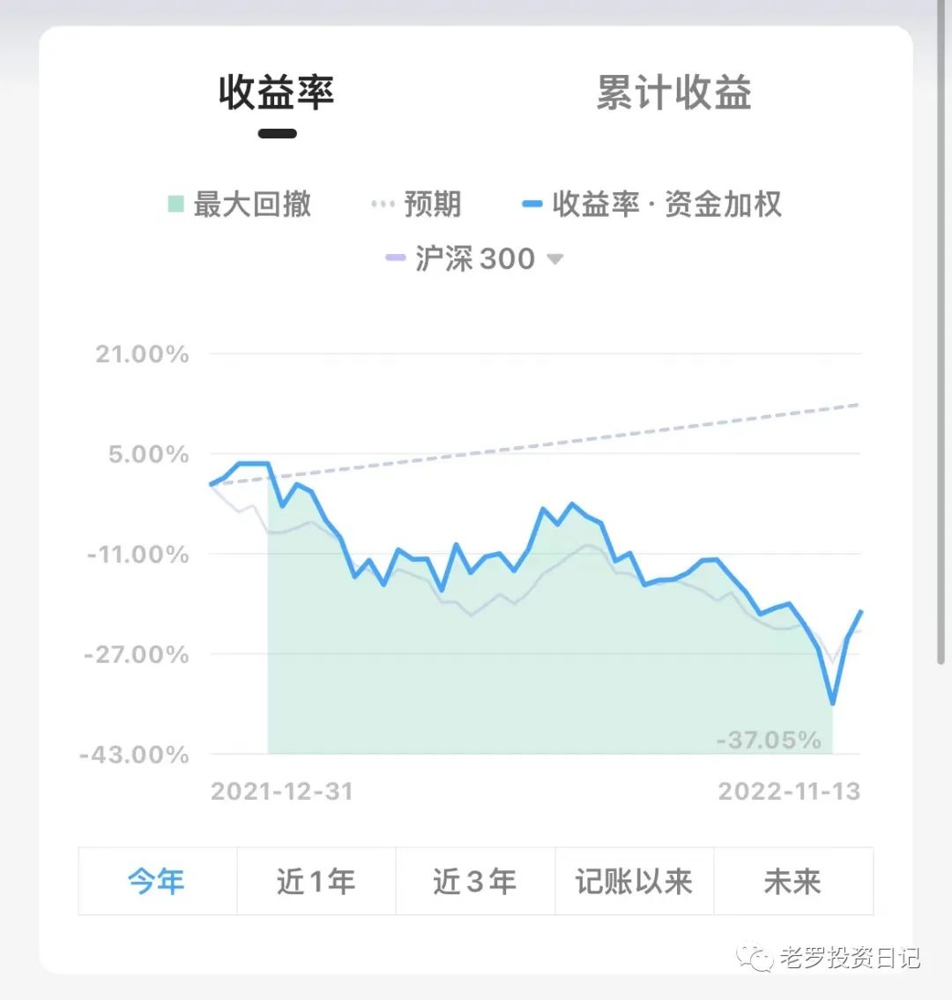
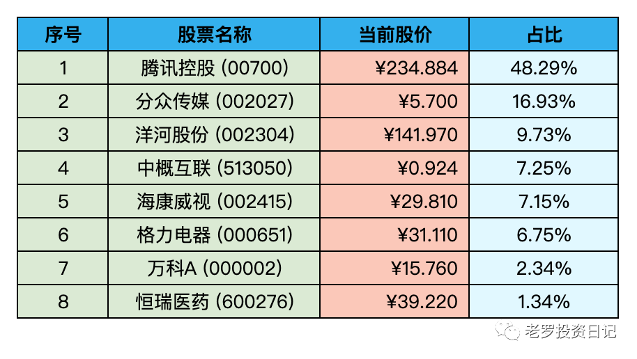

__微信公众号文章地址：[老罗实盘周记-20221112](https://mp.weixin.qq.com/s/kGup_hPSGsXIsgx6HXVyhg)__

```
老罗实盘周记，每周六更新。专注于股权投资、阅读、学习与个人成长，知行合一、日拱一卒、投资人生。微信公众号【老罗投资】，文章均首发于公众号。
```

### 1. 本周概述

+ 本周操作：<span class="red">无</span>
+ 年度收益：<span class="green">-20.03%</span>
+ 上周数据：<span class="green">-24.60%</span>



### 2. 持仓股票明细



其他还有少量宋城演义(300144)、京沪高铁(601816)，作为观察仓不记录。

### 3. 持股说明

目前估值：

+ 腾讯控股(00700)属于严重低估。
+ 格力电器(000651)，海康威视(002415)，分众传媒(002027)属于便宜。
+ 洋河股份(002304)属于不算贵可以入的区间。

本周上证指数上涨0.54%、深成指数下跌0.43%，沪深300上涨0.56%，恒生指数上涨7.21%，恒生科技上涨超6.97%。老罗的持仓上涨了4%，属于中规中矩，本周继续呆坐不动，没有任何操作。在周四时其实想买入洋河股份(002304)，但挂单134.00元没有成交，继续等待，看之后的机会。

每一个养过狗的人都有这样的经历，当带着自己的狗在河边散步时，狗常常会先跑到前面，到了一定的距离又会回到主人的身边。有时狗又会只顾自己玩耍而落在后面，到了一定的距离又会跑到主人的身边。当然有时也会与主人一起并排着走。最后狗与主人同时回到家里。主人悠闲地走了一公里，而狗却忙碌地走了四公里。但有一个规律：如不出意外的话，狗总是围绕着主人前后走。作为投资者，需要紧盯的是小狗(股票)的主人(企业)，小狗跑前跑后，最后总会回到主人的身边(股价最终反映的是企业的内在价值)。港股之前就属于小狗远远地落后主人，目前的反弹只不过是正常的价值回归罢了。

本周四美国公布十月份的CPI数据，还不错，当晚纳斯达克大涨，加息这种七伤拳属于杀敌一千，自伤八百。这一轮的加息周期应该也快接近尾声了，之后对股市的影响会越来越小。待加息周期结束，对明年的中国经济复苏老罗还是持非常乐观的态度。

日子再苦再难，总会挺过去，需要做的就是努力活下去，熬到黎明的到来。可能等五年后再回头看，2022年也不过只是普普通通的一年。

```
老罗实盘周记，每周六更新。专注于股权投资、阅读、学习与个人成长，知行合一、日拱一卒、投资人生。微信公众号【老罗投资】，文章均首发于公众号。
免责声明：本公众号只作为本人的投资日志记录，本文中提及的个股都有腰斩或血本无归的风险，本人不做任何投资建议，投资请坚持独立思考。
```

__微信公众号文章地址：[老罗实盘周记-20221112](https://mp.weixin.qq.com/s/kGup_hPSGsXIsgx6HXVyhg)__