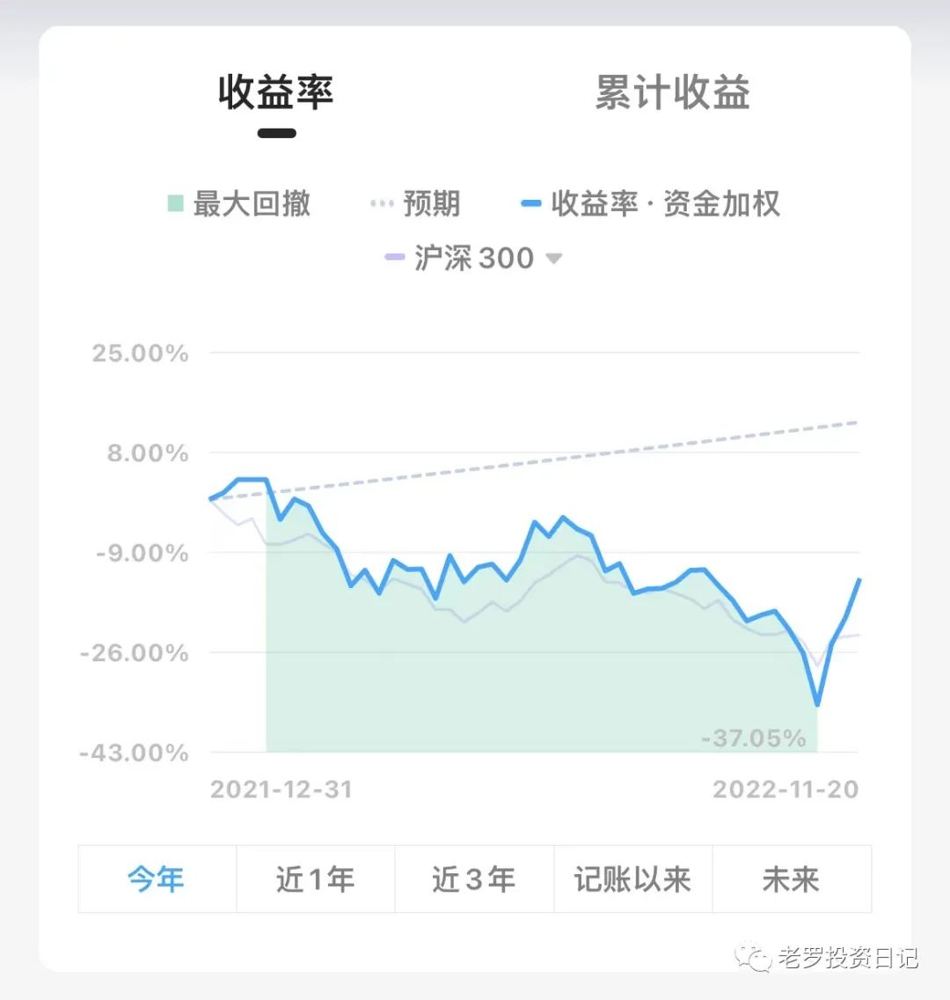
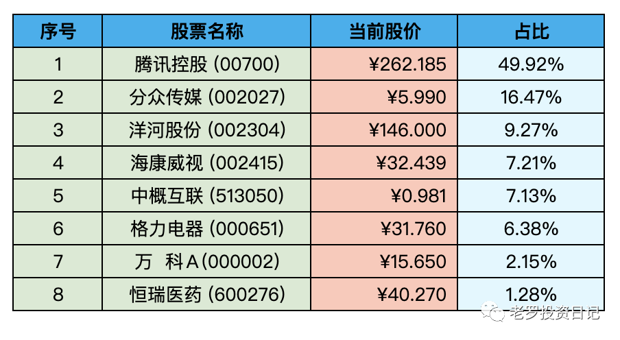

__微信公众号文章地址：[老罗实盘周记-20221119](https://mp.weixin.qq.com/s/45XKmDuIjFf1ZdgVXEWIRg)__

```
老罗实盘周记，每周六更新。专注于股权投资、阅读、学习与个人成长，知行合一、日拱一卒、投资人生。微信公众号【老罗投资】，文章均首发于公众号。
```

### 1. 本周概述

+ 本周操作：<span class="red">无</span>
+ 年度收益：<span class="green">-13.42%</span>
+ 上周数据：<span class="green">-20.03%</span>

本周上证指数上涨 0.32%、深证成指上涨 0.36%，沪深300上涨 0.35%，恒生指数上涨 3.85%，恒生科技上涨 7.19%。

本周老罗的持仓上涨了 <span class="red">6.61%</span>，今年收益率 <span class="green">-13.42%</span>，沪深300今年收益率为 <span class="green">-23.05%</span>，继续跑赢沪深300。



### 2. 持仓股票明细



其他还有少量宋城演义(300144)、京沪高铁(601816)，作为观察仓不记录。

### 3. 持股说明

持仓股票当前估值：

+ 腾讯控股(00700)属于低估。
+ 格力电器(000651)，海康威视(002415)属于便宜。
+ 分众传媒(002027)属于不算贵可以入的区间。
+ 洋河股份(002304)上涨较多，现在买就不太合适了。

本周多家中概公司发布Q3财报，老罗总的感觉是中概公司最困难的时期应该已经结束了。美股、港股的中概公司这几周的涨势比较好，老罗持仓的股票、基金中中概股的比例较大，所以整体收益受到中概股涨跌的影响也比较大。

腾讯Q3实现营业收入1400.93亿元，同比跌幅收窄至2%，净利润322.54亿元，同比增长2%，在连续四个季度的下跌后回稳。一年利润1200亿的企鹅，目前市值在2.5万亿多人民币，怎么看也不算贵，但仓位已经达到50%老罗的上限，短期内是不会再有加仓的计划了。

洋河上周设置的134.00元没有成交，之后一路上涨到了146.00元，老罗手中的少量现金也没有好的去出，只有放在账号里吃货币基金的利息了。不过不用担心，好机会一直会有，只需要耐心等待对方投出的球到达适合的击球区域，再奋力地打出一击。

在股市中获利的方式有很多种，对于老罗这种长期投资者，投资获利的来源要么是企业自身成长带来的内在价值的增长，要么是股价从低估回归到合理价格带来的估值提升。需要平心静气地去挣企业低估或是企业成长的钱，而不受到股市中各种诱惑的干扰，这需要一颗平常心和取舍的能力。因为老罗太笨，只适合像曾国藩一样“结硬寨，打呆仗”，只会这一招“老罗飞刀”，所以只能在自己小小能力圈里，用自己熟悉的打法打自己擅长的仗了。

下周世界杯就开始了，经历了三年的疫情，这个世界已经慢慢恢复到了正轨上。不管遇到多大的挑战与困难，老罗一直坚信只要坚持下去，一定就能渡过难关，困境中的企业如此，受疫情影响的人们如此，我们的国家也如此。

```
老罗实盘周记，每周六更新。专注于股权投资、阅读、学习与个人成长，知行合一、日拱一卒、投资人生。微信公众号【老罗投资】，文章均首发于公众号。
免责声明：本公众号只作为本人的投资日志记录，本文中提及的个股都有腰斩或血本无归的风险，本人不做任何投资建议，投资请坚持独立思考。
```

__微信公众号文章地址：[老罗实盘周记-20221119](https://mp.weixin.qq.com/s/45XKmDuIjFf1ZdgVXEWIRg)__