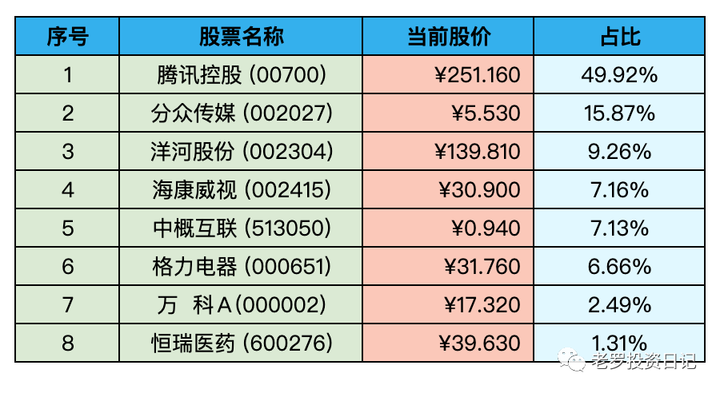

__微信公众号文章地址：[老罗实盘周记-20221127](https://mp.weixin.qq.com/s/lWaXEysNc4rYH0lCKIwKTg)__

```
老罗实盘周记，每周六更新。专注于股权投资、阅读、学习与个人成长，知行合一、日拱一卒、投资人生。微信公众号【老罗投资】，文章均首发于公众号。
```

### 1. 本周概述

+ 本周操作：<span class="red">无</span>
+ 年度收益：<span class="green">-17.86%</span>
+ 上周数据：<span class="green">-13.42%</span>

本周上证指数 +0.14%，深证成指 -2.47%，沪深300 -0.68%，恒生指数 -2.33%，恒生科技 -6.48%。

本周老罗的持仓 <span class="green">-4.44%</span>，今年收益率 <span class="green">-17.86%</span>，沪深300今年收益率为 <span class="green">-23.57%</span>，继续跑赢沪深300。

### 2. 持仓股票明细



其他还有少量宋城演义(300144)、京沪高铁(601816)，作为观察仓不记录。

### 3. 持股说明

持仓股票当前估值：

+ 腾讯控股(00700)属于低估。
+ 格力电器(000651)，海康威视(002415)、分众传媒(002027)属于便宜。
+ 洋河股份(002304)属于不算贵可以入的区间。

腾讯Q3财报公布之后，从11月18日一直到11月25日，连续6个交易日回购3.5亿港币股票，继续腾三五，如果股价继续下跌，再次出现腾六亿也不是不可能。今年腾讯累计回购已经超过250亿港币，确实是错误的报价，管理层进行大额的回购在当下也是最好的策略。

近期大股东南非报业减持了8000万股，南非报业持有腾讯股票20年，累计回报7000倍，回报率惊人。就如巴菲特所说，对一般人来说，一生能做对四到五次就能成功，买到优秀的公司股权，然后耐心等待，必定会有不错的收益。

央妈本周宣布将从12月5日起下调金融机构存款准备金率，这是今年第二次降准，释放大约5000亿元人民币的长期流动性，用以提振经济。降准利好银行和地产，所以银行、地产股在周五普遍有所上涨。
银行、地产股这两年一直在历史最低值附近徘徊，去年老罗也持有过一些银行股，主要是作为打新股的门票。但银行业一个是老罗不懂，对银行股没法做合理的估值；二是买银行股太像存定期了，每年的收益基本固定，所以去年卖出银行股换成了腾讯，持一年不含分红也就2%的收益，估计老罗以后也不会再持有银行股了，不懂的领域还是不要碰为好。

本周世界杯开幕，老罗连续几天熬夜看球，明显感觉不如年轻时恢复得那么快了，起床之后头疼+牙疼，看来为了身体还得早睡早起，有健康的身体才可能践行长期投资。

这次世界杯，老罗也没像往届一样投注买球，经过这几年的投资学习，对于胜率50%的投(du)资(qiu)再也不会轻易的下注了。

```
老罗实盘周记，每周六更新。专注于股权投资、阅读、学习与个人成长，知行合一、日拱一卒、投资人生。微信公众号【老罗投资】，文章均首发于公众号。
免责声明：本公众号只作为本人的投资日志记录，本文中提及的个股都有腰斩或血本无归的风险，本人不做任何投资建议，投资请坚持独立思考。
```

__微信公众号文章地址：[老罗实盘周记-20221127](https://mp.weixin.qq.com/s/lWaXEysNc4rYH0lCKIwKTg)__