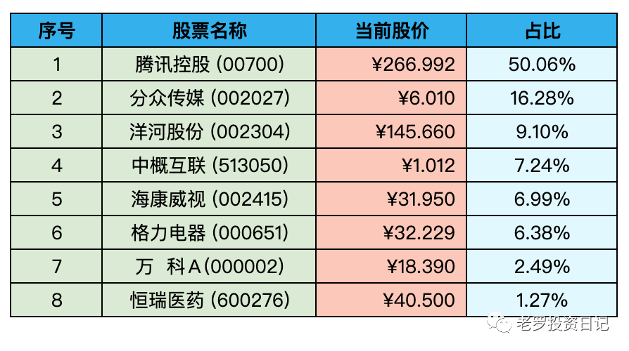

__微信公众号文章地址：[老罗实盘周记-20221203](https://mp.weixin.qq.com/s/Vd5AmKFIfspgn49O6t042Q)__

```
老罗实盘周记，每周六更新。专注于股权投资、阅读、学习与个人成长，知行合一、日拱一卒、投资人生。微信公众号【老罗投资】，文章均首发于公众号。
```

### 1. 本周概述

+ 本周操作：<span class="red">无</span>
+ 年度收益：<span class="green">-11.55%</span>
+ 上周数据：<span class="green">-17.86%</span>

本周上证指数 +1.76%，深证成指 +2.89%，沪深300 +2.52%，恒生指数 +6.27%，恒生科技 +10.81%。

本周老罗的持仓 <span class="red">+6.31%</span>，今年收益率 <span class="green">-11.55%</span>，沪深300今年收益率为 <span class="green">-21.65%</span>，继续跑赢沪深300。

### 2. 持仓股票明细



其他还有少量宋城演义(300144)、京沪高铁(601816)，作为观察仓不记录。

### 3. 持股说明

持仓股票当前估值：

+ 腾讯控股(00700)，格力电器(000651)属于便宜。
+ 海康威视(002415)属于不算贵可以入的区间。
+ 分众传媒(002027)，洋河股份(002304)上涨较多，现在买就不太合适了。

#### 3.1 分众分红

11月29日分众宣布分红计划，每10股派1.4元。今年持仓中受疫情影响最大的就是分众了，前三个季度利润下降明显，只有21.31亿人民币，预计全年利润在30亿人民币左右，还达不到2020年40亿人民币的水平。

这次分红总额达到了20.22亿人民币，几乎把前三个季度的归母净利润全部派发给了股东，管理层此举也是为了表明公司的现金流没有问题。

老罗拿到派息以后，可能会用于购买洋河股份(002304)，但洋河目前并不算便宜，需要耐心等待价格跌到140元左右，如果短期内达不到目标价，这笔分红可能丢在股票账号里赚货币基金收益。

疫情反复对广告业的影响是巨大的，好在最近有了明显的变化，对广告、旅游、餐饮等行业来说，最艰难的时候可能已经过去了。

#### 3.2 人民币升值

人民币汇率这一周上涨了接近1800点，即将破7。

升值的主要是由于美联储加息预期放缓，美元基本到底了，越来越多海外资金正在"抄底"中国资产，使得人民币汇率涨势持续扩大。还有就是防疫政策的不断优化，提升了金融市场对中国经济的信心。

#### 3.3 关于腾讯

最近腾讯涨得较多，已经突破老罗50%的持仓上限了，这种情况下并不会卖出强行控制仓位，而是在有新资金的情况下，配置其他低估公司股票，慢慢平衡持仓。

本周腾讯还是继续回购，基本还是在每天花出3.5亿港币，12月1号只花了1000万港币，买回3万多股，造成回购数量和金额的突然缩水，主要是由于港交所回购合规原因。港交所为了防止企业在二级市场交易者争夺利润，规定回购价格不能高于过去五个交易日平均价的5%，而如果股票上涨较快，可能导致能够满足回购条件的股票数量减少，从而导致总体回购规模减小。

腾讯的回购应该还会持续一段时间，继续享受占股份额慢慢变多的快乐。

```
老罗实盘周记，每周六更新。专注于股权投资、阅读、学习与个人成长，知行合一、日拱一卒、投资人生。微信公众号【老罗投资】，文章均首发于公众号。
免责声明：本公众号只作为本人的投资日志记录，本文中提及的个股都有腰斩或血本无归的风险，本人不做任何投资建议，投资请坚持独立思考。
```

__微信公众号文章地址：[老罗实盘周记-20221203](https://mp.weixin.qq.com/s/Vd5AmKFIfspgn49O6t042Q)__