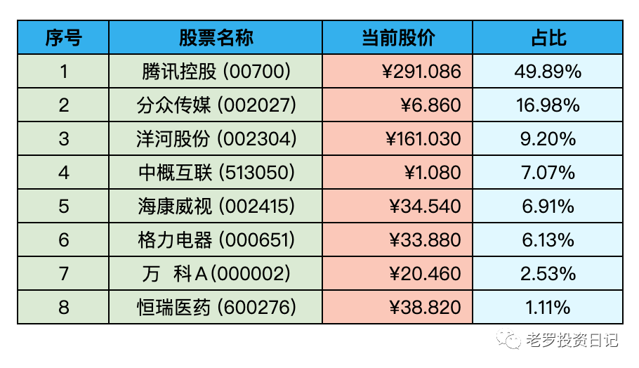
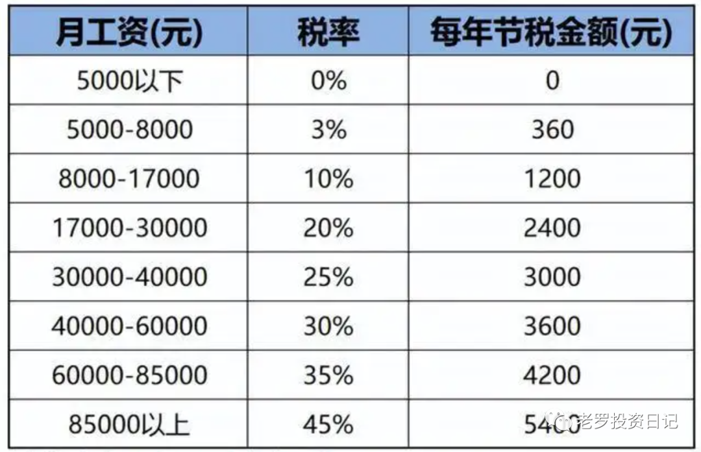

__微信公众号文章地址：[老罗实盘周记-20221210](https://mp.weixin.qq.com/s/GFZ7vLpuOgeB_gkONMbz3w)__

```
老罗实盘周记，每周六更新。专注于股权投资、阅读、学习与个人成长，知行合一、日拱一卒、投资人生。微信公众号【老罗投资】，文章均首发于公众号。
```

### 1. 本周概述

+ 本周操作：<span class="red">无</span>
+ 年度收益：<span class="green">-2.63%</span>
+ 上周数据：<span class="green">-11.55%</span>

本周上证指数 +1.61%，深证成指 +2.51%，沪深300 +3.29%，恒生指数 +6.56%，恒生科技 +12.65%。

本周老罗的持仓 <span class="red">+8.92%</span>，今年收益率 <span class="green">-2.63%</span>，沪深300今年收益率为 <span class="green">-19.07%</span>，依旧跑赢沪深300。

### 2. 持仓股票明细



其他还有少量宋城演义(300144)、京沪高铁(601816)，作为观察仓不记录。

### 3. 持股说明

持仓股票当前估值：

+ 腾讯控股(00700)，格力电器(000651)属于便宜可以入。
+ 海康威视(002415)属于不算贵可以入的区间。
+ 分众传媒(002027)，洋河股份(002304)上涨较多，现在适合观望。

#### 3.1 正式迈向结束疫情

12月7日，防疫新十条发布，本周最重要的事，没有之一。

之前老罗所在的楼出现了阳性病例，老罗正好赶上了封控的尾巴。在住户，居委会，大白的共同努力下，新十条发布后也顺利地解封了。

感谢医护工作者、各级工作人员、志愿者这三年的努力，才使新冠疫情的影响降到了最低。

之后的生活肯定会慢慢的转向正轨，每个人都要注意做好个人防护，保护好自己和他人的健康。

厚积了三年，我们也要薄发了，撸起袖子好好赚钱了！

#### 3.2 分众传媒

疫情结束对分众传媒的影响是明显的，本周上涨14.14%。防疫的进一步放开和宏观经济的恢复，有希望激活分众传媒广告客户的收入复苏，进而使得广告投放量逐渐向正常水平恢复，这些都有利于分众传媒后续业绩的改善。

12月15日将召开股东大会，主要是审议今年前三季度的利润分配方案，上周老罗已经谈过分红事宜(分红总额达到了20.22亿人民币，几乎把前三个季度的归母净利润全部派发给了股东)，在不影响经营现金流的情况下，分红给股东，举双手赞成即可。

#### 3.3 海康威视

海康最近又宣布分拆创新业务上市，旗下的机器人业务准备提交深交所上市，再加上之前的萤石，海康介时将拥有三家上市公司(或控股权)。

2022年上半年海康威视五大创新业务智能家居、机器人、热成像、汽车电子和存储业务，营收占比都在6%以下，但增速明显。

管理层可能是看到了创新业务良好的发展前景，试图通过分拆子公司上市，在创新业务做一些突破，同时主体公司在安防领域做进一步的聚焦。

后续的发展如何，还需要看分拆公司增速是否还能进一步提速，持续关注就好。

#### 3.4 个人养老金
个人养老金其实在十一月底就已经在三十六地试点，有些类似于美国的401K养老制度，不同点在于401K是个人企业分担，而我国的个人养老金是个人缴纳，国家免税。

作为打工人，老罗也在第一时间开通了个人养老金账户。个人养老金每年缴费金额最高为1.2万元，缴纳的这笔金额是可以抵扣相应的个税的，并且是税前扣除。同时投资收益暂不征税，可以用这笔钱投资相应的FOF养老基金，基本上是1-3年期的封闭基金，期满后可以卖出，再投资其他的基金。

个人养老金等到退休领取时，也是要交税的，税率是3%，而养老保险提取是要交7.5%的税，在提取税率上也有优惠。

哪些人适合交个人养老金呢？这就得看个人所得税税率在哪一档了，如果税率在3%或以下(工资低于8000)，相当于亏本买个人养老金了。具体的减税额度可以看下表：



#### 3.5 纪念江同志逝世

苟利国家生死以，岂因祸福避趋之。

```
老罗实盘周记，每周六更新。专注于股权投资、阅读、学习与个人成长，知行合一、日拱一卒、投资人生。微信公众号【老罗投资】，文章均首发于公众号。
免责声明：本公众号只作为本人的投资日志记录，本文中提及的个股都有腰斩或血本无归的风险，本人不做任何投资建议，投资请坚持独立思考。
```

__微信公众号文章地址：[老罗实盘周记-20221210](https://mp.weixin.qq.com/s/GFZ7vLpuOgeB_gkONMbz3w)__