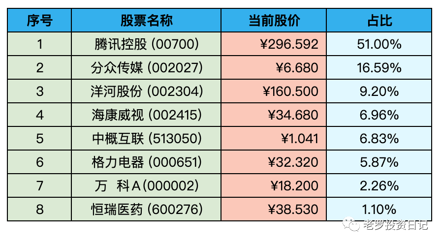

__微信公众号文章地址：[老罗实盘周记-20221217](https://mp.weixin.qq.com/s/K_0hbNLaIiMdR_5AFmnHtw)__

```
老罗实盘周记，每周六更新。专注于股权投资、阅读、学习与个人成长，知行合一、日拱一卒、投资人生。微信公众号【老罗投资】，文章均首发于公众号。
```

### 1. 本周概述

+ 本周操作：<span class="red">无</span>
+ 年度收益：<span class="green">-4.68%</span>
+ 上周数据：<span class="green">-2.63%</span>

本周上证指数 -1.22%，深证成指 -1.80%，沪深300 -1.10%，恒生指数 -2.26%，恒生科技 -5.04%。

本周老罗的持仓 <span class="green">-2.05%</span>，今年收益率 <span class="green">-4.68%</span>，沪深300今年收益率为 <span class="green">-19.96%</span>，依旧跑赢沪深300。

### 2. 持仓股票明细



其他还有少量宋城演义(300144)、京沪高铁(601816)，作为观察仓不记录。

### 3. 持股说明

持仓股票当前估值：

+ 腾讯控股(00700)，格力电器(000651)属于便宜可以入。
+ 海康威视(002415)属于不算贵可以入的区间。
+ 分众传媒(002027)，洋河股份(002304)上涨较多，现在适合观望。

#### 3.1 格力电器分红

格力电器(000651)2022年半年度分红每股分红1元，与前两年相同，2022年全年估计还会每股分2元左右。

格力属于受地产股影响很大的公司，房地产黄金十五年结束后，白色家电行业明显受到冲击。好在现在股价便宜，每年的分红也不断到账，老罗手上还有6%的持仓，估计短期内还是保持躺平不动。

#### 3.2 腾讯回购

最近腾讯还是保持一天回购3.5亿港币的节奏，最大股东也一直在卖卖卖，股价一直在320港币左右波动。

希望股价能在这个价位上多停留一阵，让腾讯多多回购，股东手上的股票不断增值。

#### 3.3 全面放开第二周

本周也是全面放开的第二周，身边感染新冠的人明显变多，老罗所在的邻居群，感染率达到了90%以上，基本上都是第三天非常难受，发烧睡不着，发烧减轻后就是嗓子像吞刀子，到第七天左右基本就都恢复正常了。

老罗目前还没有中招，打算近期去接种第四针加强疫苗，同时也尽量减少与他人的接触，做好自身的防护。保护自己，就是保护他人的健康。相信半年之后，疫情对生活的影响会越来越小，能回到19年疫情前的水平。

```
老罗实盘周记，每周六更新。专注于股权投资、阅读、学习与个人成长，知行合一、日拱一卒、投资人生。微信公众号【老罗投资】，文章均首发于公众号。
免责声明：本公众号只作为本人的投资日志记录，本文中提及的个股都有腰斩或血本无归的风险，本人不做任何投资建议，投资请坚持独立思考。
```

__微信公众号文章地址：[老罗实盘周记-20221217](https://mp.weixin.qq.com/s/K_0hbNLaIiMdR_5AFmnHtw)__