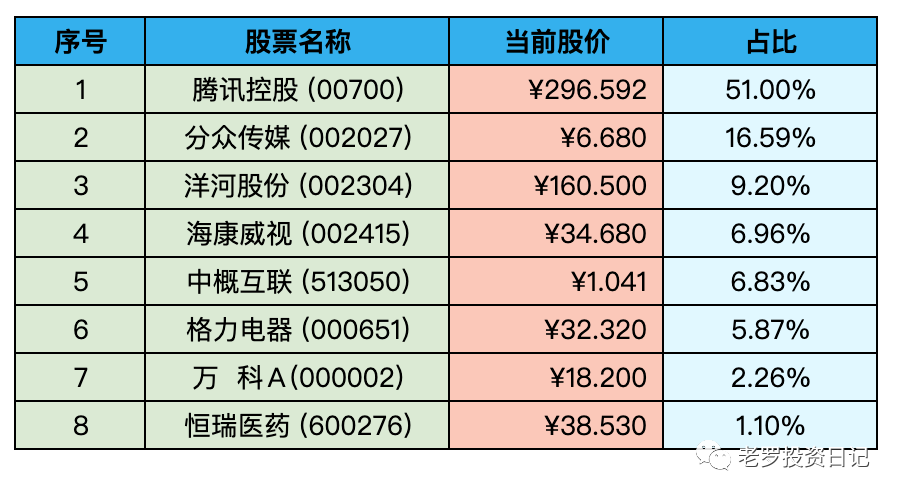

__微信公众号文章地址：[老罗实盘周记-20221231-年终总结](https://mp.weixin.qq.com/s/ezNEk1xubL-Iaanv-46QzQ)__

```
老罗实盘周记，每周六更新。专注于股权投资、阅读、学习与个人成长，知行合一、日拱一卒、投资人生。微信公众号【老罗投资】，文章均首发于公众号。
```

### 1. 本周概述red

+ 本周操作：<span class="red">无</span>
+ 年度收益：<span class="green">-2.58%</span>
+ 上周数据：<span class="green">-4.49%</span>

本周上证指数 +1.42%，深证成指 +1.53%，沪深300 +1.13%，恒生指数 +0.96%，恒生科技 +0.11%。

本周老罗的持仓 <span class="red">+1.86%</span>，今年收益率 <span class="green">-2.58%</span>，沪深300今年收益率为 <span class="green">-21.63%</span>，本年度大幅跑赢沪深300，老罗对今年的表现还算比较满意。

### 2. 持仓股票明细



其他还有少量宋城演义(300144)、京沪高铁(601816)，作为观察仓不记录。

### 3. 持股说明

持仓股票当前估值：

+ 腾讯控股(00700)，格力电器(000651)属于便宜可以入。
+ 海康威视(002415)属于不算贵可以入的区间。
+ 分众传媒(002027)，洋河股份(002304)上涨较多，现在适合观望。

#### 3.1 关于上周断更

上周老罗不幸感染了新冠病毒，从周六开始发烧，温度最高达到了39度，一直在卧床休息，实在是没有精力去更新投资周报了。

老罗虽然打了第四针疫苗，可能因为接种的时间太短，还没有产生疫苗免疫应答。在新冠和疫苗的双重夹击下，症状反而更加明显与集中，第一天就发烧、咳嗽、流鼻涕、水泥鼻+浑身疼痛。

经过七天的病程，老罗目前还是水泥鼻、咳嗽，完全好利索可能还需要一段时间。奥密克戎真是专治不服，能不得就不要得，能晚得一定要晚得，太难受了。

#### 3.2 腾讯获得六个游戏版号

12月份过审了84款国产游戏，44款进口游戏，汇总今年一整年，一共有512个游戏获得到游戏版号。

腾讯在12月获取了6个游戏版号，分别是《合金弹头：觉醒》、《重生边缘》、《饥荒：新家园》、《健康保卫战》、《宝可梦大集结》、《无畏契约》。其中的《宝可梦大集结》、《无畏契约》都属于游戏大作，在海外有着很高的知名度，有概率在明年成为腾讯的重点游戏。

总的来说，腾讯在2023年游戏方面应该有一个不错的开局，游戏领域依然会是小企鹅一个重要的现金流来源。

#### 3.3 分众传媒收到政府补助6.72亿

在昨天(12.30)收盘之后，分众传媒发布公告，从2022年至今，公司及子公司累计收到与收益相关的政府补助为6.72亿元(未经审计)，占公司最近一个会计年度净利润10%以上。

今年分众的利润原本预计是32亿左右，如果加上这6个多亿，达到38亿左右，算30倍PE，当前合理市值在1140亿，以分众现在965亿的市值来说，现在估值还是比较安全，这还是分众今年受疫情严重影响的情况下，利润下降明显拿到的成绩。

当然目前的估值离合适的买入价格还是有一定的距离，今年的最后两个月分众的涨幅比较大，老罗目前就是持有观望的态度。明年疫情完全结束后，还是比较看好分众能回归到之前的盈利水平之上。

#### 3.4 老罗年度总结

2022年老罗的过得并不算太顺利，也许能算得上是老罗这几十年来过得比较艰难的一年了。人到中年，家庭、事业、身体健康问题全方面暴露出来，年轻时不需要关注的事情一个个地冒了出来。老罗也是被搞得焦头烂额，不过总算一路咬牙坚持下来了。

这些问题都会碰到，并不是老罗的个例，这也是老罗今年大部分精力转向价值投资的主要动因。随着年龄的增长，主动收入的增长会慢慢地趋于平稳，被动收入慢慢地要占到收入的较大比例。如果碰到疾病、裁员这种不可预料的风险，如果有一份稳定的被动收入，也能做到手中有粮，心里不慌。

投资的目标是为了什么？我想投资的终极目标是提升生活的质量，并且让自己的人生能有更多的选择。

#### 3.5 书籍推荐

今年老罗读的书不算少，今天统计了一共有138本，老罗读书比较杂，投资、传记、历史、哲学、科幻都有所涉猎。这138本书中，有几本书还是很不错的，记录一下：

+ 知行合一王阳明
+ 伯克希尔股东大会问答
+ 为什么是中国
+ 像巴菲特一样投资-半小时漫画价值投资
+ 巴菲特之道
+ 谁动了我的奶酪2
+ 猫和狗的生活哲学
+ 一本书看透价值投资
+ 投资至简-从原点出发构建价值投资体系
+ 纳瓦尔宝典
+ 活着
+ 查理·芒格的原则
+ 小胖财富历险记
+ 巴菲特的嘉年华-伯克希尔股东大会的故事
+ 三个存钱罐-金融学教授的儿童财商启蒙课
+ 投资中最简单的事
+ 火眼金睛读财报
+ 更富有、更睿智、更快乐
+ 怎样选择成长股
+ 财富是认知的变现

#### 3.6 2023新年快乐

还有几个小时2022年就要过去了，愿2023年的我们，能够做喜欢的事，爱值得的人，活得尽兴且快乐，过得恣意而洒脱。

祝大家新年快乐，皆得所愿！

```
老罗实盘周记，每周六更新。专注于股权投资、阅读、学习与个人成长，知行合一、日拱一卒、投资人生。微信公众号【老罗投资】，文章均首发于公众号。
免责声明：本公众号只作为本人的投资日志记录，本文中提及的个股都有腰斩或血本无归的风险，本人不做任何投资建议，投资请坚持独立思考。
```

__微信公众号文章地址：[老罗实盘周记-20221231-年终总结](https://mp.weixin.qq.com/s/ezNEk1xubL-Iaanv-46QzQ)__