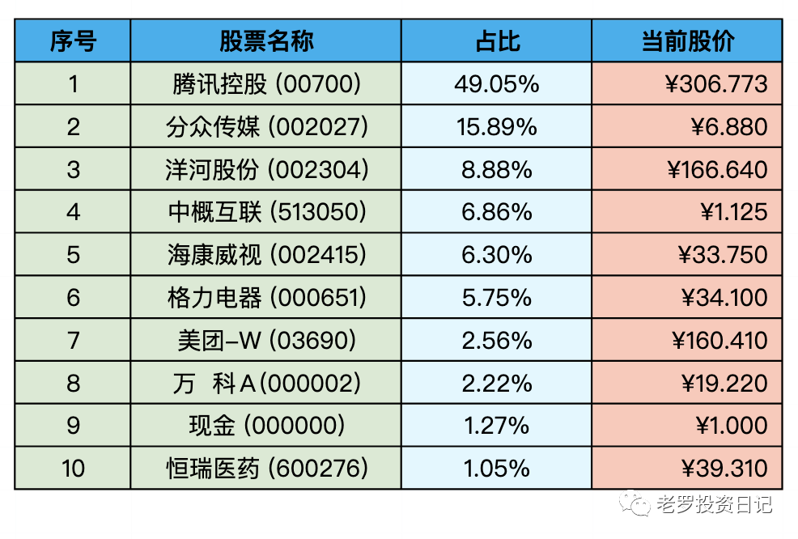
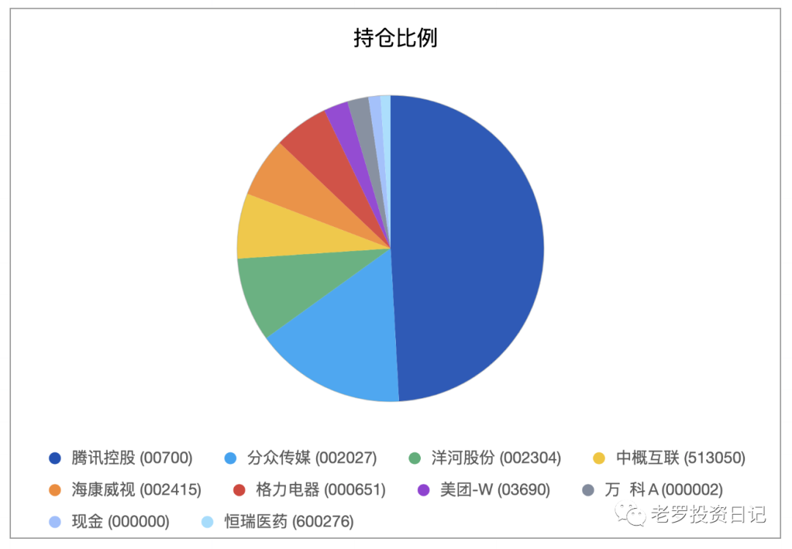

__微信公众号文章地址：[老罗实盘周记-20230107](https://mp.weixin.qq.com/s/eNCyv1WtgnL8rMPi01qw8w)__

```
老罗实盘周记，每周六更新。专注于股权投资、阅读、学习与个人成长，知行合一、日拱一卒、投资人生。微信公众号【老罗投资】，文章均首发于公众号。
```

### 1. 本周概述red

+ 本周操作：<span class="red">无</span>
+ 年度收益：<span class="red">+5.66%</span>

本周上证指数 +2.21%，深证成指 +3.19%，沪深300 +2.82%，恒生指数 +6.12%，恒生科技 +7.32%。

本周老罗的持仓 <span class="red">+5.66%</span>，今年收益率 <span class="red">+5.66%</span>，沪深300今年收益率为 <span class="red">+2.82%</span>，2023年第一周继续跑赢沪深300。

### 2. 持仓股票明细





其他还有少量宋城演义(300144)、京沪高铁(601816)，作为观察仓不记录。

### 3. 持股说明

持仓股票当前估值：

+ 格力电器(000651)属于便宜可以入。
+ 腾讯控股(00700)，海康威视(002415)属于还不算贵可以少量入的区间。
+ 分众传媒(002027)，洋河股份(002304)上涨较多，现在适合观望。

#### 3.1 腾讯除权

1月5日腾讯除权，每10股腾讯股票派发1股美团B股股票，腾讯的股价由前一天的收盘价调整为：腾讯收盘价-(美团收盘价/10)。

但美团的股票需要3月24日才能派发股票，港股通账号估计3月27日才能到账，中间会有一个除权了但没有收到股票的时间。在3月底收到美团股票后，港股通账户可以直接卖出。

所以老罗先把分到的美团股票虚拟加入持仓之中，占比大约是整个持仓的2.5%。最近美团股票价格的涨跌，都会对整体收益产生小小的影响。

老罗同时也把现金纳入到了持仓之中进行统计，也是为了加深对“All cash is equal”理论的理解。

#### 3.2 海康回购

海康1月4日宣布公司回购股票已经完成，在22年9月16日到23年1月4日之间，累计回购了6699万股，占总股本的比例0.71%，耗资20.4亿元，基本完成去年9月份的回购计划，这也是海康第一次进行的股票回购行动。

海康在22年受美国制裁传言、国内外需求降低等负面影响，股价大跌了31.82%，现在还是处于不算贵的区间。但老罗对海康的设定的持仓上限是10%以下，目前的价格吸引力也不算太大，所以暂时还只会观望，继续平躺。

#### 3.3 新冠乙类乙管

从明天开始，新冠病毒感染由乙类甲管调整为乙类乙管。新冠病毒感染者不再实行隔离措施，不再判定密切接触者；不再划定高低风险区；对新冠病毒感染者实施分级分类收治并适时调整医疗保障政策；检测策略调整为愿检尽检；调整疫情信息发布频次和内容。依据国境卫生检疫法，不再对入境人员和货物等采取检疫传染病管理措施。这是续上个月发布的新十条后，又一个里程碑。

老罗也明显感觉到了身边的变化，公司恢复办公，街上的人明显多了起来，开始堵车了，堂食吃饭的人也络绎不绝，生活慢慢地回归到了正轨。

从十一月底开始居家隔离，老罗基本足不出户，头发居然长过了耳朵，这也是近十年来头发留得最长的阶段。出门理了一个毛寸，顿时觉得神清气爽，最困难的时候，应该是已经渡过了。

```
老罗实盘周记，每周六更新。专注于股权投资、阅读、学习与个人成长，知行合一、日拱一卒、投资人生。微信公众号【老罗投资】，文章均首发于公众号。
免责声明：本公众号只作为本人的投资日志记录，本文中提及的个股都有腰斩或血本无归的风险，本人不做任何投资建议，投资请坚持独立思考。
```

__微信公众号文章地址：[老罗实盘周记-20230107](https://mp.weixin.qq.com/s/eNCyv1WtgnL8rMPi01qw8w)__