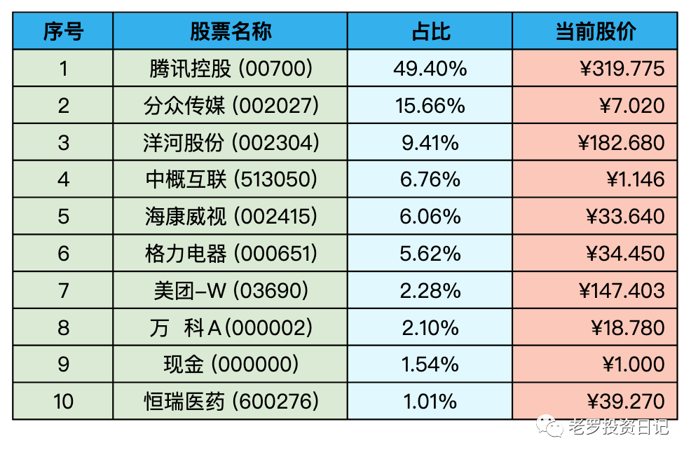
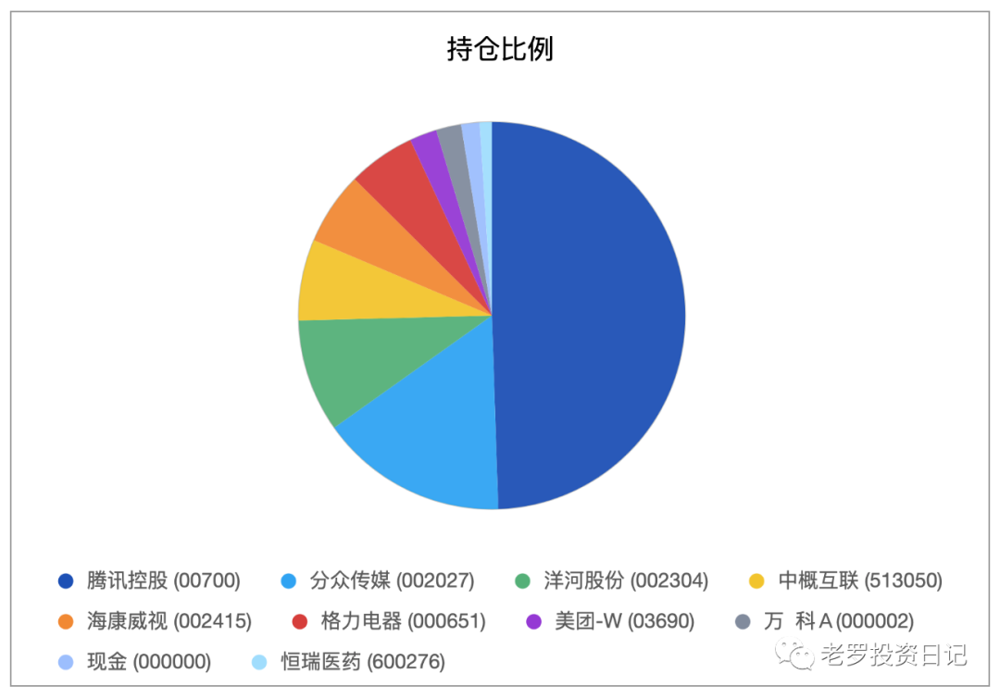
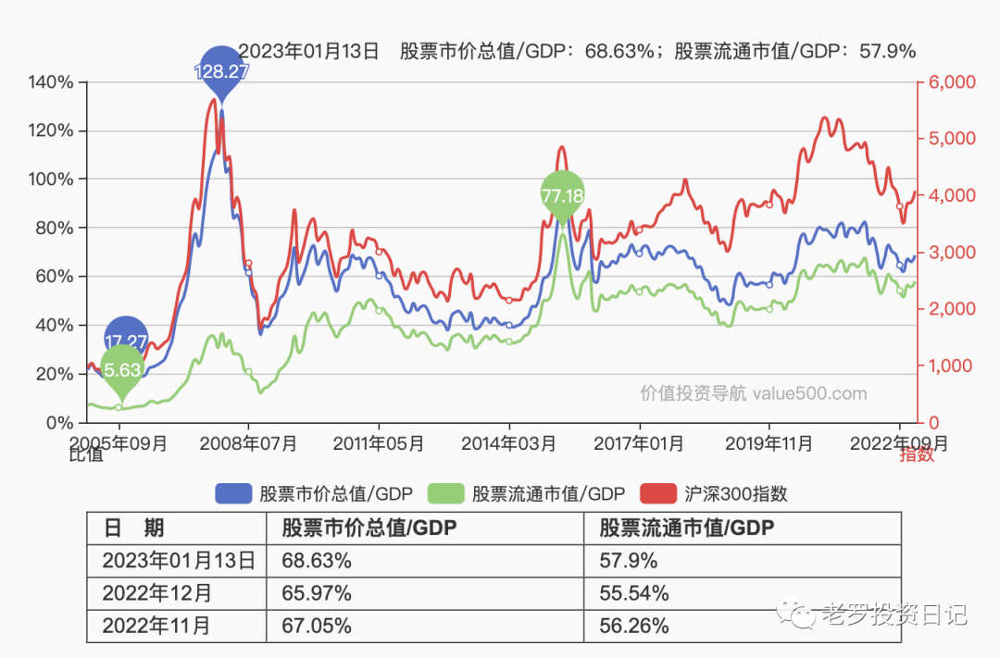

__微信公众号文章地址：[老罗实盘周记-20230114](https://mp.weixin.qq.com/s/RrFtAFE__90KxQuRkYmz_Q)__

```
老罗实盘周记，每周六更新。专注于股权投资、阅读、学习与个人成长，知行合一、日拱一卒、投资人生。微信公众号【老罗投资】，文章均首发于公众号。
```

### 1. 本周概述red

+ 本周操作：<span class="red">无</span>
+ 年度收益：<span class="red">+9.54%</span>
+ 上周数据：<span class="red">+5.66%</span>

本周上证指数 +1.19%，深证成指 +2.06%，沪深300 +2.35%，恒生指数 +3.56%，恒生科技 +2.79%。

本周老罗的持仓 <span class="red">+3.88%</span>，今年收益率 <span class="red">+9.54%</span>，沪深300今年收益率为 <span class="red">+5.24%</span>，继续跑赢沪深300。

### 2. 持仓股票明细





其他还有少量宋城演义(300144)、京沪高铁(601816)，作为观察仓不记录。

### 3. 持股说明

持仓股票当前估值：

+ 格力电器(000651)属于便宜可以入。
+ 海康威视(002415)，腾讯控股(00700)属于不算贵可以入的区间。
+ 分众传媒(002027)，洋河股份(002304)上涨较多，现在适合观望。

#### 3.1 北向资金涌入

北向资金近20个交易日涌入了1138亿人民币，外资纷纷唱多中国资产，表示看好A股今年的表现，并且用真金白银加仓A股市场。

从大A当前的巴菲特指数68.63%来看，A股确实非常的便宜，现在买入也有比较大的胜率。当然现在的买入机会没有2022年10月那么好，当时的巴菲特指数在62%左右，属于极度低估，这么好的买入机会，一般几年才会出现一次。当然错过了也不用纠结，市场就像钟摆，只要有耐心，总会有回归便宜的时候。



> 巴菲特指数是什么？

> 巴菲特指数也有人称之为巴菲特指标，它计算基于美国股市的市值与衡量国民经济发展状况的国民生产总值(GNP)。巴菲特认为，若两者之间的比率处于70%至80%的区间之内，这时买进股票就会有不错的收益。但如果在这个比例偏高时买进股票，就等于在“玩火”。

#### 3.2 分众传媒分红到账

周二晚(1月10日)分众传媒分红到账，分众这次分红合计是20.22亿元，每股派息0.14元，税后是0.126元。周三除权除息，分红不但没让股价下跌，本周反而上涨了4.15%。

这笔分红老罗打算分给洋河，但目前洋河股价超出买点比较多，暂时先躺在股票账号里吃利息。

#### 3.3 《王者荣耀》蝉联全球手游畅销榜冠军

> Sensor Tower 商店情报数据显示，2022年12月腾讯《王者荣耀》在全球App Store和Google Play吸金近2亿美元，蝉联全球手游畅销榜冠军。来自中国iOS市场的收入占94.4%，海外市场收入占比为5.6%。

《王者荣耀》赚钱能力依然恐怖，全年收入超过22亿美元，同比去年增长了4.6亿美元。自2015年发售以来，累计的营收也超过了100亿美元，这个成绩已经是前无古人了。

MOBA游戏属于生命周期较长的游戏类型，老罗预计《王者荣耀》还能继续为腾讯今后几年创造不少的收入。并且腾讯在2022年底新获取的游戏版号中，也有很不错的游戏，游戏这块业务的竞争优势依然比较明显。

本周腾讯继续回购，其中有三天的回购金额达到了3.5亿港币。企鹅371.4的价格已经超出买点10%左右，并且老罗的腾讯已经达到持仓上限，继续躺平不动。

```
老罗实盘周记，每周六更新。专注于股权投资、阅读、学习与个人成长，知行合一、日拱一卒、投资人生。微信公众号【老罗投资】，文章均首发于公众号。
免责声明：本公众号只作为本人的投资日志记录，本文中提及的个股都有腰斩或血本无归的风险，本人不做任何投资建议，投资请坚持独立思考。
```

__微信公众号文章地址：[老罗实盘周记-20230114](https://mp.weixin.qq.com/s/RrFtAFE__90KxQuRkYmz_Q)__