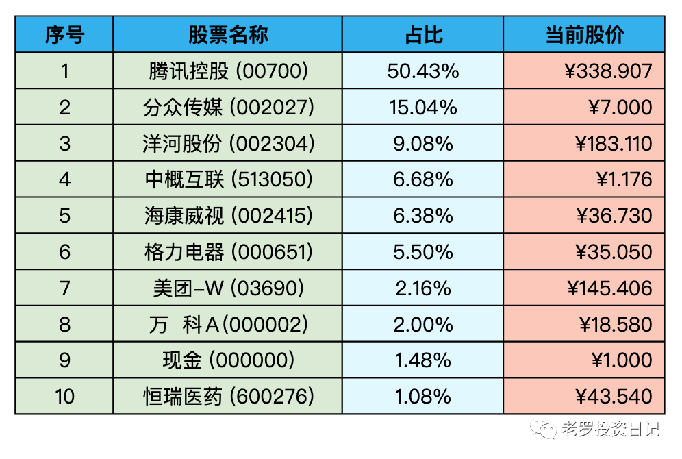
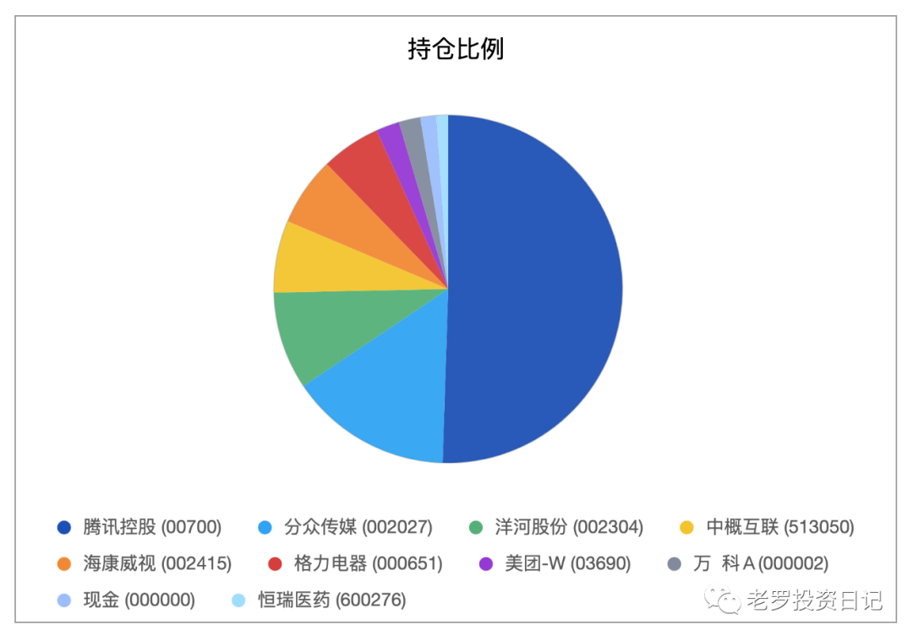

__微信公众号文章地址：[老罗实盘周记-20230121-兔年大吉](https://mp.weixin.qq.com/s/DtQqfliMFsY1-DRJa4evPQ)__

```
老罗实盘周记，每周六更新。专注于股权投资、阅读、学习与个人成长，知行合一、日拱一卒、投资人生。微信公众号【老罗投资】，文章均首发于公众号。
```

### 1. 本周概述red

+ 本周操作：<span class="red">无</span>
+ 年度收益：<span class="red">+13.64%</span>
+ 上周数据：<span class="red">+9.54%</span>

本周上证指数 +2.18%，深证成指 +3.26%，沪深300 +2.63%，恒生指数 +1.41%，恒生科技 +0.31%。

本周老罗的持仓 <span class="red">+4.10%</span>，今年收益率 <span class="red">+13.64%</span>，沪深300今年收益率为 <span class="red">+8.00%</span>，依旧跑赢沪深300。

### 2. 持仓股票明细





其他还有少量宋城演义(300144)、京沪高铁(601816)，作为观察仓不记录。

### 3. 持股说明

持仓股票当前估值：

+ 格力电器(000651)属于便宜可以入。
+ 海康威视(002415)属于不算贵可以入的区间。
+ 腾讯控股(00700)，分众传媒(002027)，洋河股份(002304)上涨较多，现在适合观望。

#### 3.1 春节前一周腾讯继续回购

春节前的这一周(1.16-.1.19)，企鹅依然每天(除了20号)回购3.5亿港币，平均每天回购90万股，成本在370港币左右。1月20日公告宣布要发行977万股作为员工激励，相当于10天回购的份额。

除了回购，腾讯其他各项都比较平稳，在经历过严厉的A4纸考验之后，股价也从188.6港币爬到了391.8港币，两个半月翻倍。

#### 3.2 分众发布年报预告

分众的年报预计是在4月29日正式发布，20号分众发布公告，预计2022年全年利润为27.71亿-28.51亿元，同比下降52.98%-54.3%。

疫情影响广告行业受到冲击非常之大，很多广告主缩减了广告预算，利润腰斩也在正常预测的范围之内，所以预告发布之后，股价的影响非常之小。

#### 3.3 2022年GDP增涨3%

1月17日，国新办举行2022年国民经济运行情况新闻发布会，国家统计局就GDP、消费、就业等给予解答和展望。2022年，我国经济总量突破120万亿元，达到121万亿元，这是继2020年、2021年连续突破100万亿元、110万亿元之后，又跃上新的台阶。按年均汇率计算，120万亿元折合美元约18万亿美元，稳居世界第二位。从人均水平来看，2022年我国人均GDP达到了85698元，比上年实际增长3%。按年平均汇率折算，达到12741美元，连续两年保持在1.2万美元以上。

周二发布的GDP数据，略低于预期，应该是12月份的全面放开，大多数人在家休息对经济还是产生了一定的影响。老罗觉得这个数据还算不错，毕竟去年经历了那么多的困难，也算拿到了不错的成绩单。

在经历阵痛之后，能感觉到明显转变，最明显的就是人民币大幅度升值，进入2023年的这半个月以来，人民币对美元已经升值了近4%，说明大家对中国经济的基本面有了很大的信心。同时美国加息预期的降低，大量的外资也涌入购买低估的优质资产，最近20天北向资金高达1261亿，比2020年一整年还要多。

人民币升值对老罗的持仓还是有一定影响，港币与美元基本挂钩，持有的腾讯的成本也在不断的增涨，降低了一些收益。

#### 3.4 春节快乐

时间如白驹过隙转瞬即逝，春节对于中年人老罗来说，代表又虚度了一岁，头顶的白发又增添了几分，反倒有几分伤感。

虎年很快就要过去了，这一年里经历了太多，虽然很困难，但困难总能过去。老罗会在兔年里继续努力，日拱一卒，做更好的自己。

最后祝大家兔年春节快乐，身体健康，万事如意，慢慢变富。

前兔似锦年年好，大展宏兔步步高！

Happy Chinese new year！

```
老罗实盘周记，每周六更新。专注于股权投资、阅读、学习与个人成长，知行合一、日拱一卒、投资人生。微信公众号【老罗投资】，文章均首发于公众号。
免责声明：本公众号只作为本人的投资日志记录，本文中提及的个股都有腰斩或血本无归的风险，本人不做任何投资建议，投资请坚持独立思考。
```

__微信公众号文章地址：[老罗实盘周记-20230121-兔年大吉](https://mp.weixin.qq.com/s/DtQqfliMFsY1-DRJa4evPQ)__