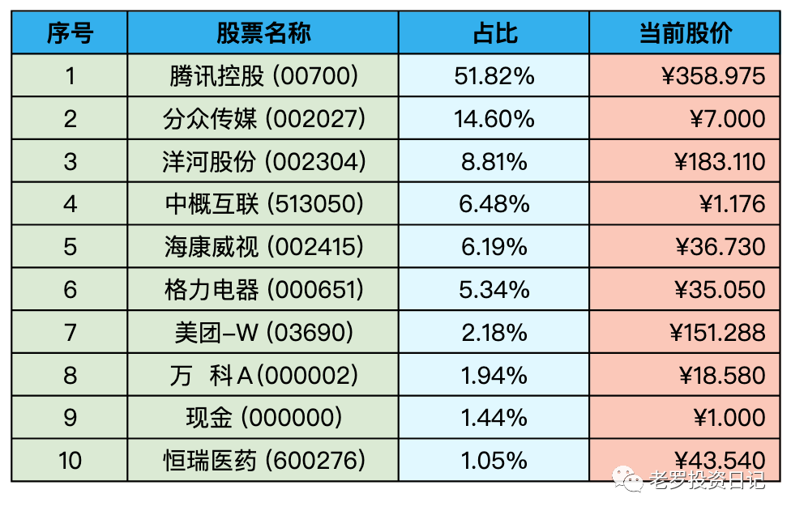
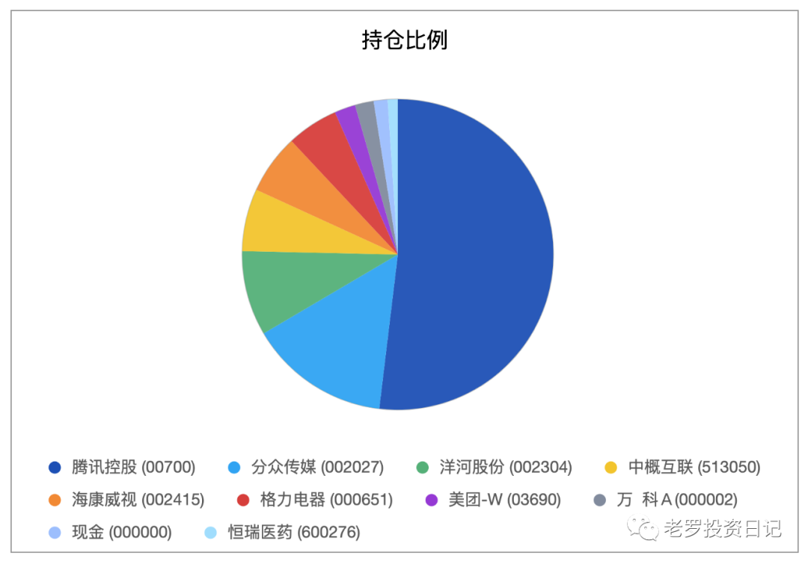

__微信公众号文章地址：[老罗实盘周记-20230128](https://mp.weixin.qq.com/s/Yk0iZvV7LrOgcE7hbn7mYw)__

```
老罗实盘周记，每周六更新。专注于股权投资、阅读、学习与个人成长，知行合一、日拱一卒、投资人生。微信公众号【老罗投资】，文章均首发于公众号。
```

### 1. 本周概述

+ 本周操作：<span class="red">无</span>
+ 年度收益：<span class="red">+17.14%</span>
+ 上周数据：<span class="red">+13.64%</span>

本周春节假期，A股不开盘，恒生指数 +2.92%，恒生科技 +5.35%。

本周老罗的持仓 <span class="red">+3.50%</span>，今年收益率 <span class="red">+17.14%</span>，沪深300今年收益率为 <span class="red">+8%</span>。兔年开了个好头，依旧跑赢沪深300。

### 2. 持仓股票明细





其他还有少量宋城演义(300144)、京沪高铁(601816)，作为观察仓不记录。

### 3. 持股说明

持仓股票当前估值：

+ 格力电器(000651)属于便宜可以入。
+ 海康威视(002415)属于不算贵可以入的区间。
+ 腾讯控股(00700)，分众传媒(002027)，洋河股份(002304)上涨较多，现在适合观望。

#### 3.1 腾讯回到四百港币

10月底跌破200港币的腾讯，怎么看也是市场先生送钱。老罗在200港币左右对腾讯进行了加仓，一直加到了45%的仓位，具体的可以参见老罗实盘周记-20221029。当时计划腾讯如果还下跌，会继续买买买，一直买到50%的最高仓位为止。

没想到短短三个月，腾讯股价翻倍，市场先生虽然疯狂，经常会给出一些离谱的报价，但是清醒得也很快，很快就恢复到了正常的报价，老罗也失去了再上车的机会。

当时老罗的年度收益达到了去年的最低点-34.92%，做出主要贡献的就是小企鹅。市值跌去三分之一，白花花的银子就这么赔出去了，一点不慌也是不可能的，毕竟老罗还是一介肉身凡胎，俗人一个。

话归正题，腾讯今年的开局不错。第一个是《三体》1月15号首播，收视与评价都不错。第二个是拿到新的游戏版号，游戏方面的收入企稳。第三个是视频号直播春晚的观看人数达到了1.9亿人次，高于去年的1.2亿人次，视频号的商业化稳步进行，广告方面的收入今年应该有较大的提升。

总的来说，腾讯当前3.43万亿(人民币)的市值，还远未达到它的合理估值范围，企鹅老罗会继续持有不动。

#### 3.2 兔年开工大吉

今天也是兔年开工的第一天，大多数人在去年的日子都不好过，很多企业降本增效搞裁员，很多打工人春节前待业中，很多企业家也赚钱不易，艰难维持。大家都憋着一股劲，想在今年撸起袖子拼命干，还出了个新词叫“报复性赚钱”。

老罗稍微总结了下自己赚钱的方法，简单来说就是保主业、拓副业、杜绝超前消费。主业是稳定现金流的来源，暂时轻易不能放弃。副业目前主要是投资，而且主要是股票+基金投资，老罗自认为已经找到了可行并且是唯一可行的道路，方向对了，剩下的只需要不断扩展自己的能力圈。最后一点超前消费没有什么兴趣，钱基本都花在了吃穿用度等正常的支出上了。

老罗在兔年计划再想想其他副业，多建立几条现金流“管道”，“管道”越多越不会感到焦虑，毕竟经济基础决定上层建筑，老罗一直坚信真正的自由，是拥有选择的权力。

```
老罗实盘周记，每周六更新。专注于股权投资、阅读、学习与个人成长，知行合一、日拱一卒、投资人生。微信公众号【老罗投资】，文章均首发于公众号。
免责声明：本公众号只作为本人的投资日志记录，本文中提及的个股都有腰斩或血本无归的风险，本人不做任何投资建议，投资请坚持独立思考。
```

__微信公众号文章地址：[老罗实盘周记-20230128](https://mp.weixin.qq.com/s/Yk0iZvV7LrOgcE7hbn7mYw)__