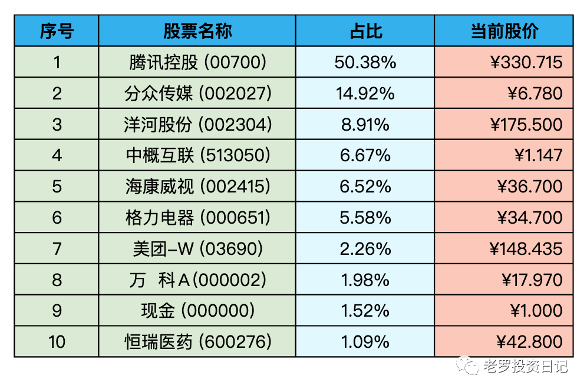
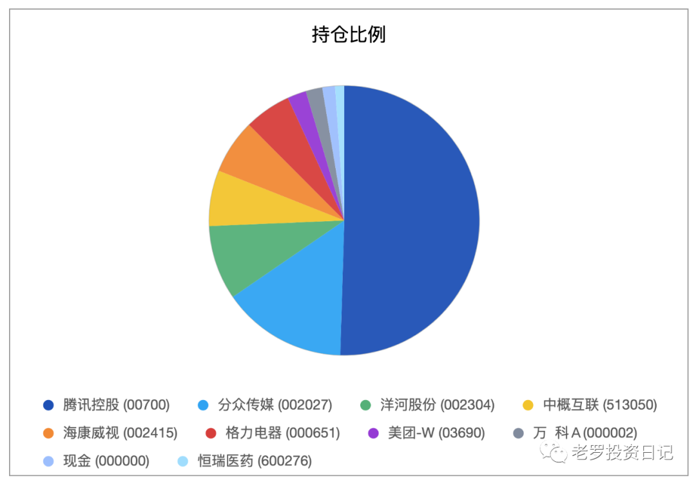

__微信公众号文章地址：[老罗实盘周记-20230204](https://mp.weixin.qq.com/s/fQMJRUT_3UgwaAuqXZRP8A)__

```
老罗实盘周记，每周六更新。专注于股权投资、阅读、学习与个人成长，知行合一、日拱一卒、投资人生。微信公众号【老罗投资】，文章均首发于公众号。
```

### 1. 本周概述

+ 本周操作：<span class="red">无</span>
+ 年度收益：<span class="red">+10.81%</span>
+ 上周数据：<span class="red">+17.14%</span>

本周上证指数 -0.04%，深证成指 +0.61%，沪深300 -0.95%，恒生指数 -4.53%，恒生科技 -3.72%。

本周老罗的持仓 <span class="green">-6.33%</span>，今年收益率 <span class="red">+10.81%</span>，沪深300今年收益率为 <span class="red">+6.97%</span>，小幅跑赢沪深300。

### 2. 持仓股票明细





其他还有少量宋城演义(300144)、京沪高铁(601816)，作为观察仓不记录。

### 3. 持股说明

持仓股票当前估值：

+ 腾讯控股(00700)，格力电器(000651)属于不算贵可以入的区间。
+ 分众传媒(002027)，洋河股份(002304)、海康威视(002415)现在适合观望。

本周下调了海康微视与格力电器的三年后估值。

+ 格力电器三年后估值下调到3600亿。
+ 海康微视三年后估值下调到5000亿。

#### 3.1 A股全面注册制

> 全面注册制来了！2月1日，中国证监会就全面实行股票发行注册制涉及的《首次公开发行股票注册管理办法》等主要制度规则草案公开征求意见。这标志着经过4年的试点后，股票发行注册制将正式在全市场推开，开启全面深化资本市场改革的新局面，为资本市场服务高质量发展打开更广阔的空间。

> 证监会指出，注册制改革的本质是把选择权交给市场，强化市场约束和法治约束。说到底，是对政府与市场关系的调整。与核准制相比，不仅涉及审核主体的变化，更重要的是充分贯彻以信息披露为核心的理念，发行上市全过程更加规范、透明、可预期。

全面注册制后，新股会更多，新股发行的定价会更市场化，以前打新那种基本不赔的局面不会再有了，也不能再将打新作为稳定获利的途径。

新股数量变多，投资的可选择性也更多，当然踩雷的概率也会变得更大。老罗没有投资新股的能力，选股的原则依旧是上市五年以上的公司，所以A股全面注册制对老罗的影响基本为0。

#### 3.2 延迟退休

> 延迟退休问题，一直是大家非常关注的话题。近日，中信证券发布文章称“渐进式延迟退休方案或于2023年公布”、“2025年正式实施”。这一时间安排确实跟很多专家估计的差不多。

首先不管消息的可靠性，看看隔壁法国也在推行64岁退休的方案，在人口老龄化的国家，养老金不足的情况越来越成为一个严重的问题，延迟退休也就势在必行了。

老罗认为唯一的出路，是在年轻时多投放精力学习，多铺设几条现金流“管道”，当主动收入不是最主要的收入来源，被动收入就能满足日常的生活需求，像延迟退休、子女教育、赡养老人、自己养老等也不再是需要关心的问题了。

80后、90后真是悲催的一代，上学卷完上班卷，三十五岁在公司被嫌年纪大，想要六十岁退休又嫌太年轻要多干上个几年才能退。

#### 3.3 腾讯暂停回购

春节前腾讯一直在买买买，基本每天花费3.5亿港币用来回购，同时股价也一路涨涨涨。

但突然在1月19日后就停止回购了，这是什么原因呢？原来港股在年报发布前的两个月是静默期，不允许有回购等交易，而腾讯22年的财报预计是在3月22日发布，1月22日正好赶上了春节假期，所以1月20日就是静默期前的最后一个交易日了(1月20日当天没有回购，当天实施奖励计划发行了新股977万股)。

```
老罗实盘周记，每周六更新。专注于股权投资、阅读、学习与个人成长，知行合一、日拱一卒、投资人生。微信公众号【老罗投资】，文章均首发于公众号。
免责声明：本公众号只作为本人的投资日志记录，本文中提及的个股都有腰斩或血本无归的风险，本人不做任何投资建议，投资请坚持独立思考。
```

__微信公众号文章地址：[老罗实盘周记-20230204](https://mp.weixin.qq.com/s/fQMJRUT_3UgwaAuqXZRP8A)__