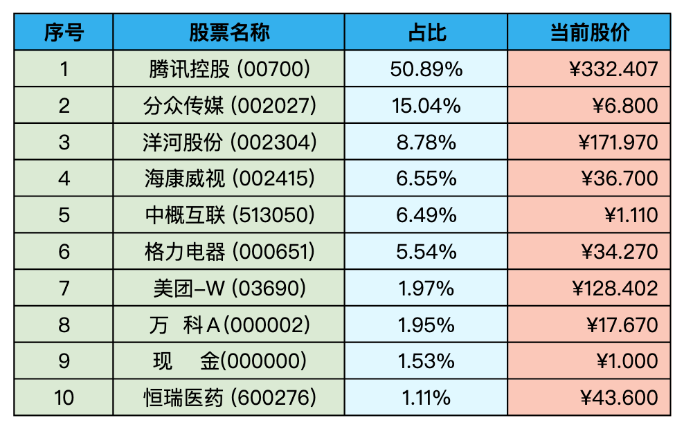
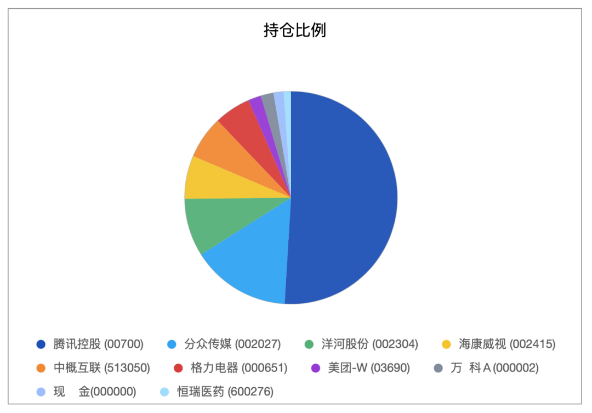

__微信公众号文章地址：[老罗实盘周记-20230211](https://mp.weixin.qq.com/s/DqMujzGfceFoYDWk9C4_8w)__

```
老罗实盘周记，每周六更新。专注于股权投资、阅读、学习与个人成长，知行合一、日拱一卒、投资人生。微信公众号【老罗投资】，文章均首发于公众号。
```

### 1. 本周概述

+ 本周操作：买入银华日利ETF(511880)货币基金，买入价格为100.285人民币。
+ 年度收益：<span class="red">+10.17%</span>
+ 上周数据：<span class="red">+10.81%</span>

本周上证指数 -0.08%，深证成指 -0.64%，沪深300 -0.85%，恒生指数 -2.17%，恒生科技 -5.87%。

本周老罗的持仓 <span class="green">-0.64%</span>，今年收益率 <span class="red">+10.17%</span>，沪深300今年收益率为 <span class="red">+6.06%</span>。

### 2. 持仓股票明细





最近没有特别吸引人的公司股票可以买入，所以将现金换成货币基金，比存券商的理财产品多亿点点收益(银华日利ETF基金年化收益率在2.5%-3.0%之间)，在老罗的实盘账号里当做现金等价物汇总，不再单独列项计算。

其他还有少量宋城演义(300144)、京沪高铁(601816)，作为观察仓不记录。

### 3. 持股说明

持仓股票当前估值：

一、格力电器(000651)属于便宜可以入。

二、腾讯控股(00700)，海康威视(002415)属于不算贵可以入的区间。

三、分众传媒(002027)，洋河股份(002304)上涨较多，现在适合观望。

#### 3.1 抖音全国上线外卖业务

最近一条抖音将在3月1日上线全国外卖平台的消息登上热搜，抖音官方第一时间是否认了这条消息，称目前仍然只在北京、上海、成都试点外卖业务，全国上线暂无时间表。

这条消息影响最大的就是美团(03690)了，本周跌幅达到了-14.29%，市值跌去千亿港币，老罗从腾讯分红到的美团股票也缩水不少。

本来原计划3月份到手后持有一阵，但考虑到自己对美团这个公司确实不了解，修改为到手后就卖出，买入银华日利。

#### 3.2 禁酒令

中国人保财险党委办在1月30日发布了《关于印发禁酒令的通知》，对公司各级机构和员工发布了六条禁酒令，禁酒令又一次出现了。

自从2012年最严禁酒令出台之后，中高端白酒政务需求占比已经降到很小的比例，所以老罗认为对酒企的影响不会特别大，如果真能像2012年那种程度的影响，又是一次难得捡便宜货的机会。

#### 3.3 一月份社融数据

一月份社融数据在周五收盘后公布了，增加了5.98万亿元，算是远超预期了。广义货币(M2)余额273.81万亿元，同比增长了12.6%，增速分别比上月末和上年同期高0.8个和2.8个百分点。

人民币贷款4.9万亿创了单月的历史纪录，其中住户贷款仅仅增加了2572亿元，短期贷款增加341亿元，中长期贷款增加2231亿元。

楼市还是半死不活的，短期看不到恢复的希望，最近还有好多朋友提前还了房贷。其实这个时候，货币供应充足，楼市成交惨淡无法承担蓄水池的角色，股市不贵并且无人问津，正是买入期权的好时候。

老罗作为房奴目前还欠着银行XXX万，相当于银行给不到5个点的低息贷款让我去做投资，只要能年化收益超过5%就是赚。提前还贷就为了不到5个点的利息，真的可能不是最好的选择，老罗还是安心的当房奴，给银行打工罢了。

#### 3.4 流浪气球

这周的网红气球又吸引了不少眼球，今年内部环境明显改善，外部环境依然不容乐观，但这个世界就是机遇与挑战并存。

老罗投资A股和港股，就是看好中国今后的发展，不管外部挑战如何严峻，老罗依然坚定看好中国的经济发展，向巴神学习，绝不做空自己的祖国。

```
老罗实盘周记，每周六更新。专注于股权投资、阅读、学习与个人成长，知行合一、日拱一卒、投资人生。微信公众号【老罗投资】，文章均首发于公众号。
免责声明：本公众号只作为本人的投资日志记录，本文中提及的个股都有腰斩或血本无归的风险，本人不做任何投资建议，投资请坚持独立思考。
```

__微信公众号文章地址：[老罗实盘周记-20230211](https://mp.weixin.qq.com/s/DqMujzGfceFoYDWk9C4_8w)__