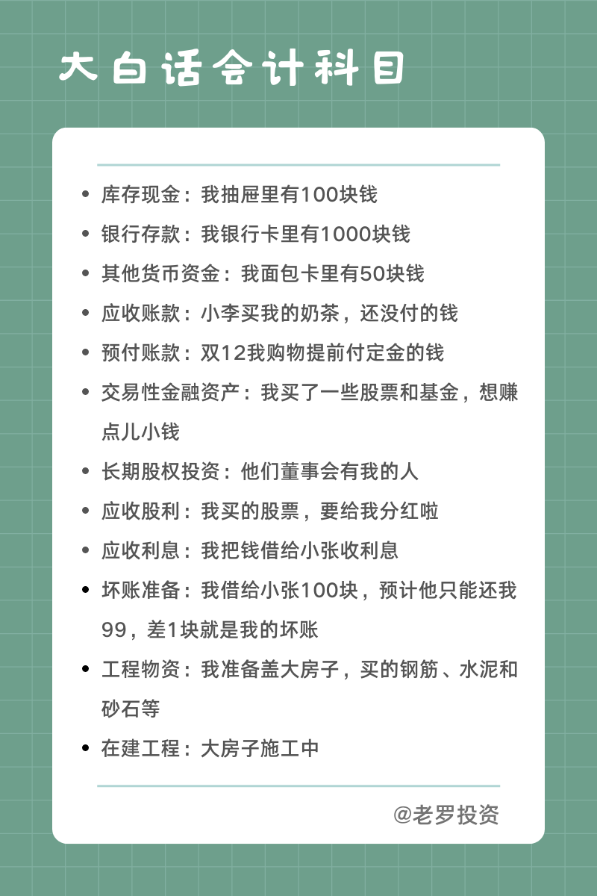
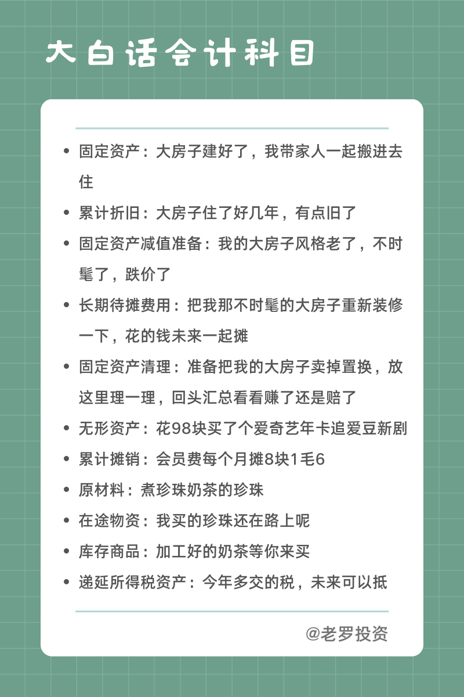
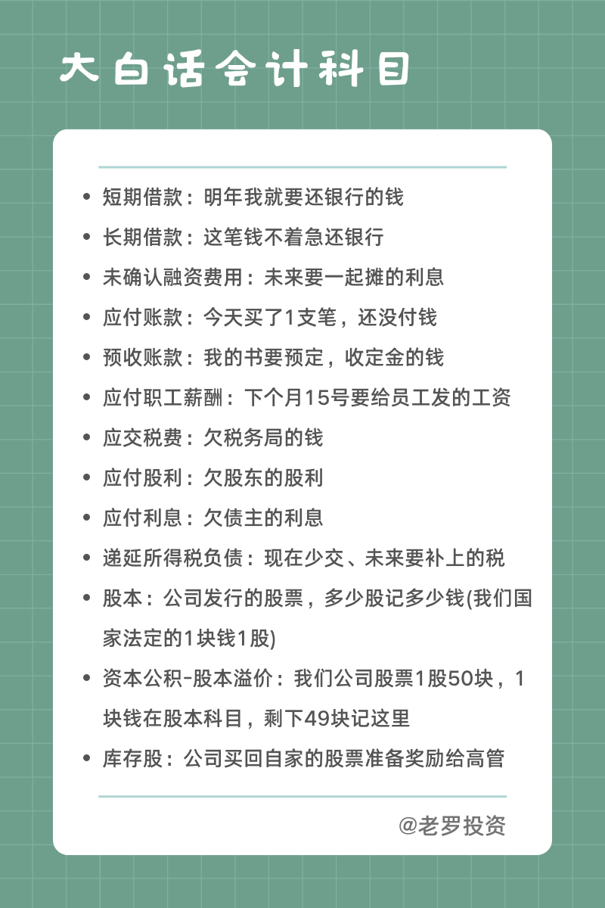
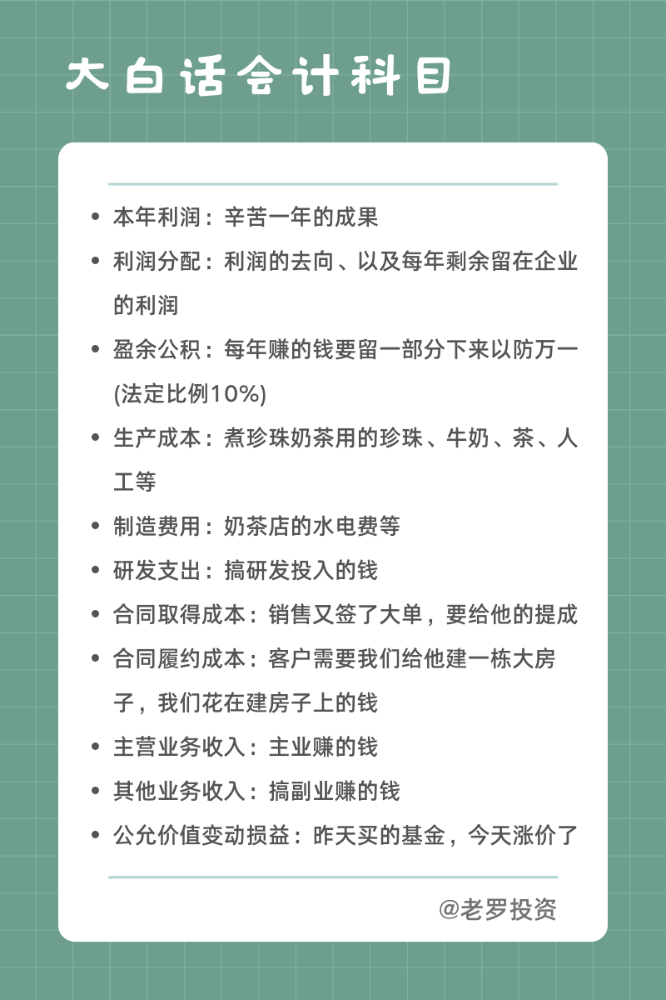
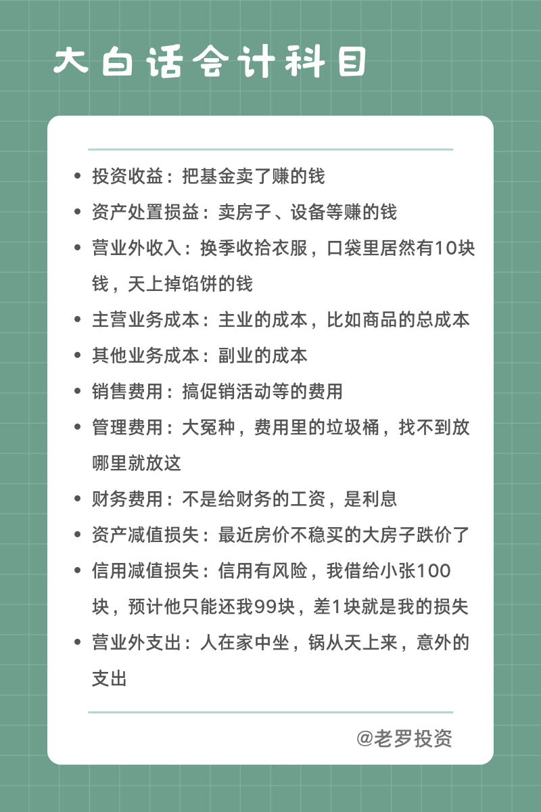

__微信公众号文章地址：[大白话会计科目](https://mp.weixin.qq.com/s/YjFn1rdpzdKo408jVziBMA)__

+ 库存现金：我抽屉里有100块钱
+ 银行存款：我银行卡里有1000块钱
+ 其他货币资金：我面包卡里有50块钱
+ 应收账款：小李买我的奶茶，还没付的钱
+ 预付账款：双12我购物提前付定金的钱
+ 交易性金融资产：我买了一些股票和基金，想赚点儿小钱
+ 长期股权投资：他们董事会有我的人
+ 应收股利：我买的股票，要给我分红啦
+ 应收利息：我把钱借给小张收利息
+ 坏账准备：我借给小张100块，预计他只能还我99，差1块就是我的坏账
+ 工程物资：我准备盖大房子，买的钢筋、水泥和砂石等
+ 在建工程：大房子施工中

+ 固定资产：大房子建好了，我带家人一起搬进去住
+ 累计折旧：大房子住了好几年，有点旧了
+ 固定资产减值准备：我的大房子风格老了，不时髦了，跌价了
+ 长期待摊费用：把我那不时髦的大房子重新装修一下，花的钱未来一起摊
+ 固定资产清理：准备把我的大房子卖掉置换，放这里理一理，回头汇总看看赚了还是赔了
+ 无形资产：花98块买了个爱奇艺年卡追爱豆新剧
+ 累计摊销：会员费每个月摊8块1毛6
+ 原材料：煮珍珠奶茶的珍珠
+ 在途物资：我买的珍珠还在路上呢
+ 库存商品：加工好的奶茶等你来买
+ 递延所得税资产：今年多交的税，未来可以抵

+ 短期借款：明年我就要还银行的钱
+ 长期借款：这笔钱不着急还银行
+ 未确认融资费用：未来要一起摊的利息
+ 应付账款：今天买了1支笔，还没付钱
+ 预收账款：我的书要预定，收定金的钱
+ 应付职工薪酬：下个月15号要给员工发的工资
+ 应交税费：欠税务局的钱
+ 应付股利：欠股东的股利
+ 应付利息：欠债主的利息
+ 递延所得税负债：现在少交、未来要补上的税
+ 股本：公司发行的股票，多少股记多少钱（我们国家法定的1块钱1股）
+ 资本公积-股本溢价：我们公司股票1股50块，1块钱在股本科目，剩下49块记这里
+ 库存股：公司买回自家的股票准备奖励给高管

+ 本年利润：辛苦一年的成果
+ 利润分配：利润的去向、以及每年剩余留在企业的利润
+ 盈余公积：每年赚的钱要留一部分下来以防万一（法定比例10%）
+ 生产成本：煮珍珠奶茶用的珍珠、牛奶、茶、人工等
+ 制造费用：奶茶店的水电费等
+ 研发支出：搞研发投入的钱
+ 合同取得成本：销售又签了大单，要给他的提成
+ 合同履约成本：客户需要我们给他建一栋大房子，我们花在建房子上的钱
+ 主营业务收入：主业赚的钱
+ 其他业务收入：搞副业赚的钱
+ 公允价值变动损益：昨天买的基金，今天涨价了

+ 投资收益：把基金卖了赚的钱
+ 资产处置损益：卖房子、设备等赚的钱
+ 营业外收入：换季收拾衣服，口袋里居然有10块钱，天上掉馅饼的钱
+ 主营业务成本：主业的成本，比如商品的总成本
+ 其他业务成本：副业的成本
+ 销售费用：搞促销活动等的费用
+ 管理费用：大冤种，费用里的垃圾桶，找不到放哪里就放这
+ 财务费用：不是给财务的工资，是利息
+ 资产减值损失：最近房价不稳买的大房子跌价了
+ 信用减值损失：信用有风险，我借给小张100块，预计他只能还我99块，差1块就是我的损失
+ 营业外支出：人在家中坐，锅从天上来，意外的支出

__微信公众号文章地址：[大白话会计科目](https://mp.weixin.qq.com/s/YjFn1rdpzdKo408jVziBMA)__