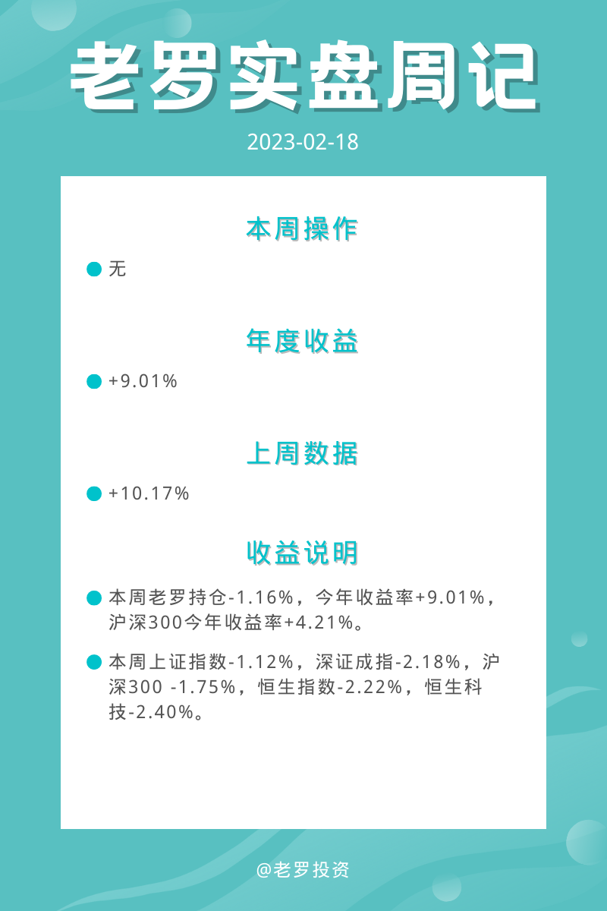
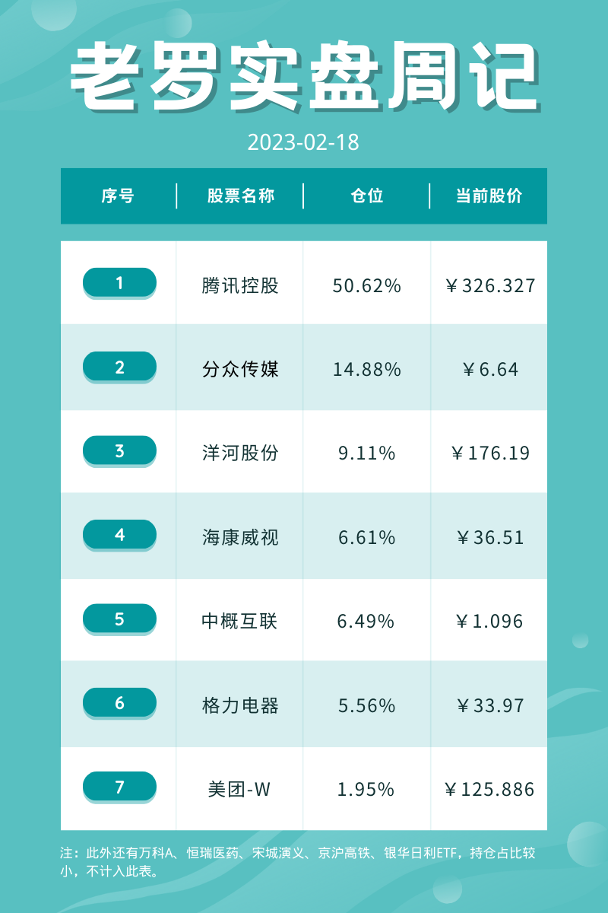
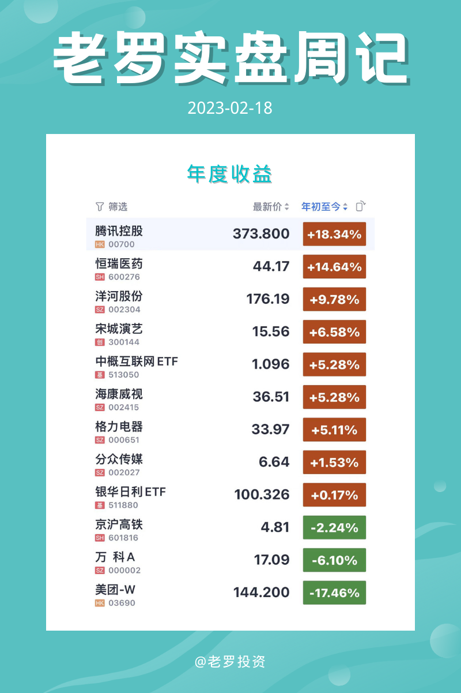

__微信公众号文章地址：[老罗实盘周记-20230218](https://mp.weixin.qq.com/s/zSPT_id_lLZUShrEUS7v_A)__

```
老罗实盘周记，每周六更新。专注于股权投资、阅读、学习与个人成长，知行合一、日拱一卒、投资人生。微信公众号【老罗投资】，文章均首发于公众号。
```

### 1. 本周概述



### 2. 持仓股票明细





### 3. 持股说明

持仓股票当前估值：

一、腾讯控股(00700)，格力电器(000651)属于便宜可以入。

二、分众传媒(002027)，洋河股份(002304)，海康威视(002415)上涨较多，现在适合观望。

#### 3.1 微信门店快送

> 2月15日据媒体报道，微信正在深圳和广州两地测试小程序快送服务，新项目名称为“门店快送”。腾讯对此回应称，微信正在广深地区内测小程序“门店快送”服务，旨在帮助消费者发现附近提供快送服务的优质小程序。广深地区的用户可在“发现-小程序”内进行体验。针对微信入局外卖的说法，相关人士解释：“微信不是要下场做外卖，只是内测一种接口能力，让已经具备了外送服务能力的商家接进来，并非自己做。”

微信门店快送应该是应对抖音的本地生活服务对美团外卖的冲击，美团近期的股价也明显反映了抖音本地生活服务强大的影响力。

腾讯一如既往的喜欢做平台，与万物互联，并不亲自下场比赛，格局一下子就打开了。

#### 3.2 微信公众号升级图片功能

微信公众号近期对图片消息功能进行了升级，具体的升级内容包括：创作者可以填写标题，描述语由140字扩充为300字，用户在手机上可以横滑浏览所有图片，展示比例为3:4。

老罗尝试了一下，前天的一篇文章使用的就是公众号图片功能。说实话功能确实有点像某红书，说明某红书在图片信息流方面的使用体验确实是值得借鉴的。

#### 3.3 基金E账户APP上线

> 针对当前投资者缺乏公募基金资产统一查询渠道的行业痛点问题，中国结算开发了基金E账户APP，提供了一站式查询功能，方便个人查询其持有的场外公募基金账户及份额情况。投资者在任何渠道购买的任何一家公募基金产品，都可以在这个基金E账户上实现“一键查询”。

找人要到了一个邀请码注册了基金E账户，需要提供身份证、银行卡等敏感信息进行认证，所以老罗翻箱倒柜找到了一个百年不用的银行卡，不是老罗信不过中国结算，确实是害怕万一有漏洞造成资金上的损失。

里面的基金信息确实是特别的全，有些不知道猴年马月买的基金也能查询到，值得注册。

#### 3.4 全面实行股票发行注册制

2月17日，中国证监会发布全面实行股票发行注册制相关制度规则，自发布之日起施行。 全面实行注册制制度规则的发布实施，标志着注册制的制度安排基本定型，注册制推广到全市场和各类公开发行股票行为。 注册制从试点推向全市场，开启了全面深化资本市场改革的新局面，为资本市场服务高质量发展打开更广阔的空间。

该来的还是来了，以后打新的风险会越来越高，收益越来越少，不过该打新还是得打，毕竟打新拼的还是人品。

总体来说对中国的股市是件好事，中小企业融资成本会降低，好的公司有更大的机会发展壮大。对投资人来说，如果能在能力圈之内找到优秀的潜力股，也许有机会获得超额的收益。

```
老罗实盘周记，每周六更新。专注于股权投资、阅读、学习与个人成长，知行合一、日拱一卒、投资人生。微信公众号【老罗投资】，文章均首发于公众号。
免责声明：本公众号只作为本人的投资日志记录，本文中提及的个股都有腰斩或血本无归的风险，本人不做任何投资建议，投资请坚持独立思考。
```

__微信公众号文章地址：[老罗实盘周记-20230218](https://mp.weixin.qq.com/s/zSPT_id_lLZUShrEUS7v_A)__