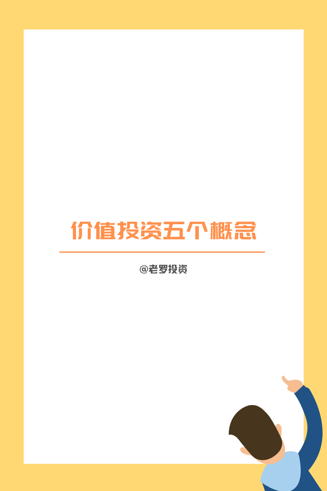
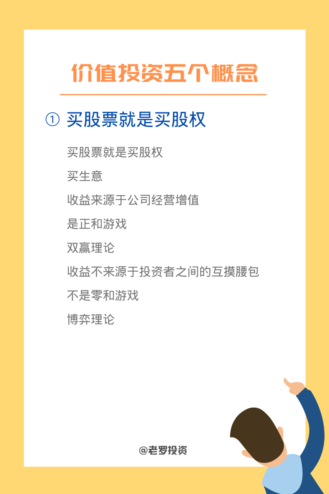
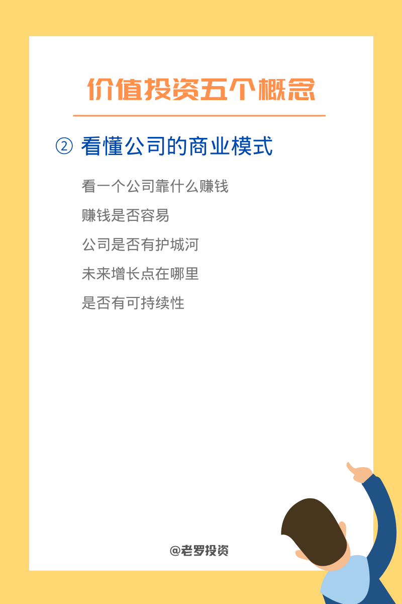
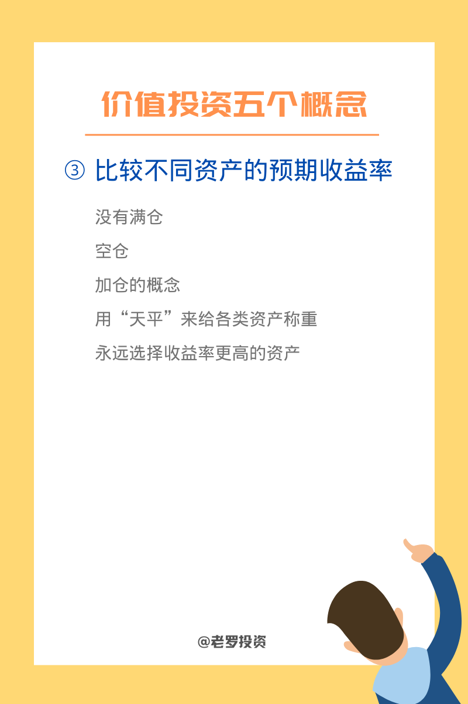
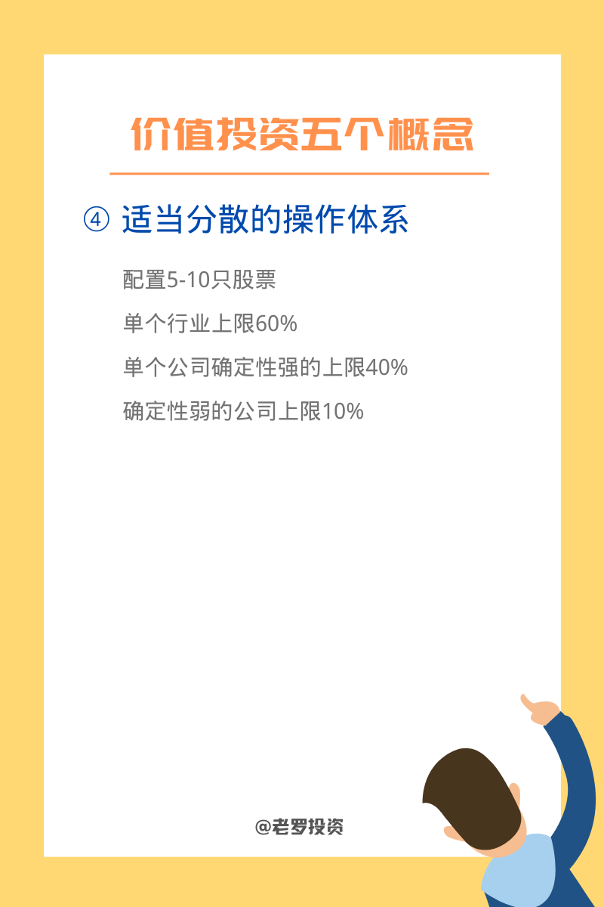
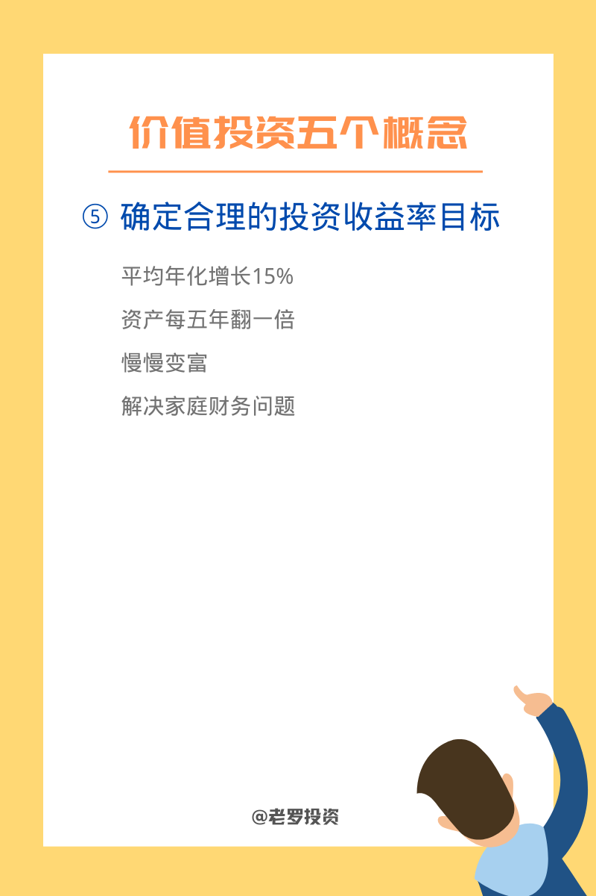

__微信公众号文章地址：[价值投资五个概念](https://mp.weixin.qq.com/s/QsxrFfsJQil4x8AzXPkqtw)__

### 1. 买股票就是买股权

买股票就是买股权，买生意。

收益来源于公司经营增值是正和游戏，双赢理论。

收益不来源于投资者之间的互摸腰包，不是零和游戏，博弈理论。

### 2. 看懂公司的商业模式

看一个公司靠什么赚钱，赚钱是否容易。

公司是否有护城河，未来增长点在哪里，是否有可持续性。

### 3. 比较不同资产的预期收益率

没有满仓、空仓、加仓的概念。

用“天平”来给各类资产称重，远选择收益率更高的资产。

### 4. 适当分散的操作体系

配置5-10只股票，单个行业上限60%。

单个公司确定性强的上限40%，确定性弱的公司上限10%。

### 5. 确认合理的投资收益率目标

平均年化增长15%，资产每五年翻一倍。

慢慢变富，解决家庭财务问题。

__微信公众号文章地址：[价值投资五个概念](https://mp.weixin.qq.com/s/QsxrFfsJQil4x8AzXPkqtw)__