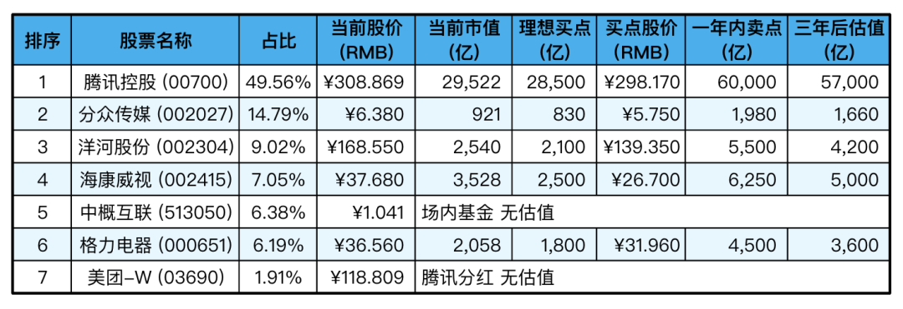
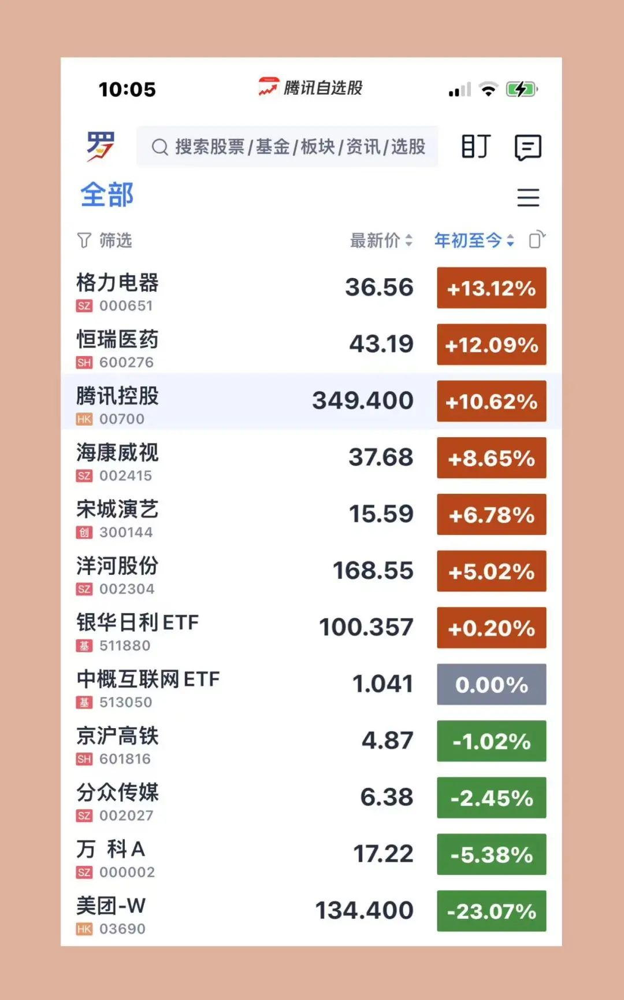

__微信公众号文章地址：[老罗实盘周记-20230225](https://mp.weixin.qq.com/s/VkZElZ9hWvsYw1xln4zsVg)__

```
老罗实盘周记，每周六更新。专注于股权投资、阅读、学习与个人成长，知行合一、日拱一卒、投资人生。微信公众号【老罗投资】，文章均首发于公众号。
```

### 1. 本周概述

+ 本周操作：<span class="red">无</span>
+ 年度收益：<span class="red">5.05%</span>
+ 上周数据：<span class="red">9.01%</span>

本周：上证指数 +1.34%，深证成指 +0.61%，沪深300 +0.66%，恒生指数 -3.43%，恒生科技 -5.80%，老罗的持仓 <span class="green">-3.96%</span>。

截止到2023年2月25日，实盘收益率为：<span class="red">5.05%</span>，沪深300收益率为：<span class="red">4.89%</span>，勉强跑赢沪深300。

### 2. 持仓股票明细



其他还有少量万科A(000002)、恒瑞医药(600276)、宋城演义(300144)、京沪高铁(601816)，份额较少，作为观察仓不记录。

下表是持有的各公司年初至今涨跌幅：



### 3. 持股说明

#### 3.1 洋河年度工作大会

2月19日，一年一度的洋河股份年度工作大会如约而至。和2022年一样，洋河股份党委书记、董事长，双沟酒业董事长张联东的演讲，再次聚焦于二次创业和二次腾飞。

洋河股份在总结过去成绩的基础上，将重点放在推动更高质量、更可持续、更加健康的发展。张联东以务虚和务实两个层面分别提出了“六思洋河”“十问洋河”的重大课题，强调要从思考力、组织力、执行力三个方面系统备战、集中破局、重点突围，实现更高质量的发展。

洋河管理层的发展思路依然比较清晰，并且在短期利益上能让位于长期利益。从停止接收经营商梦之蓝M6+订单上就可以看出来，放着短期的钱不去赚，还有可能得罪经销商，也要减轻库存压力，一般的公司真的不容易做到。

在年度大会结束没几天，洋河的董事、执行总裁刘化霜24号宣布因为个人原因离职。高层管理人员的变动是好是坏，还需要进一步地观察。

#### 3.2 格力分红

格力电器2月20日晚间公告，2022年中期权益分派方案为：以公司现有总股本剔除已回购股份1756.41万股后的56.14亿股为基数，向全体股东每10股派10元现金。股权登记日为2023年2月24日，除权除息日为2023年2月27日。

格力一般是年中1股分红1元，全年1股分红2元，所以每年的持有格力的成本会以3元左右下降，虽然赚不到什么大钱，但持股体验还是相当不错的。

尽管现在很多人不看好格力，认为美的发展前景更好，老罗认为格力目前在多元化方面，虽然没有大的突破，并且存在董明珠退休后继任人的问题，但整体的基本盘暂时没有变化，目前在空调这个领域的地位还是比较稳固，老罗还会继续地持有。

这次格力的分红到账后，因为没有太好的目标，可能暂时不做任何的操作，或是买入银华日利货币基金。

#### 3.3 一元退市

在\*ST西源(600139)提前锁定一元退市后，24日又有一家A股上市公司也提前锁定一元退市。这家A股上市公司便是\*ST荣华(600311)，截至2月24日收盘，该公司股票已经连续16个交易日收盘价低于1元，即便后续4个交易日股价收盘连续涨停，也仍将触及连续20个交易日的每日股票收盘价均低于人民币一元的退市标准。

大A实行全面注册制后，相应的退市机制必然会更加地完善，良好的进入与退出机制，上市公司能更好的低成本融资，二级市场投资人有更多的投资标的，长远来看都是利好。

#### 3.4 伯克希尔年度股东信和年报

根据伯克希尔哈撒韦本周发布的公告，公司将在当地时间25日早8点（北京时间晚21点）发布巴菲特的年度股东信和年报，而今年的线下股东会则将在当地时间5月6日举行。

老罗认为巴菲特的年度股东信是学习股票投资最好的必读书籍，没有之一，巴神的投资秘诀都在股东信里讲得清清楚楚，历年的股东信都值得反复的研读。

```
老罗实盘周记，每周六更新。专注于股权投资、阅读、学习与个人成长，知行合一、日拱一卒、投资人生。微信公众号【老罗投资】，文章均首发于公众号。
免责声明：本公众号只作为本人的投资日志记录，本文中提及的个股都有腰斩或血本无归的风险，本人不做任何投资建议，投资请坚持独立思考。
```

__微信公众号文章地址：[老罗实盘周记-20230225](https://mp.weixin.qq.com/s/VkZElZ9hWvsYw1xln4zsVg)__