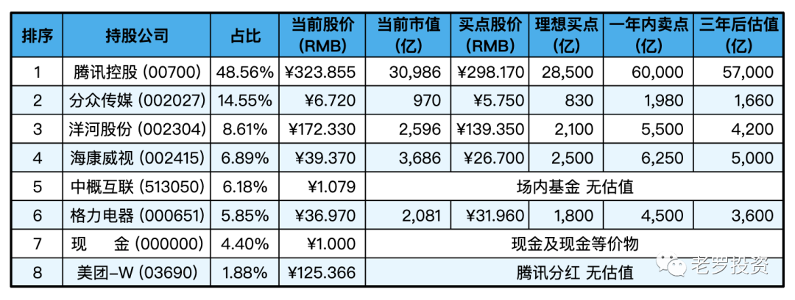
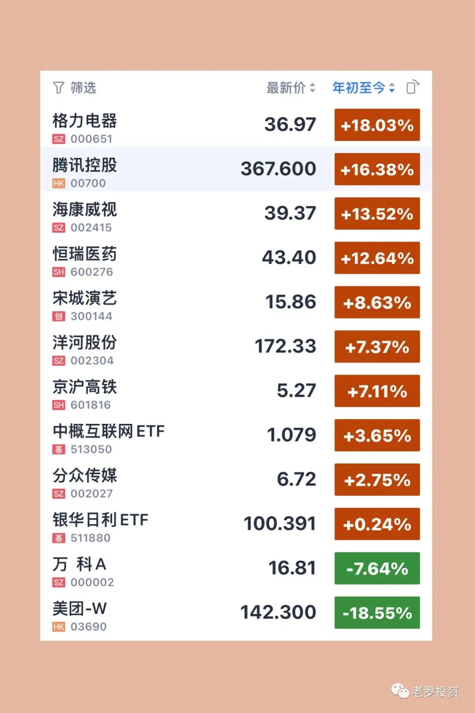

__微信公众号文章地址：[老罗实盘周记-20230304](https://mp.weixin.qq.com/s/igx_IJpGpzK9mgDSpjyxBw)__

```
老罗实盘周记，每周六更新。专注于股权投资、阅读、学习与个人成长，知行合一、日拱一卒、投资人生。微信公众号【老罗投资】，文章均首发于公众号。
```

### 1. 本周概述

本周操作：使用上周格力的分红和部分新到位的资金，买入了大约3%仓位的银华日利ETF(511880)，买入价格100.368元。货币基金当作现金等价物进行统计，不再单列新项目。

+ 年度收益：<span class="red">9.48%</span>
+ 上周数据：<span class="red">5.05%</span>

本周：上证指数 +1.87%，深证成指 +0.55%，沪深300 +1.71%，恒生指数 +2.79%，恒生科技 +5.00%，老罗的持仓 <span class="red">+4.43%</span>。

截止到2023年3月4日，实盘收益率为：<span class="red">9.48%</span>，沪深300收益率为：<span class="red">6.69%</span>，小幅跑赢沪深300。

### 2. 持仓股票明细



其他还有少量万科A(000002)、恒瑞医药(600276)、宋城演义(300144)、京沪高铁(601816)，份额较少，作为观察仓不记录。

下表是持有的各公司年初至今涨跌幅：



### 3. 持股说明

#### 3.1 巴菲特2023致股东信

2月26日巴菲特在伯克希尔哈撒韦官网发布了一年一度的致股东公开信。伯克希尔2022年净亏损228.19亿美元，上年同期盈利为897.95亿美元；第四季度净利润181.64亿美元，去年同期盈利396.46亿美元。而巴菲特表示，2022年是伯克希尔的“好年份”，当年调整后营业收益创下308亿美元的新纪录。

已经从事职业投资80年、现年93岁的股神，每年发布的股东信都值得大家仔细地研读，因为它是股权投资最好的“教材”，而且它居然还是完全免费的！

老罗挑选了一些印象深刻的内容，摘录下来：

1、伯克希尔的股东基本上是“储蓄一次，储蓄一世”的类型。

老罗：只有坚持做一个长期主义者，耐得住寂寞，淡化市场波动和情绪，才能慢慢变富。

2、当管理大型企业时，信任和规则都是缺一不可的。我们可以理解商业错误，但我们对个人不当行为的容忍度为零。

老罗：管理企业最重要的原则是信任和规则，永远不要试图和不诚信的人做好一笔生意。

3、我们持有股票是基于我们对企业长期经营业绩的预期，而不是将其视为熟练买卖的工具。查理和我不是选股高手，我们是选择商业模式的人。

老罗：买股票其实是买公司，买商业模式。

4、股票会不时地以愚蠢的价格交易，可能是高也可能是低。“有效市场”只存在于教科书中。

老罗：“市场先生”很不理性。

5、野草会在鲜花盛开的时候枯萎，随着时间的推移，只需少数胜利，就能创造奇迹。而且早点开始也有帮助，还能帮助你活到90多岁。

老罗：只需少数几次成功的投资你就可以变得富有，并且投资要趁早。

6、如果回购价格低于公司内在价值，那么公司所有股东将全方面受益。

老罗：小企鹅发完年报后请继续冲。

7、一个重要的警告：财务报表中的“运营利润”是我们非常关注的，但这些数字很容易经理人操纵，只要他们想要这样做。

老罗：读财务报表是为了排除企业，需要重点关注运营利润中的疑点。

8、我们所有者不断的储蓄（通过他们的留存收益）、复利的力量、避免重大错误，以及最重要——搭上“美国顺风”。没有伯克希尔哈撒韦，美国也会过得不错，反之则不然。

老罗：股权投资其实是赌国运。

9、从短期看，市场是一台投票机，但从长远来看，它是一台称重机。

老罗：价值投资的核心理念，面对市场波动时，它就是北极星指标。

10、投资是没有100%的把握，因此，使用杠杆是危险的。一串美妙的数字乘以零，永远等于零。不要指望一夜暴富。

老罗：不用杠杆，这四个字值四个亿！

#### 3.2 2022年GDP数据公布

国家统计局2月28日发布了2022年国民经济和社会发展统计公报，初步核算，全年国内生产总值1,210,207亿元，比2021年增长3.0%。去年在疫情的各种冲击下，还能保持3个点的增涨，属实不易。

年末全国人口141,175万人，比上年末减少85万人，其中城镇常住人口92,071万人。这应该是首次出现人口下降的年份，人口红利消失、出生率降低、老龄化，人口问题会越来越突出。

2022年很艰难，大部分人都感受了前所未有的压力，疫情反复、裁员、毕业生找工作难、中小企业难以为继，好在大家都咬牙坚持了下来。

刚刚发布的2月份PMI数据全面好转，比1月上升2.5个百分点至52.6%。其中一些关键指标，比如新订单、生产、从业人员、经营预期等均超过50%荣枯线。作为首个公布的2月重要经济数据，制造业PMI数据释放出我国经济有力复苏的积极信号。

老罗也明显感觉到了身边一些积极的变化，街上的人多了，地铁挤了，七点出门也开始堵车了，短短两个月就恢复到了19年的那种烟火气。

天佑中华，山河无恙，人间皆安。

```
老罗实盘周记，每周六更新。专注于股权投资、阅读、学习与个人成长，知行合一、日拱一卒、投资人生。微信公众号【老罗投资】，文章均首发于公众号。
免责声明：本公众号只作为本人的投资日志记录，本文中提及的个股都有腰斩或血本无归的风险，本人不做任何投资建议，投资请坚持独立思考。
```

__微信公众号文章地址：[老罗实盘周记-20230304](https://mp.weixin.qq.com/s/igx_IJpGpzK9mgDSpjyxBw)__