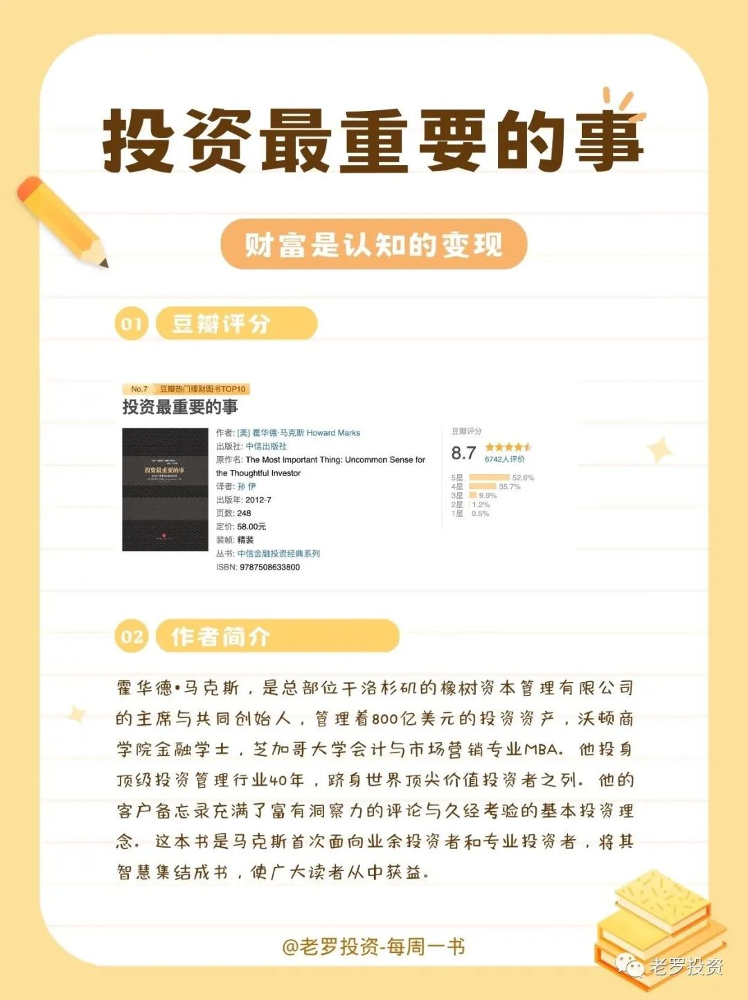
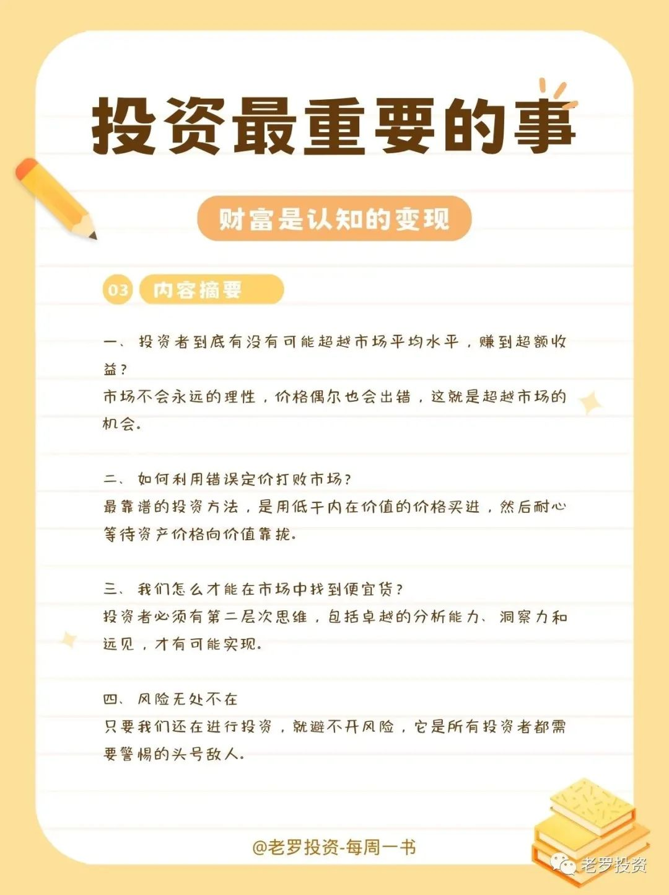
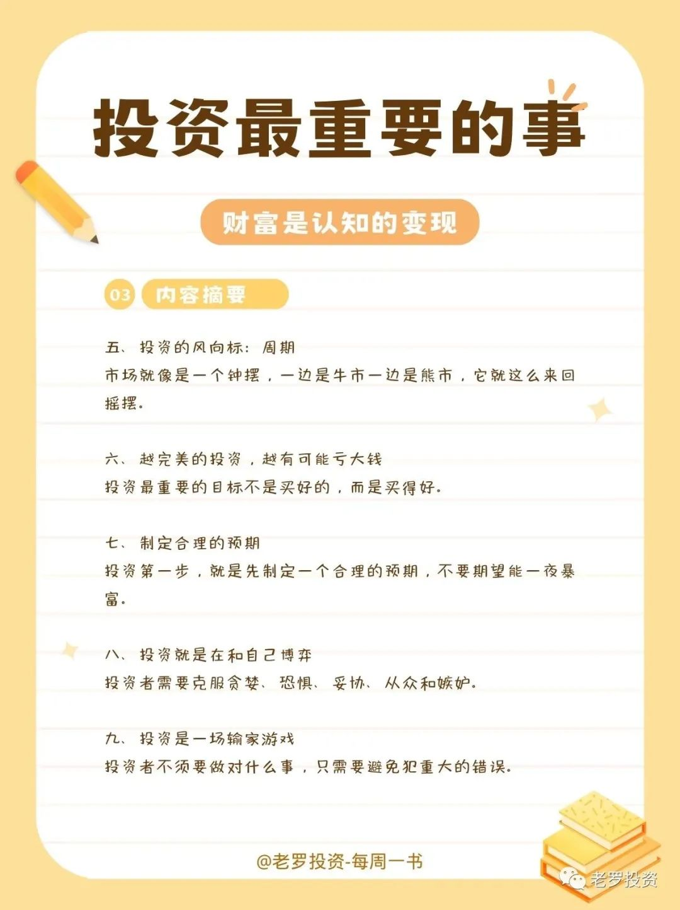
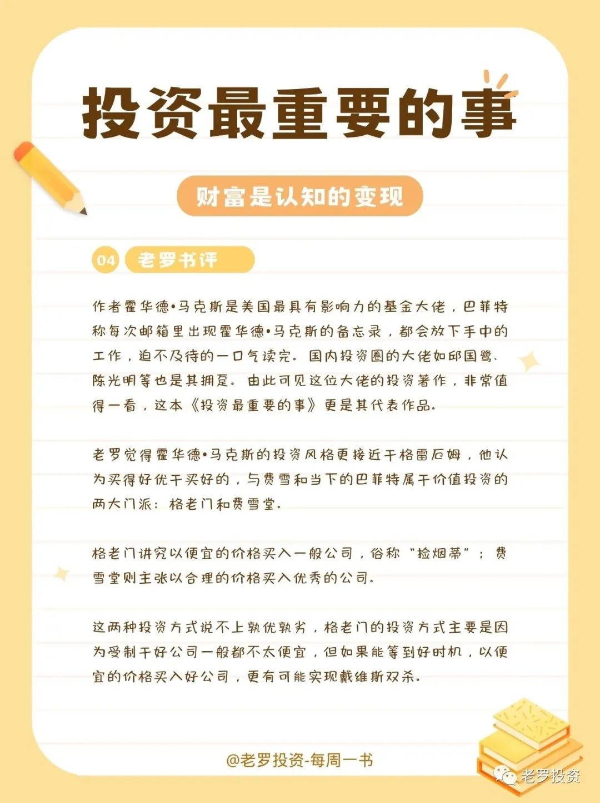

__微信公众号文章地址：[老罗读书第2期-投资最重要的事](https://mp.weixin.qq.com/s/shpNQv8zphKj10BR8L46Gg)__

### 1. 投资最重要的事

### 2. 豆瓣评分&作者简介

#### 2.1 豆瓣评分

+ 豆瓣评分：8.7 分

#### 2.2 作者简介

霍华德•马克斯，是总部位于洛杉矶的橡树资本管理有限公司的主席与共同创始人，管理着800亿美元的投资资产，沃顿商学院金融学士，芝加哥大学会计与市场营销专业MBA。他投身顶级投资管理行业40年，跻身世界顶尖价值投资者之列。他的客户备忘录充满了富有洞察力的评论与久经考验的基本投资理念。这本书是马克斯首次面向业余投资者和专业投资者，将其智慧集结成书，使广大读者从中获益。

### 3. 内容摘要

一、投资者到底有没有可能超越市场平均水平，赚到超额收益？

市场不会永远的理性，价格偶尔也会出错，这就是超越市场的机会。

二、如何利用错误定价打败市场？

最靠谱的投资方法，是用低于内在价值的价格买进，然后耐心等待资产价格向价值靠拢。

三、我们怎么才能在市场中找到便宜货？

投资者必须有第二层次思维，包括卓越的分析能力、洞察力和远见，才有可能实现。

四、风险无处不在

只要我们还在进行投资，就避不开风险，它是所有投资者都需要警惕的头号敌人。

五、投资的风向标：周期

市场就像是一个钟摆，一边是牛市一边是熊市，它就这么来回摇摆。

六、越完美的投资，越有可能亏大钱

投资最重要的目标不是买好的，而是买得好。

七、制定合理的预期

投资第一步，就是先制定一个合理的预期，不要期望能一夜暴富。

八、投资就是在和自己博弈

投资者需要克服贪婪、恐惧、妥协、从众和嫉妒。

九、投资是一场输家游戏

投资者不须要做对什么事，只需要避免犯重大的错误。

### 4. 老罗书评

作者霍华德•马克斯是美国最具有影响力的基金大佬，巴菲特称每次邮箱里出现霍华德•马克斯的备忘录，都会放下手中的工作，迫不及待的一口气读完。国内投资圈的大佬如邱国鹭、陈光明等也是其拥趸。由此可见这位大佬的投资著作，非常值得一看，这本《投资最重要的事》更是其代表作品。

老罗觉得霍华德•马克斯的投资风格更接近于格雷厄姆，他认为买得好优于买好的，与费雪和当下的巴菲特属于价值投资的两大门派：格老门和费雪堂。

格老门讲究以便宜的价格买入一般公司，俗称“捡烟蒂”；费雪堂则主张以合理的价格买入优秀的公司。

这两种投资方式说不上孰优孰劣，格老门的投资方式主要是因为受制于好公司一般都不太便宜，但如果能等到好时机，以便宜的价格买入好公司，更有可能实现戴维斯双杀。

__微信公众号文章地址：[老罗读书第2期-投资最重要的事](https://mp.weixin.qq.com/s/shpNQv8zphKj10BR8L46Gg)__