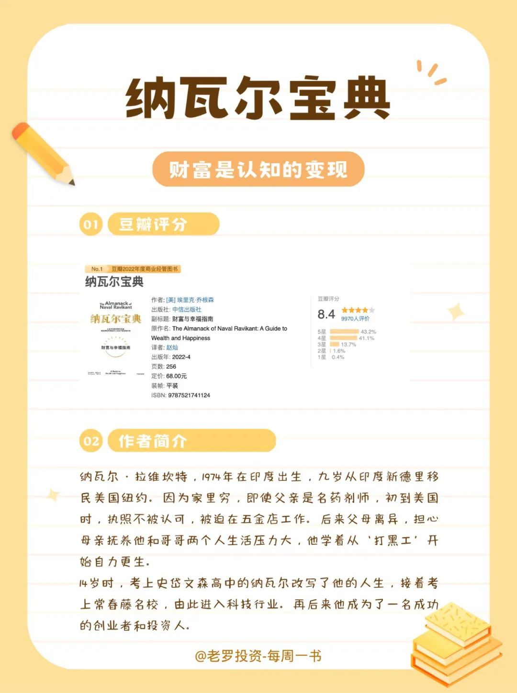
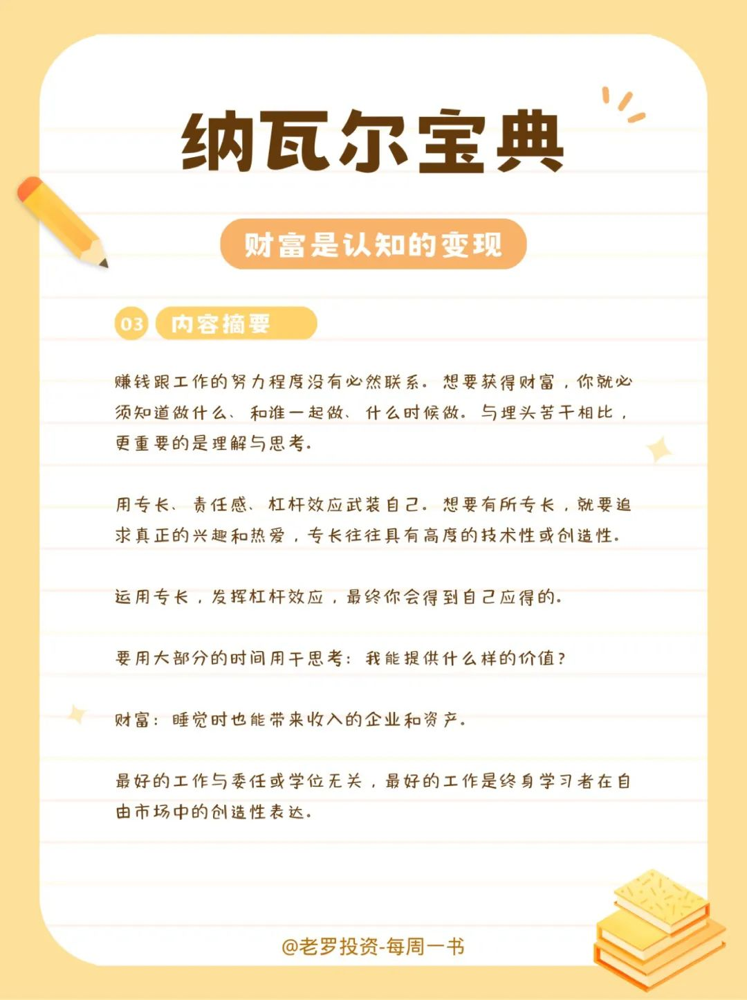
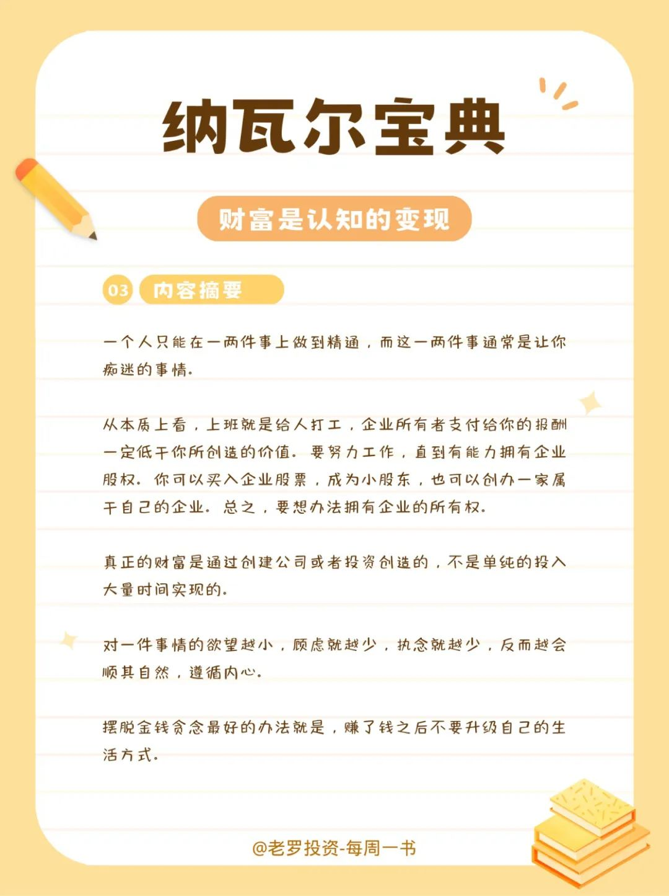
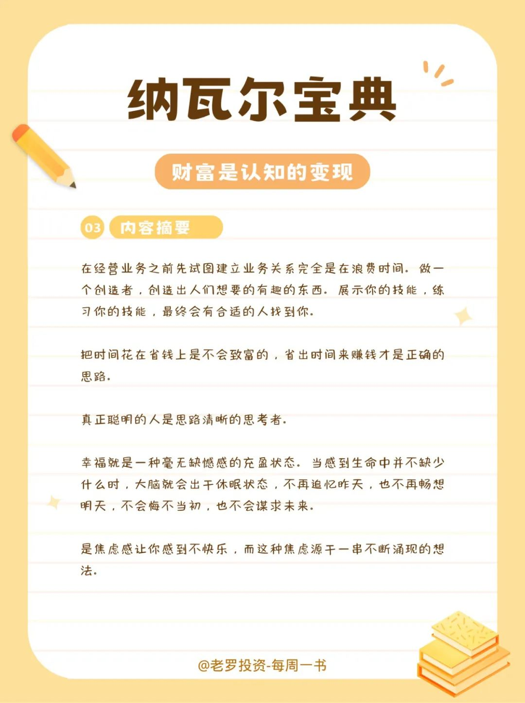
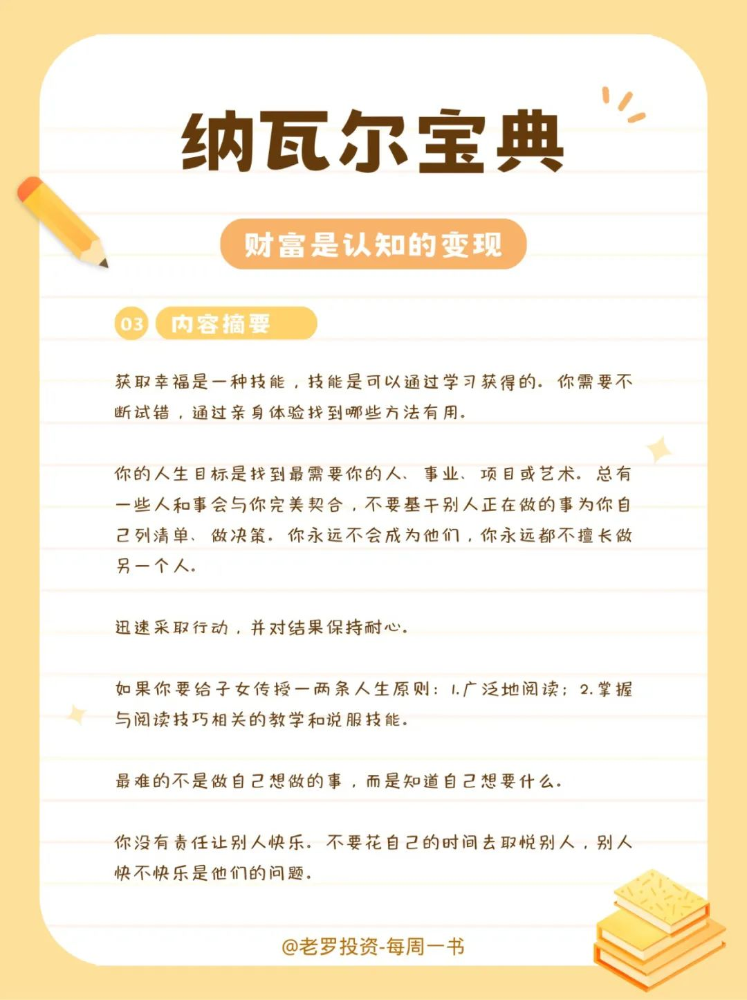
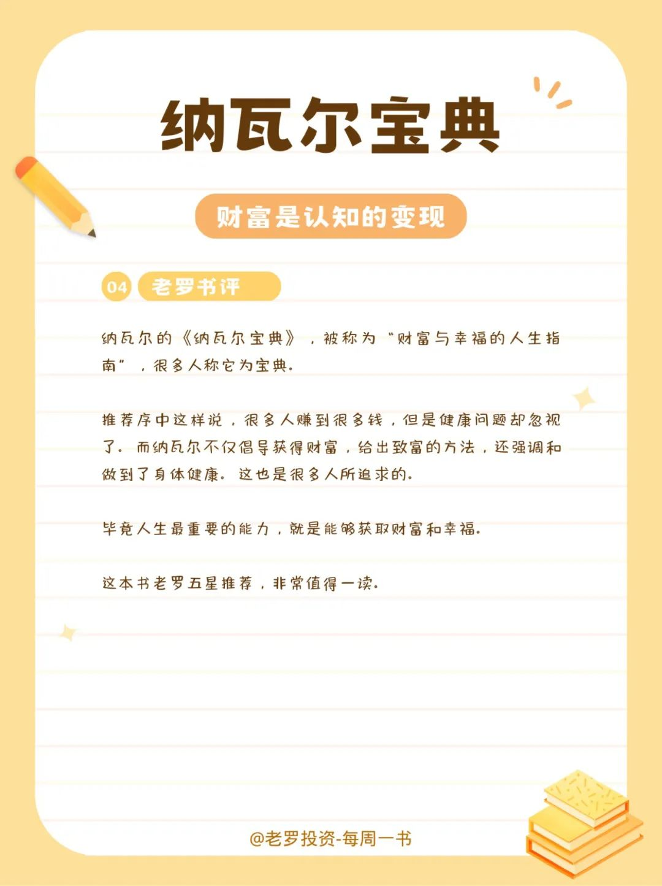

__微信公众号文章地址：[老罗读书第3期-纳瓦尔宝典](https://mp.weixin.qq.com/s/9ld3YQ-jgbJ38Dxdj5gRew)__

### 1. 投资最重要的事

### 2. 豆瓣评分&作者简介

#### 2.1 豆瓣评分

+ 豆瓣评分：8.4 分

#### 2.2 作者简介

纳瓦尔•拉维坎特，1974年在印度出生，九岁从印度新德里移民美国纽约。因为家里穷，即使父亲是名药剂师，初到美国时，执照不被认可，被迫在五金店工作。后来父母离异，担心母杀抚养他和哥哥两个人生活压力大，他学着从『打黑工』开始自力更生。

14岁时，考上史岱文森高中的纳瓦尔改写了他的人生，接着考上常春藤名校，由此进入科技行业，再后来他成为了一名成功的创业者和投资人。

### 3. 内容摘要

赚钱跟工作的努力程度没有必然联系。想要获得财富，你就必须知道做什么、和谁一起做、什么时候做。与埋头苦干相比，更重要的是理解与思考。

用专长、责任感、杠杆效应武装自己。想要有所专长，就要追求真正的兴趣和热爱，专长往往具有高度的技术性或创造性。

运用专长，发挥杠杆效应，最终你会得到自己应得的。

要用大部分的时间用于思考：我能提供什么样的价值？

财富：睡觉时也能带来收入的企业和资产。

最好的工作与委任或学位无关，最好的工作是终身学习者在自由市场中的创造性表达。

一个人只能在一两件事上做到精通，而这一两件事通常是让你痴迷的事情。

从本质上看，上班就是给人打工，企业所有者支付给你的报酬一定低于你所创造的价值。要努力工作，直到有能力拥有企业股权。你可以买入企业股票，成为小股东，也可以创办一家属于自己的企业。总之，要想办法拥有企业的所有权。

真正的财富是通过创建公司或者投资创造的，不是单纯的投入大量时间实现的。

对一件事情的欲望越小，顾虑就越少，执念就越少，反而越会顺其自然，遵循内心。

摆脱金钱贪念最好的办法就是，赚了钱之后不要升级自己的生活方式。

在经营业务之前先试图建立业务关系完全是在浪费时间。做一个创造者，创造出人们想要的有趣的东西。展示你的技能，练习你的技能，最终会有合适的人找到你。

把时间花在省钱上是不会致富的，省出时间来赚钱才是正确的思路。

真正聪明的人是思路清晰的思考者。

幸福就是一种毫无缺憾感的充盈状态。当感到生命中并不缺少什么时，大脑就会出于休眠状态，不再追忆昨天，也不再畅想明天，不会悔不当初，也不会谋求未来。

是焦虑感让你感到不快乐，而这种焦虑源于一串不断涌现的想法。

获取幸福是一种技能，技能是可以通过学习获得的。你需要不断试错，通过亲身体验找到哪些方法有用。

你的人生目标是找到最需要你的人、事业、项目或艺术。总有一些人和事会与你完美契合，不要基于别人正在做的事为你自己列清单、做决策。你永远不会成为他们，你永远都不擅长做另一个人。

迅速采取行动，并对结果保持耐心。

如果你要给子女传授一两条人生原则：

1. 广泛地阅读；
2. 掌握与阅读技巧相关的教学和说服技能。

最难的不是做自己想做的事，而是知道自己想要什么。

你没有责任让别人快乐。不要花自己的时间去取悦别人，别人快不快乐是他们的问题。

### 4. 老罗书评

纳瓦尔的《纳瓦尔宝典》，被称为『财富与幸福的人生指南』，很多人称它为宝典。

推荐序中这样说，很多人赚到很多钱，但是健康问题却忽视了。而纳瓦尔不仅倡导获得财富，给出致富的方法，还强调和做到了身体健康，这也是很多人所追求的。

毕竟人生最重要的能力，就是能够获取财富和幸福。

这本书老罗五星推荐，非常值得一读。

__微信公众号文章地址：[老罗读书第3期-纳瓦尔宝典](https://mp.weixin.qq.com/s/9ld3YQ-jgbJ38Dxdj5gRew)__