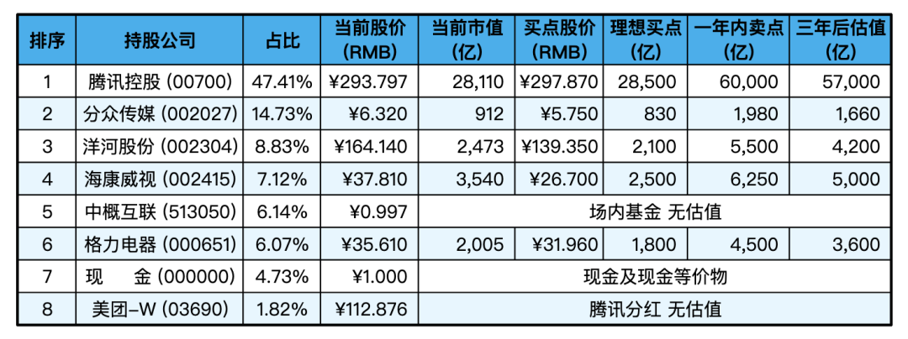
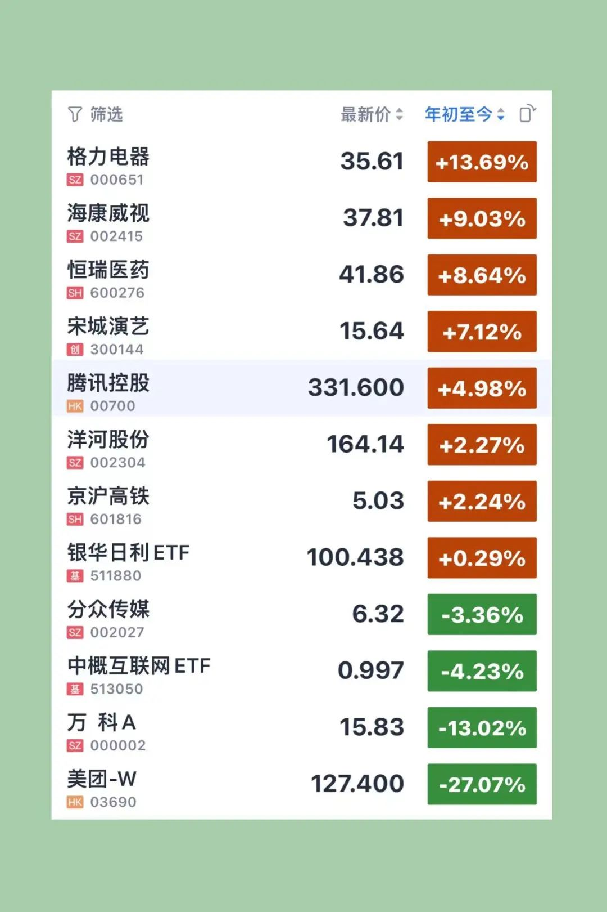

__微信公众号文章地址：[老罗实盘周记-20230311](https://mp.weixin.qq.com/s/i6fvCwmowM8aDEcZHtIeqw)__

```
老罗实盘周记，每周六更新。专注于股权投资、阅读、学习与个人成长，知行合一、日拱一卒、投资人生。微信公众号【老罗投资】，文章均首发于公众号。
```

### 1. 本周概述

+ 本周操作：<span class="red">无</span>
+ 年度收益：<span class="red">1.73%</span>
+ 上周数据：<span class="red">9.48%</span>

本周：上证指数 -2.95%，深证成指 -3.45%，沪深300 -3.96%，恒生指数 -6.07%，恒生科技 -10.19%，老罗的持仓 <span class="green">-7.75%</span>。

截止到2023年3月11日，老罗实盘收益率为：<span class="red">1.73%</span>，沪深300收益率为：<span class="red">2.47%</span>，小幅跑输沪深300。

### 2. 持仓股票明细



其他还有少量万科A(000002)、恒瑞医药(600276)、宋城演义(300144)、京沪高铁(601816)，份额较少，作为观察仓不记录。

下表是持有的各公司年初至今涨跌幅：



### 3. 本周重要事项

#### 3.1 证监会升格为国务院直属机构

根据国务院关于提请审议国务院机构改革方案的议案，中国证券监督管理委员会调整为国务院直属机构。中国证券监督管理委员会由国务院直属事业单位调整为国务院直属机构。

将强化资本市场监管职责，划入国家发展和改革委员会的企业债券发行审核职责，由中国证券监督管理委员会统一负责公司（企业）债券发行审核工作。

新国家监管机构的成立将降低多个部门和多个监管标准之间的协调难度，并提高监管效率。

证监会升级，目标是消除监管面的盲点、扩大直接融资和防范金融风险，有利于金融业的健康发展，合规的金融机构将有更多的收益。

老罗认为长期对股市有利，短期无影响，了解即可。

#### 3.2 理性看待波动

本周回撤较多，特别是港股，受到美联储加息消息影响更大，腾讯(00700)本周下跌9.79%，美团(03690)下跌10.47%。老罗持有的港股份额占持股公司的一半，所以实盘本周也下跌得比较多。

大多数的股民(包括曾经的老罗)对波动的反应比较强烈，往往一周下跌10%可能就赶紧卖掉止损了。较大的波动对心理确实是一种挑战，心理承受力只要稍差一点，可能就坐不住了。

关于波动这件事，很多投资大师都谈过，比如股神巴菲特和《投资最重要的事》的作者霍华德·马克斯(美国橡树资本管理有限公司创始人)。

巴菲特：“真正的投资人喜欢波动都还来不及，长期我们将获得超越市场平均水平的回报率。就我们的情况而言，也许我们的业绩在某一年会有较大的波动，但是我相信这个副作用的结果，长期而言我们将获得超越市场平均水平的满意的回报率。”

巴菲特从来都不会在意股价短期的波动，大神更关注的是股票对应企业未来的盈利能力，也就是未来现金流折现。短期股价的波动对巴神来说，可能是以更便宜价格买入的好机会。

对于那些满心期盼股市上涨的人，巴菲特用了一个生动形象的比喻：“大多数人，包括将在未来成为净买入者那些人，看到股价上升会觉得舒服。这些股东就像是看到汽油价格上涨感到高兴的通勤者，仅仅因为他们的油箱里已经装满了够用一整天汽油。”

老罗认为我们作为车主，不应该为油价下跌而感到高兴么？

巴菲特曾说：“在我早期的日子里，我也乐于看到市场上涨。然后我读到格雷厄姆的《聪明的投资者》第八章(市场先生理论)，这章说明了投资者如何对待股价的波动。立刻一切在我眼前发生了变化，低价成为了我的朋友。拿起那本书是我一生中最幸运的时刻之一。”

我们一定要记住，市场行情给我们提供了便利：要么利用市场行情，要么不去管它。千万不要因为股价上涨而购买，或者是因为股价下跌而抛售。

从根本上讲，价格波动对真正的投资者只有一个重要意义，即当价格大幅下跌后，给投资者买入的机会，反之亦然。在除此之外的其他时间里，投资者最好忘记股市的存在，更多的关心**股息回报**和**企业的经营结果**。

霍华德·马克斯：波动性并非风险本身，低波动的资产和策略将带来较低的回报。

在他看来，风险是出现不良结果的概率，而波动性充其量是风险存在的指标。但波动性并非风险本身。

只要没有因波动性而破产，那么波动性就是一个暂时现象，大多数投资者不应像他们看起来那样重视波动性。

不管行情好坏，老罗最喜欢做的事就是少看或不看盘，多看书、多锻炼。当有好机会时，慢慢买入；当达到卖出条件时，分批卖出。这应该是股权投资最舒服的状态，慢慢变富，同时每天聪明一点点，变成更优秀的人。

### 4. 本周阅读

+ 《雪球专刊》 305-310期，一共6本，总共20多万字，这几期一般，可读可不读，三颗星：⭐️⭐️⭐️。
+ 《巴菲特幕后智囊-查理·芒格传》，这本书讲述了芒格人生的各种细节，可以从不一样的角度来了解这位投资大神，老罗评价四颗星：⭐️⭐️⭐️⭐️，值得一读。

### 5. 本周运动

本周跳绳两次，夏天越来越近，肚子上的肉很快就要藏不住了，开始运动。

祝大家周末愉快！

```
老罗实盘周记，每周六更新。专注于股权投资、阅读、学习与个人成长，知行合一、日拱一卒、投资人生。微信公众号【老罗投资】，文章均首发于公众号。
免责声明：本公众号只作为本人的投资日志记录，本文中提及的个股都有腰斩或血本无归的风险，本人不做任何投资建议，投资请坚持独立思考。
```

__微信公众号文章地址：[老罗实盘周记-20230311](https://mp.weixin.qq.com/s/i6fvCwmowM8aDEcZHtIeqw)__