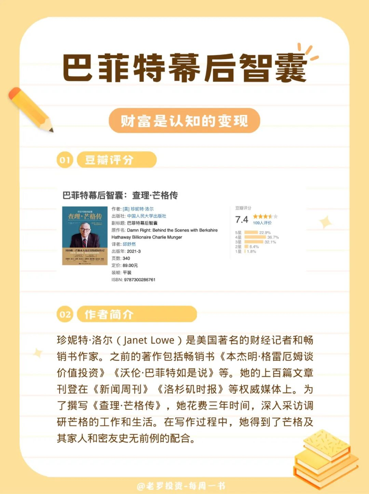
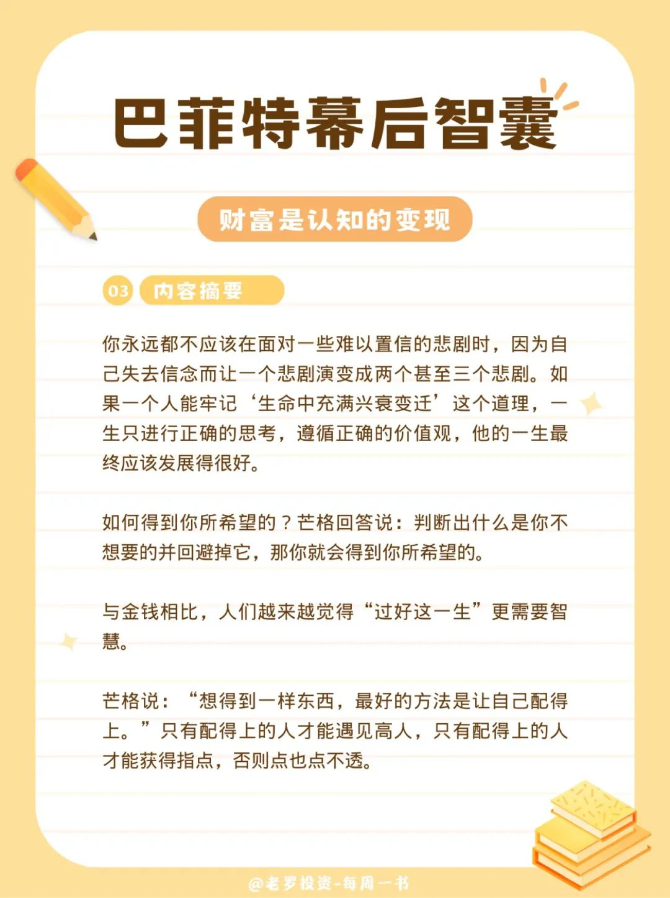
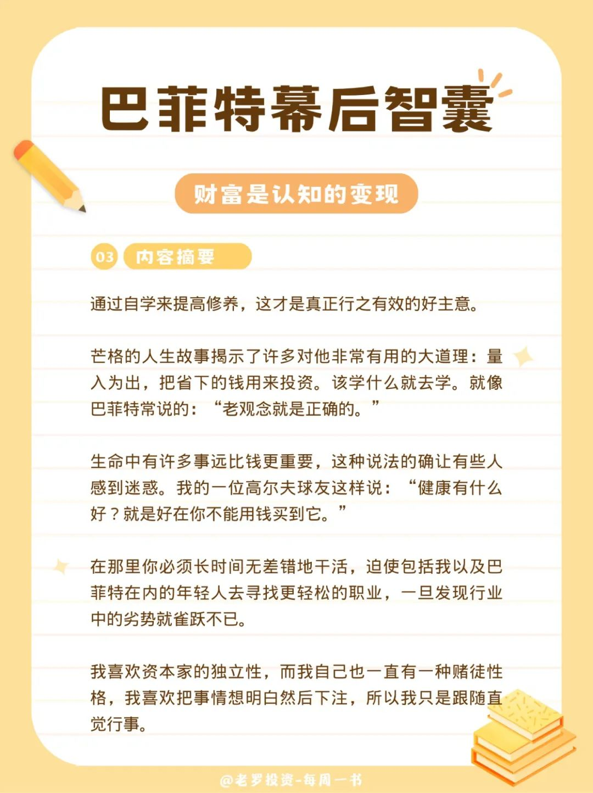
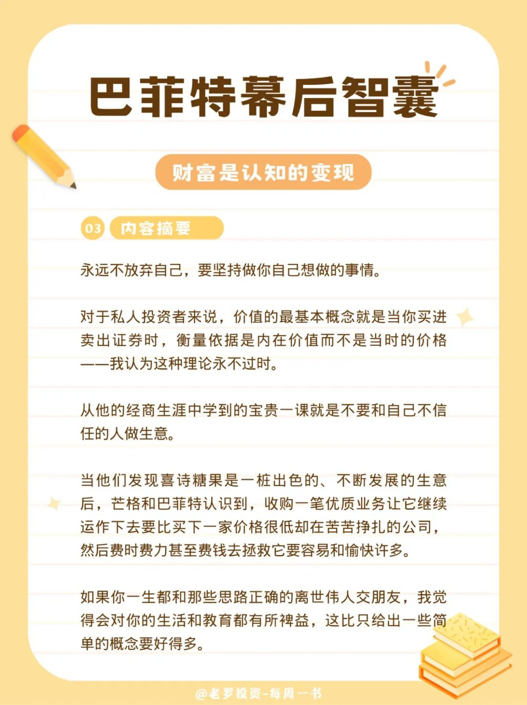
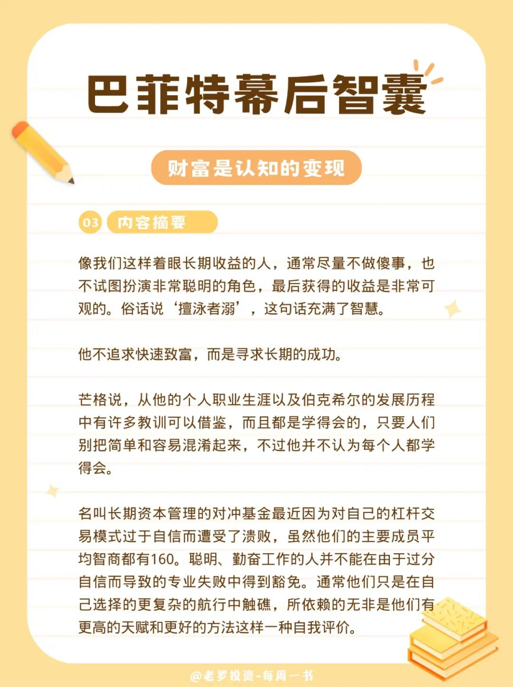
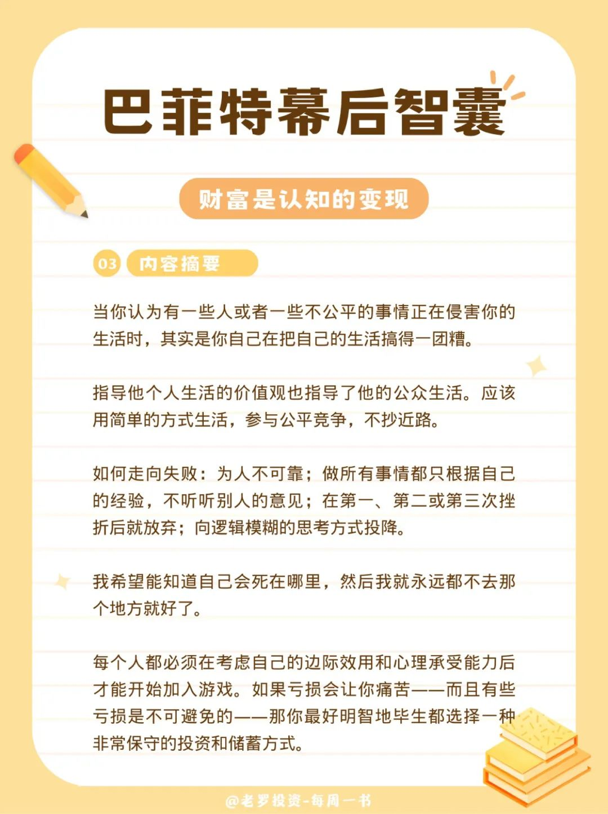
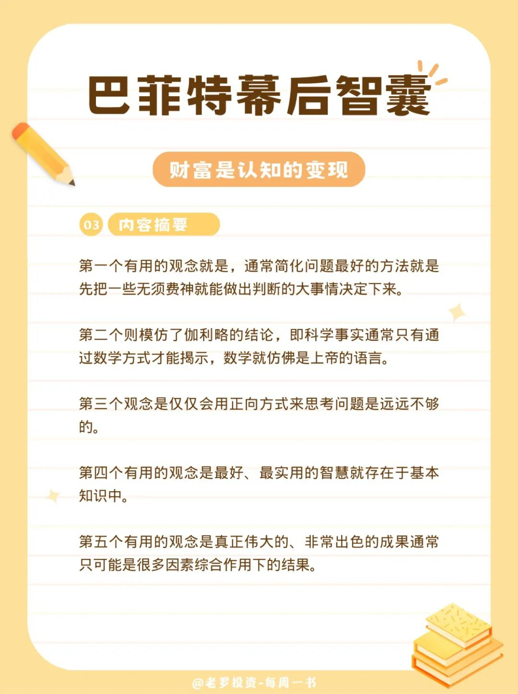
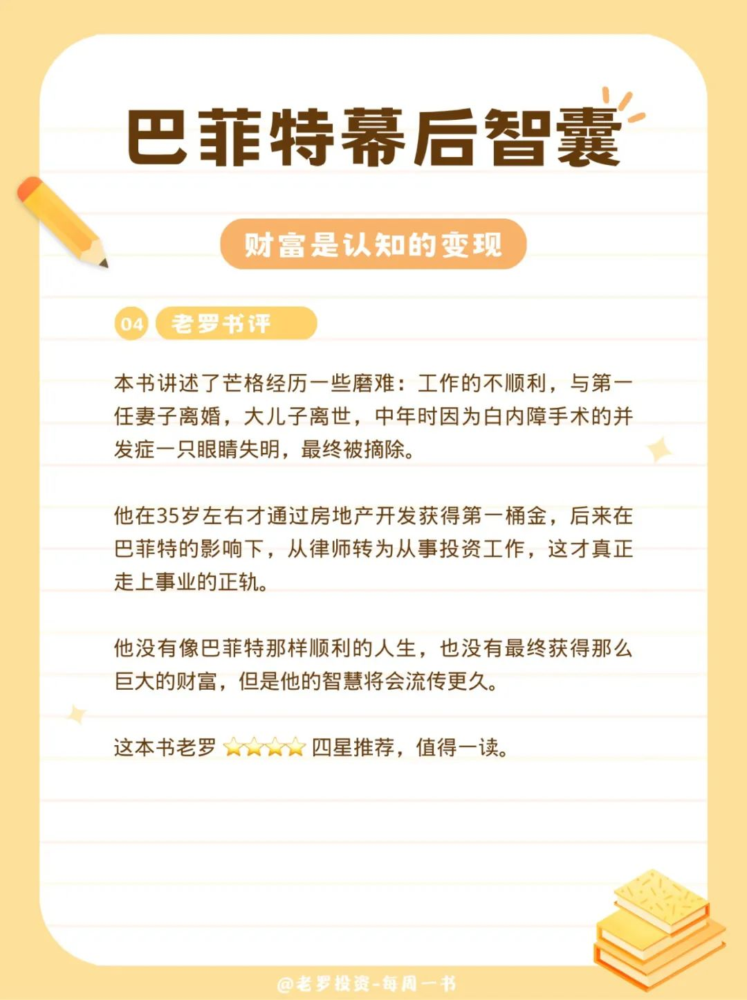

__微信公众号文章地址：[老罗读书第4期-巴菲特幕后智囊-查理芒格传](https://mp.weixin.qq.com/s/O8klo-L5-o1JPD7gfAEaUQ)__

### 1. 豆瓣评分&作者简介

#### 1.1 豆瓣评分

+ 7.4 分

#### 1.2 作者简介

珍妮特·洛尔（Janet Lowe）是美国著名的财经记者和畅销书作家。之前的著作包括畅销书《本杰明·格雷厄姆谈价值投资》《沃伦·巴菲特如是说》等。她的上百篇文章刊登在《新闻周刊》《洛杉矶时报》等权威媒体上。

为了撰写《查理·芒格传》，她花费三年时间，深入采访调研芒格的工作和生活。在写作过程中，她得到了芒格及其家人和密友史无前例的配合。

### 2. 内容摘要

你永远都不应该在面对一些难以置信的悲剧时，因为自己失去信念而让一个悲剧演变成两个甚至三个悲剧。如果一个人能牢记“生命中充满兴衰变迁”这个道理，一生只进行正确的思考，遵循正确的价值观，他的一生最终应该发展得很好。

如何得到你所希望的？芒格回答说：判断出什么是你不想要的并回避掉它，那你就会得到你所希望的。

与金钱相比，人们越来越觉得“过好这一生”更需要智慧。

芒格说：“想得到一样东西，最好的方法是让自己配得上。”只有配得上的人才能遇见高人，只有配得上的人才能获得指点，否则点也点不透。

通过自学来提高修养，这才是真正行之有效的好主意。

芒格的人生故事揭示了许多对他非常有用的大道理：量入为出，把省下的钱用来投资。该学什么就去学。就像巴菲特常说的：“老观念就是正确的。”

生命中有许多事远比钱更重要，这种说法的确让有些人感到迷惑。我的一位高尔夫球友这样说：“健康有什么好？就是好在你不能用钱买到它。”

在那里你必须长时间无差错地干活，迫使包括我以及巴菲特在内的年轻人去寻找更轻松的职业，一旦发现行业中的劣势就雀跃不已。

我喜欢资本家的独立性，而我自己也一直有一种赌徒性格，我喜欢把事情想明白然后下注，所以我只是跟随直觉行事。

永远不放弃自己，要坚持做你自己想做的事情。

对于私人投资者来说，价值的最基本概念就是当你买进卖出证券时，衡量依据是内在价值而不是当时的价格——我认为这种理论永不过时。

从他的经商生涯中学到的宝贵一课就是不要和自己不信任的人做生意。

当他们发现喜诗糖果是一桩出色的、不断发展的生意后，芒格和巴菲特认识到，收购一笔优质业务让它继续运作下去要比买下一家价格很低却在苦苦挣扎的公司，然后费时费力甚至费钱去拯救它要容易和愉快许多。

如果你一生都和那些思路正确的离世伟人交朋友，我觉得会对你的生活和教育都有所裨益，这比只给出一些简单的概念要好得多。

像我们这样着眼长期收益的人，通常尽量不做傻事，也不试图扮演非常聪明的角色，最后获得的收益是非常可观的。俗话说“擅泳者溺”，这句话充满了智慧。

他不追求快速致富，而是寻求长期的成功。

芒格说，从他的个人职业生涯以及伯克希尔的发展历程中有许多教训可以借鉴，而且都是学得会的，只要人们别把简单和容易混淆起来，不过他并不认为每个人都学得会。

名叫长期资本管理的对冲基金最近因为对自己的杠杆交易模式过于自信而遭受了溃败，虽然他们的主要成员平均智商都有160。聪明、勤奋工作的人并不能在由于过分自信而导致的专业失败中得到豁免。通常他们只是在自己选择的更复杂的航行中触礁，所依赖的无非是他们有更高的天赋和更好的方法这样一种自我评价。

当你认为有一些人或者一些不公平的事情正在侵害你的生活时，其实是你自己在把自己的生活搞得一团糟。

指导他个人生活的价值观也指导了他的公众生活。应该用简单的方式生活，参与公平竞争，不抄近路。

如何走向失败：为人不可靠；做所有事情都只根据自己的经验，不听听别人的意见；在第一、第二或第三次挫折后就放弃；向逻辑模糊的思考方式投降。

我希望能知道自己会死在哪里，然后我就永远都不去那个地方就好了。

每个人都必须在考虑自己的边际效用和心理承受能力后才能开始加入游戏。如果亏损会让你痛苦——而且有些亏损是不可避免的——那你最好明智地毕生都选择一种非常保守的投资和储蓄方式。

第一个有用的观念就是，通常简化问题最好的方法就是先把一些无须费神就能做出判断的大事情决定下来。

第二个则模仿了伽利略的结论，即科学事实通常只有通过数学方式才能揭示，数学就仿佛是上帝的语言。

第三个观念是仅仅会用正向方式来思考问题是远远不够的。

第四个有用的观念是最好、最实用的智慧就存在于基本知识中。

第五个有用的观念是真正伟大的、非常出色的成果通常只可能是很多因素综合作用下的结果。

### 3. 老罗书评

本书讲述了芒格经历一些磨难：工作的不顺利，与第一任妻子离婚，大儿子离世，中年时因为白内障手术的并发症一只眼睛失明，最终被摘除。

他在35岁左右才通过房地产开发获得第一桶金，后来在巴菲特的影响下，从律师转为从事投资工作，这才真正走上事业的正轨。

他没有像巴菲特那样顺利的人生，也没有最终获得那么巨大的财富，但是他的智慧将会流传更久。

这本书老罗 ⭐️⭐️⭐️⭐️ 四星推荐，值得一读。

__微信公众号文章地址：[老罗读书第4期-巴菲特幕后智囊-查理芒格传](https://mp.weixin.qq.com/s/O8klo-L5-o1JPD7gfAEaUQ)__