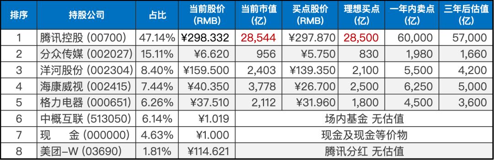
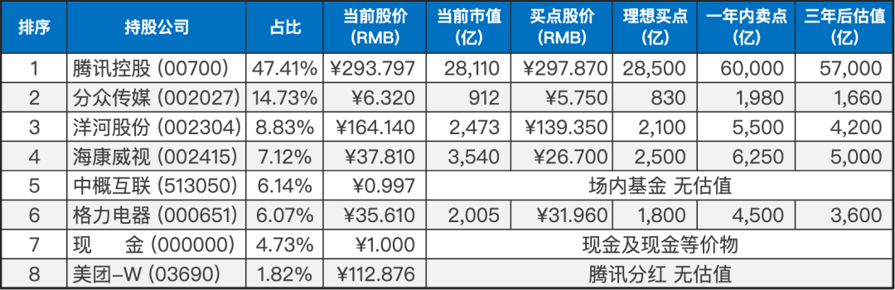

__微信公众号文章地址：[老罗实盘周记-20230318](https://mp.weixin.qq.com/s/Rojo9r_IegKqowcntdSv8g)__

```
老罗实盘周记，每周六更新。专注于股权投资、阅读、学习与个人成长，知行合一、日拱一卒、投资人生。微信公众号【老罗投资】，文章均首发于公众号。
```

### 1. 本周交易

无

### 2. 目前持仓

目前持仓：腾讯控股 47.14%，分众传媒 15.11%，洋河股份 8.40%，海康微视 7.44%，格力电器 6.26%，中概互联 6.14%，现金 4.63%，美团-W 1.81%。

其他还有少量万科A(000002)、恒瑞医药(600276)、宋城演义(300144)、京沪高铁(601816)，份额较少，作为观察仓不记录。

**注：港股已换算为人民币**



### 3. 上周数据



### 4. 持仓收益

本周：上证指数 +0.63%，深证成指 -1.44%，沪深300 -0.21%，恒生指数 +1.03%，恒生科技 +5.22%，老罗的持仓 <span class="red">+2.08%</span>。

截止到今日，老罗实盘今年收益率为：<span class="red">+3.81%</span>，沪深300今年收益率为：<span class="red">+2.25%</span>，勉强跑赢沪深300。

### 5. 重要事项

#### 5.1 硅谷银行破产

当地时间3月10日，美国Silicon Valley Bank(硅谷银行)因资不抵债遭金融监管部门关闭。美国加利福尼亚州金融保护和创新局当日宣布，已依法接管主要服务初创企业的区域性银行硅谷银行，并指派美国联邦储蓄保险公司为硅谷银行进行清算管理。

硅谷银行今年的状况原本看起来是稳定的，就在2月14日，该银行还登上了《福布斯》杂志“2023美国百大银行”榜单。

但随着美联储提高基准利率，债券的价值开始下跌。这通常不是问题，因为下跌只会导致“未实现损失”，这种“损失”不计入银行在未来出现低迷时可以使用的资本缓冲。但是当储户变得焦虑并开始提款时，银行有时不得不在这些债券到期之前，出售它们以弥补资金外逃。该银行不得不出售210亿美元的高流动性资产，以应对存款外逃，并因此亏损了18亿美元。

硅谷银行属于典型的借新还旧，短贷长投给玩砸了，在低利率的时候没有问题，但碰到美元加息周期，美债投资出现亏空，储户担心资金安全，出现了挤兑，系统性风险一下就暴露了出来。

类比到个人投资者，一定要合理分配资金，像高风险、高波动的股权投资，一定要用五年以上用不到的闲钱来进行投资。否则一遇到特殊事件(不得不用钱的情况)，可能就必须“割肉”卖出，影响整体的投资收益。

#### 5.2 央行年内首次降准

中国央行17日发布消息称，决定于2023年3月27日降低金融机构存款准备金率0.25个百分点，本次下调后，金融机构加权平均存款准备金率约为7.6%，释放长期资金5000亿左右。

先来聊一聊什么是“存款准备金率”，大家都知道银行做的是杠杆生意，我们普通人/企业作为储户将钱存给银行，然后银行再将钱贷款给其他人/企业，银行就是一个做资金生意的中介平台。

看起来银行本身并不创造钱，只是钱的搬运工，但是这种搬运工是可以将钱越搬越多的，这怎么实现呢？

第一步：张总向宇宙银行存款100元，然后宇宙银行再将这100元贷款给李总。宇宙银行于是有了100元负债（张总的存款）和100元资产（李总的贷款）。

李总再将这100元存进宇宙银行，宇宙银行再将这100元贷款给王总。宇宙银行于是有了200元负债（张总和李总的存款），以及200元资产（李总和王总的贷款）。

以上过程就是信用创造，理论上来讲，初始只需要有100元存款就可以无限循环下去创造无限的存款和贷款，但是这只是理想状态，因为宇宙银行不能将所有存款都放贷出去，因为要预留一定资金给存款人来取现金，如果存款人都去银行把所有钱都取出来，那么银行就会因为流通性不足而倒闭，所以银行是最怕挤兑的，不过一般是不会发生这种情况的。

那么银行应该留下多少钱比较合适呢？比如张总向宇宙银行存款100元，宇宙银行会留下20元，把剩余的80元都放贷出去，由于这种逐级递减效应，最后一定是有尽头的（最终产生贷款400元），不会无限派生。

一般我们把留下的钱称之为存款准备金，而留下的钱的比率称为存款准备金率，存款100元，留下20元，那么存款准备金率就是20%；留下10元，那么存款准备金率就是10%。这次我们的央行降准之后金融机构的加权平均存款准备金率就是7.6%，也就是存款100元，只需要留下7.6元，剩余的92.4元都可以贷款出去。

从上面的逻辑我们可以看出一个结果：存款准备金率越低，那么银行能够放贷的钱就越多，能够创造的钱就越多，比如这次降低了0.25个百分点就释放了5000亿左右的资金。

从上述我们知道金融机构是具有很强的货币扩张能力的，而这种货币扩张能力得益于两个条件，第一是不断进行信贷投放，其次是存款准备金率的大小，而央行决定了商业银行的存款准备金率大小，相当于是掌握了货币扩张的开关，当需要向市场投放资金的时候就降低存款准备金率，反之则提高存款准备金率。

在全球通胀的大背景下，我国还能做到降准释放长期流动性，拉动消费，帮助经济回稳向上，属实不易。

#### 5.3 腾讯进入可买入区间

其实从上周腾讯不断下调时，就已经进入了可以买入的区间，但腾讯占的仓位(47%)过高，老罗暂时还没有打算出手，如果腾讯股价进一步下跌(占整体持仓的比重也会降低)，可能会进行少量的买入。

腾讯本周还有几件小事，知道即可：

《王者荣耀》继续霸占手游畅销榜冠军，2月吸金2.25亿美元，依然是一台核动力印钞机。

腾讯会议取消免费不限时会议，toB的业务也得赚钱了，不可能一直免费。

微信小程序可以使用数字人民币了。

### 6. 本周读书

看完《雪球专刊》311-316期，一共6本，这几本都比较一般，大多数是讲基金投资的内容，可看可不看，老罗评分⭐️⭐️⭐️三颗星。

### 7. 本周运动

本周跳绳两次，继续恢复中，遏制住了体重继续增长的势头。

祝大家周末愉快！

```
老罗实盘周记，每周六更新。专注于股权投资、阅读、学习与个人成长，知行合一、日拱一卒、投资人生。微信公众号【老罗投资】，文章均首发于公众号。
免责声明：本公众号只作为本人的投资日志记录，本文中提及的个股都有腰斩或血本无归的风险，本人不做任何投资建议，投资请坚持独立思考。
```

__微信公众号文章地址：[老罗实盘周记-20230318](https://mp.weixin.qq.com/s/Rojo9r_IegKqowcntdSv8g)__