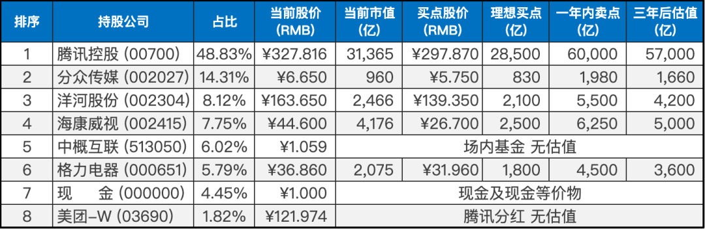
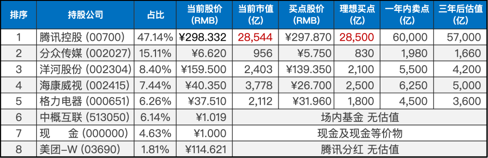
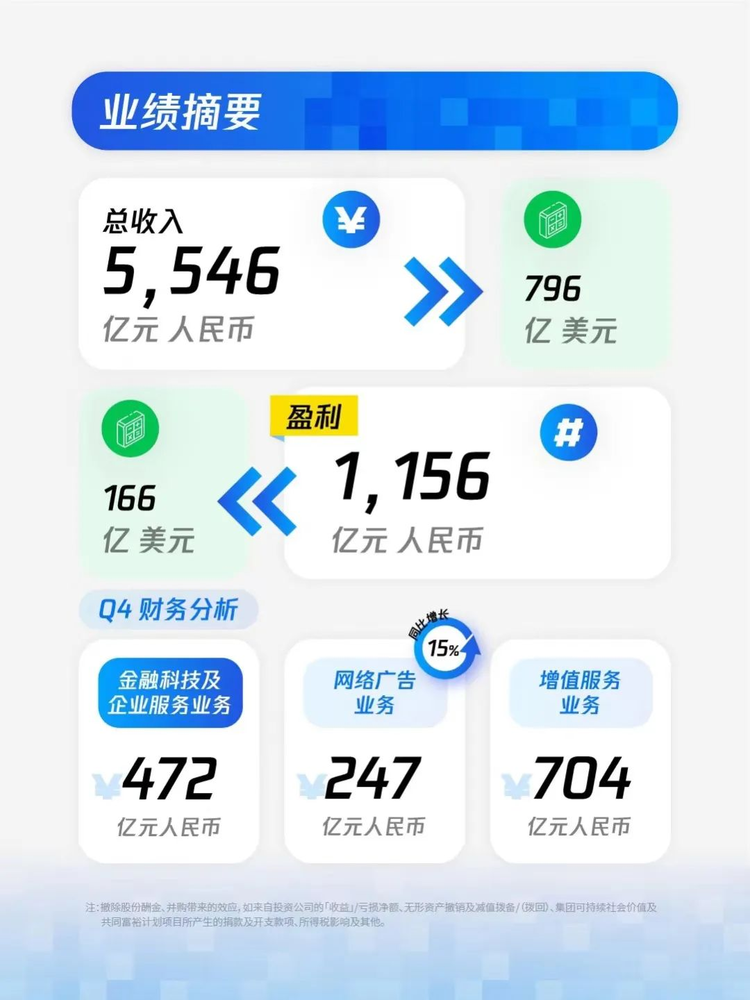
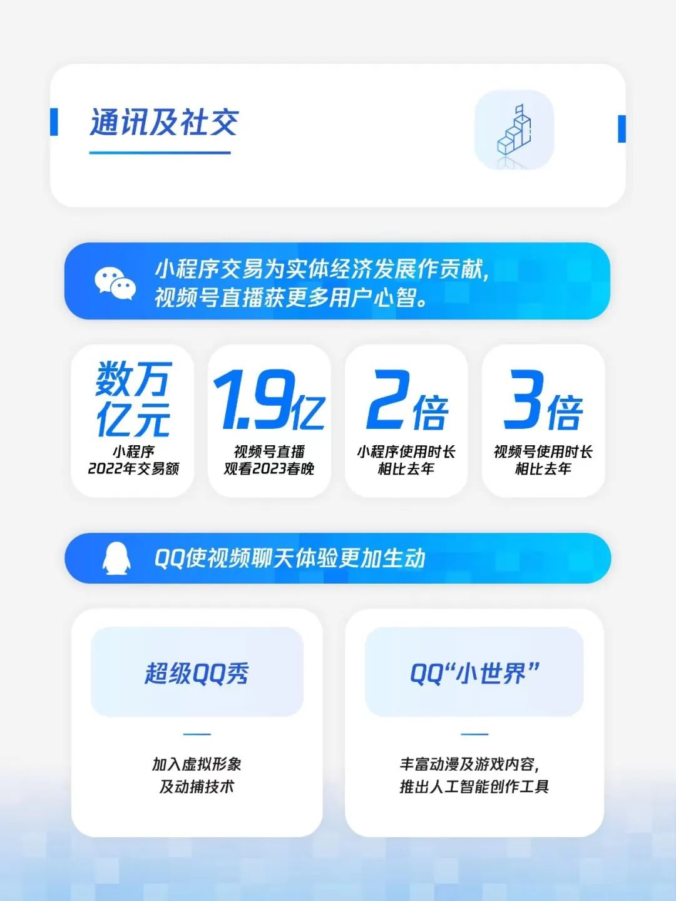

__微信公众号文章地址：[老罗实盘周记-20230325](https://mp.weixin.qq.com/s/Jg5ZjWRC9rzJQ4Ws9CNI7w)__

```
老罗实盘周记，每周六更新。专注于股权投资、阅读、学习与个人成长，知行合一、日拱一卒、投资人生。微信公众号【老罗投资】，文章均首发于公众号。
```

### 1. 本周交易

无

### 2. 目前持仓

目前持仓：腾讯控股48.83%，分众传媒14.31%，洋河股份8.12%，海康微视7.75%，中概互联6.02%，格力电器5.79%，现金4.45%，美团-W 1.82%。

其他还有少量万科A(000002)、恒瑞医药(600276)、宋城演义(300144)、京沪高铁(601816)，份额较少，作为观察仓不记录。

**注：港股已换算为人民币**



### 3. 上周数据



### 4. 持仓收益

本周：上证指数 +0.46%，深证成指 +3.16%，沪深300指数 +1.72%，恒生指数 +2.03%，恒生科技 +6.16%，老罗的持仓 <span class="red">+6.33%</span>。

截止到今日，老罗实盘今年收益率为 <span class="red">+10.14%</span>，沪深300今年收益率为 <span class="red">+4.01%</span>，小幅跑赢沪深300。

### 5. 重要事项

#### 5.1 腾讯发布财报

腾讯控股于2023年3月22日发布了2022年财报。全年营收为5546亿元人民币，同比下降1%；非国际标准盈利为1156亿元人民币，同比下降7%。

第四季度营收为1450亿元人民币，同比增长1%；非国际标准盈利为297亿人民币，同比增长19%。这表明腾讯在“降本增效”政策的推行下，利润表现不俗，虽然营收并未出现明显改善。这一点可以从销售和市场推广费用减少了28%的情况得到佐证。

值得注意的是，腾讯在研发支出上仍然保持高额投入，这在决定公司未来领先地位方面至关重要。与此同时，一般行政支出也增加了19%至1067亿元人民币。

除了美团的特别分红外，腾讯还提高了常规分红，每股拟分红2.4元港币，比2021年增加了50%。但考虑到港股通抽20%的高额红利税，分红其实比较亏。



<span class="green">通讯及社交方面</span>，微信小程序和视频号已经成为中国移动互联网市场的主要力量，超越了朋友圈的使用时长。在去年同期，小程序的使用时长增长了2倍，而视频号的使用时长增长了3倍。这表明用户越来越青睐于这些应用，并认为它们更符合他们的需求和兴趣。

同时微信小程序已经成为移动电商市场的重要一环，完成的交易额已经达到数万亿，这证明微信小程序已经成为品牌和商家必不可少的销售渠道之一。

总的来说，小程序和视频号的崛起是腾讯移动互联网市场发展的重要趋势，也为企业和用户带来了更多的商业价值和便利。



<span class="green">数字内容方面</span>，腾讯的收费增值服务人数下降了1%至2.34亿，这主要是由于腾讯视频和QQ音乐的订阅人数下降。腾讯表示，这是由于内容播放延期引起的。作为腾讯视频的用户我也深有体会，2022年腾讯视频确实没有推出令人激动的爆款剧集。

不过这个现象在2023年第一季度得到了改变，《三体》的爆火让腾讯视频的尴尬局面得以改善。然而，这也再次突显了腾讯视频这种不断投入、不断推出爆款的商业模式，对企业带来的压力。这种模式需要公司不断地推陈出新、投入大量资金，并需要时刻关注消费者的兴趣和需求，以保持业务增长。

虽然这样的商业模式能够带来可观的收益，但其代价是企业需要不断进行投入和创新，以维持其市场地位。

<span class="green">游戏方面</span>，随着2022年下半年游戏版号发放的回暖，腾讯成功获得多款备受期待的游戏版号，包括《黎明觉醒：生机》、《合金弹头》、《无畏契约》等。这些游戏的上线将会缓解目前爆款游戏逐渐“老化”所带来的负面影响。

此外，腾讯还引起了人们对于国际游戏市场的关注。2022年第四季度，国际游戏市场的贡献占到了游戏总收入的33%，比2021年同期提高了5个百分点。

这一趋势一方面反映了国内游戏市场在未成年保护政策下所面临的困难，另一方面也表明国际游戏市场是一条值得探索的道路。

<span class="green">网络广告方面</span>，网络广告业务在2022年第四季度出现同比增长，其中视频号广告的投放起到了关键作用。

相比于以销售为导向的抖音广告，视频号广告更注重广告主和用户之间的联系，致力于为广告主打造品牌效力和沉淀私域流量。这种广告形式更具有长期吸引力，尤其是对那些有长远规划的广告主。

另外，随着疫情逐渐得到控制，预计2023年广告需求将进一步释放，为广告业务带来更多的机遇和挑战。

整体来说，腾讯2022年年报<span class="red">中规中矩，符合预期</span>，期待腾讯在2023年王者归来。

#### 5.2 腾讯分红的美团股票到账

在24日晚，腾讯分红的美团股票到账了，这意味着到下周一即27日，使用港股通就可以正常交易了。

老罗计划在下周卖出，因为我并不了解开水团，也很少使用他家的服务。打算将卖出的资金买入分众或洋河，虽然这两家公司的股价并不便宜，但看好它们的发展前景和稳定性。如果在这两个公司之间没有找到合适的机会，也可能会把资金投入银华日利货币基金。

#### 5.3 美联储加息

美联储在当地时间3月22日宣布将联邦基金利率目标区间上调25个基点至4.75%至5%之间，为自2007年10月以来最高水平，这是自2022年3月以来第9次加息。

虽然这次加息基本符合市场预期，但这也意味着美联储认为控制通胀仍是当务之急，打破了之前市场传言美联储会停止加息甚至降息的观点。

事实上，这次加息还表明了美联储对其提供的银行业流动性救助工具充满自信。

然而，美国2月份通胀依然维持在6%的高位，离达成2%的通胀目标还有很长的路要走。因此，美联储不得不继续加息，并按计划继续缩表。虽然美联储货币政策不可能马上大转弯，但从实践来看，美联储在截至3月15日的一周内扩表了3000亿美元，向市场释放流动性。这一数字超过了2008年金融危机最严重时期救市资金的规模，这意味着美联储仍然需要保持灵活性以应对当前的金融形势。

尽管美联储的货币政策不可能马上大转弯，但继续加息的动力已经大为减弱，这意味着本轮美联储加息可能接近尾声，美国货币政策正逐步转向。

无限QE造成的烂摊子，最终还是一地鸡毛。

#### 5.4 投资框架

老罗的投资框架包括三个方面：价值观、世界观和方法论。指导老罗在决策过程中应该关注什么，如何看待市场和企业，以及如何构建有效的投资策略。

具体来说，价值观是投资的基础，它强调投资者应该从企业经营中获利，而非单纯追求股价涨势。投资者需要成为“竞争优势”的挖掘者，而不是“景气趋势”的追随者，从而实现长期收益。

其次，世界观是投资者需要认识到的现实，它指出经济系统的复杂性和难以预测性，投资者应该保持谨慎，不轻易相信外推式预测，而要基于对市场和企业的深入理解来做出决策。

最后，基于前两个方面的指导，投资者需要建立一套可行的方法论，这包括在遇到问题时多往坏处想，不依赖单一情景的乐观预测，以能够容忍股票的缺点而不是无限放大其优点为买入条件，从而获得更高的安全边际。

这样的投资策略可以帮助投资者避免不必要的风险，实现长期的投资回报。

### 6. 本周读书

本周阅读了《雪球专刊》318-324期，一共7本，20余万字，基金投资的文章占大多数，有一两篇文章不错，整体老罗评分两星⭐️⭐️，不值得花时间阅读。

### 7. 本周运动

本周跳绳两次，体重没有大的变化，继续保持。

祝大家周末愉快！

```
老罗实盘周记，每周六更新。专注于股权投资、阅读、学习与个人成长，知行合一、日拱一卒、投资人生。微信公众号【老罗投资】，文章均首发于公众号。
免责声明：本公众号只作为本人的投资日志记录，本文中提及的个股都有腰斩或血本无归的风险，本人不做任何投资建议，投资请坚持独立思考。
```

__微信公众号文章地址：[老罗实盘周记-20230325](https://mp.weixin.qq.com/s/Jg5ZjWRC9rzJQ4Ws9CNI7w)__