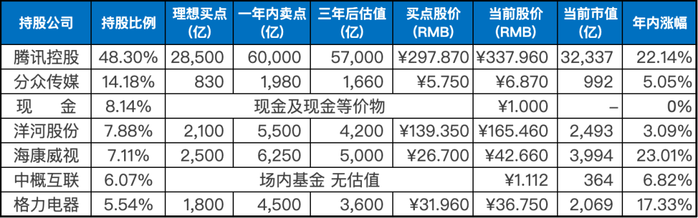
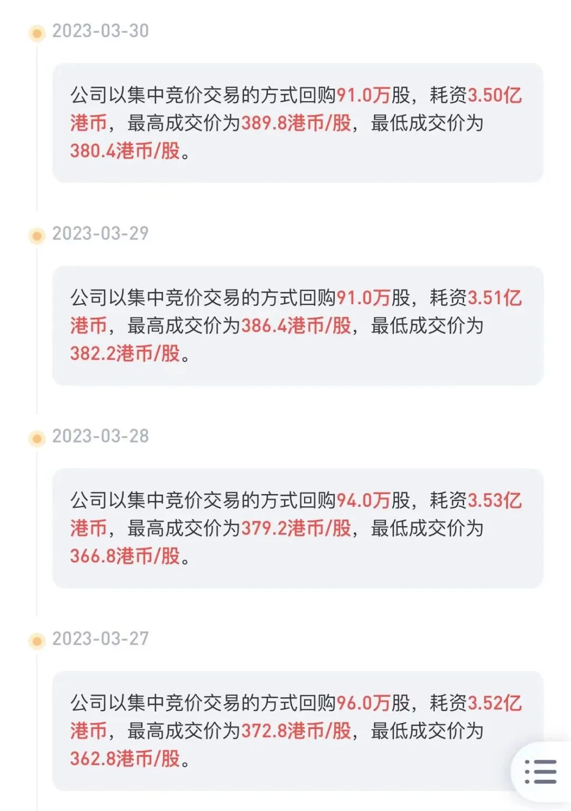

__微信公众号文章地址：[老罗实盘周记-20230401](https://mp.weixin.qq.com/s/YEbqbbtzlT9yrEEWO2RufA)__

```
老罗实盘周记，每周六更新。专注于股权投资、阅读、学习与个人成长，知行合一、日拱一卒、投资人生。微信公众号【老罗投资】，文章均首发于公众号。
```

### 1. 本周交易

+ 周一(3.27)卖出腾讯分红的美团股票，卖出价格分别为132.10港币与132.30港币。成功卖在最低点，卖出原因：不懂不持有。
+ 周三(3.29)，用卖出美团的资金，加上少量新入资金买入银华日利货币基金，买入价格为100.498人民币。

### 2. 目前持仓

目前持仓：腾讯控股48.30%，分众传媒14.18%，现金8.14%，洋河股份7.88%，海康微视7.11%，中概互联6.07%，格力电器5.54%。

其他还有少量万科A(000002)、恒瑞医药(600276)、宋城演义(300144)、京沪高铁(601816)，份额较少，作为观察仓不记录。

**注：港股已换算为人民币**



### 3. 上周数据


### 4. 持仓收益

本周：上证指数 +0.22%，深证成指 +0.79%，沪深300指数 +0.59%，恒生指数 +2.43%，恒生科技 +1.87%，老罗的持仓 <span class="red">+2.16%</span>。

截止到今日，老罗实盘今年收益率为 <span class="red">+12.30%</span>，沪深300今年收益率为 <span class="red">+4.63%</span>，小幅跑赢沪深300。

### 5. 重要事项

#### 5.1 腾讯本周恢复股票回购

腾讯经历了一段敏感期之后，在发布年报后恢复了回购股份。还是熟悉的配方，还是熟悉的味道，腾三亿又回来了。

3月27日到3月31日每天回购3.5亿港币的股票，合计超过了450万股，腾讯的股价本周也表现良好，再次上涨。

老罗倒是希望股价能慢点涨，给腾讯的股票回购以更多的时间和空间。



#### 5.2 全面注册制正式实施

3月27日，首批主板注册制新股正式开启网上申购。从沪、深两市主板注册制第一股的发行市盈率来看，两只新股均突破了主板“23倍市盈率红线”。

随着全面注册制时代的正式开启，主板新股实现市场化定价，上述23倍市盈率“隐形天花板”的突破也就意味着，投资者彻底作别“闭眼打新”时代。

3月29日，三只首日上市交易的新股中有两只出现首日破发（主要指首日收盘价跌破发行价，盘中跌破则归为盘中破发），其中一只为主板新股，这也是继2019年年初罕见的主板新股破发后，四年多来的第一次。此外，自3月20日出现年内首只新股破发后，迄今已有四只新股破发。

之前打新虽然可以获取稳定的高收益，但全面注册制后，打新风险变得很高，因此投资者在打新时需要谨慎考虑自身风险承受能力，并进行充分的风险评估和研究。

打新有风险，投资需谨慎。

#### 5.3 阿里巴巴设立六大业务集团

3月27日有媒体报道，阿里巴巴集团创始人马云已经返回中国。马云回国的具体原因未有公开披露，但这一消息结束了各种关于他下落的猜测和传言。

两天后，阿里巴巴集团董事会主席兼首席执行官张勇在发布的全员信中宣布，启动“1+6+N”组织变革，设立阿里云智能、淘宝天猫商业、本地生活、菜鸟、国际数字商业、大文娱等六大业务集团和多家业务公司。

每个集团都将成立独立的董事会，并实行各自CEO负责制，阿里巴巴集团将全面实行控股公司管理。

张勇还表示，“市场是最好的试金石，未来，具备条件的集团和公司，都将有独立融资和上市的可能性。”

阿里巴巴此次的组织变革可以说是中国民营企业历史上的一次最大的调整，是非常大胆的一步，调整目的是提高公司的灵活性和战略性，更好地适应后疫情时代的变化和挑战。

此次变革让阿里巴巴更加聚焦于前台业务，加强与消费者和商家的互动，同时为各业务集团和业务公司提供更多的自主权和独立决策的能力。这将有助于提高公司的执行效率和市场反应速度。此外，这也能够更好地激发员工的积极性，增强企业的活力和创新力。

整体来看，这是一次非常积极和有益的变革，也是阿里巴巴公司发展史上的重要里程碑。

老罗虽然不是阿里巴巴的股东，但是持有的中概互联基金，阿里是他投资组合中的第二大重仓股，占比高达22%以上，因此也比较关注阿里巴巴的动态和发展。

#### 5.4 投资中最重要的事是保持良好的心态

人生并非总能如愿以偿，风雨兼程，跌宕起伏。我们不可避免地会遇到各种挫折和挑战，或许怀才不遇，或许付出不得回报。

为了抵御生命中的挑战和逆境，我们需要坚韧不拔和勇气，只有这样才能克服困难和面对逆境。

生活质量的高低，对大多数人来说，不仅取决于财务状况，更取决于个人内心的特质。平静、接受、希望、信任、欣赏以及坚定的乐观情绪，是支撑我们面对生活中各种挑战和困境的重要力量。

即使遭遇财务上的挫折，也能从内心感受到生活的美好，有信心和勇气去面对困境，积极地寻求改变和进步。因此，内在的坚定和积极的心态，才是真正决定我们生活质量高低的关键。

约翰·弥尔顿在《失乐园》一书中提到，失明后的他意识到，“心灵是个自主的地方，一念起，天堂变地狱；一念灭，地狱变天堂”。这句话告诉我们，内心的态度对于我们的生活质量至关重要。

我们可以通过调整思想和态度，将困难转化为机遇，将负面情绪转化为积极的力量。在面对挑战和逆境时，需要学会控制我们的内心，以坚定和积极的心态来面对生活中的不确定性。

在生活中，我们会面对很多无法改变的事情，这时候需要学会调整自己的心态，让自己更加坚强。

投资之路充满波折，没有一位投资者是平坦的，有人曾遭破产，有人经历亲情失落，还有人在逆境中遭受嘲讽和怀疑，人生前20年充满艰辛。

无论何时何地，意外和压力总会找上门，而成功的投资者都有一个共同特点：强大的痛苦承受能力和稳定的心态。

每个人都会遭遇痛苦和挫折，而不屈不挠则是一种崇高的美德。

生活中有很多事情超出我们的掌控，但我们可以决定如何面对。无论是好是坏，公平还是不公平，冷漠还是热情，态度是我们可以掌握的自主权。

除了身体上的疾病，大多数的痛苦都源自情绪，源自我们对事物的感知。

选择不受伤害的心态，就不会感到受到伤害；总是认为自己是受害者，就会一直处于痛苦之中。

只有当一件事情让你的情绪失控，才会对你的生活造成毁灭性的影响，否则它不会对你造成伤害。要像岸边的岩石一样坚定，即使四周波涛汹涌，海浪冲刷不停，也能保持不动摇。

外部的事物，如我们的健康、他人的看法，都无法完全被掌控，但我们可以完全掌控自己的意图、情绪和态度。

毁灭还是超脱，完全取决于对待问题的态度。你可以选择看到问题，也可以选择看到解决问题的机会。无论如何，你的态度将决定你的经历和结果。

投资是我们人生中的一部分，但并不是全部。面对人生中的各种挑战和机遇，我们需要以积极的态度去面对，并认识到财富并不是幸福的全部。

我们需要关注自己的内心世界，培养平静、感恩、善良、宽容、乐观和坚韧等品质，这些品质才是我们在人生中真正需要追求和珍惜的。

希望这些建议可以帮助大家变得更加幸福，共勉。

### 6. 本周读书

#### 6.1 《金钱博弈》

1998年亚洲金融危机暴发，韩国经济陷入困境，"国家破产"成为频繁出现的词汇。

多年过去了，大宇公司破产，三星等财团被欧美金融巨头强行接管。韩国政府和民众一直认为这是国际货币基金组织在韩国经济衰退时趁火打劫的行为。

然而，事实真的如同电影《国家破产之日》所描绘的那样吗？韩国经济究竟存在着哪些问题？外国资本的紧急援助是否只是简单的财富掠夺？《金钱博弈》从不同的角度揭示了这场著名收购案的幕后故事。

这本书老罗 ⭐️⭐️⭐️⭐️⭐️ 五星推荐，非常值得阅读。

#### 6.2 《所罗门王的指环》

这本小书充满了有趣而温情的动物行为观察，作者通过自己的长期观察，娓娓道来。读者仿佛可以感受到一位温和睿智的长者在午后的摇椅上讲述这些故事的情形。

这本书老罗 ⭐️⭐️⭐️⭐️ 四星推荐，值得一读。

#### 6.3 《雪球专刊325期》

介绍大盘风格基金，老罗评分⭐️⭐️两星，不值得阅读。

### 7. 本周运动

本周运动三天，运动内容是跳绳加跑步机爬坡，继续保持。

祝大家周末愉快！

```
老罗实盘周记，每周六更新。专注于股权投资、阅读、学习与个人成长，知行合一、日拱一卒、投资人生。微信公众号【老罗投资】，文章均首发于公众号。
免责声明：本公众号只作为本人的投资日志记录，本文中提及的个股都有腰斩或血本无归的风险，本人不做任何投资建议，投资请坚持独立思考。
```

__微信公众号文章地址：[老罗实盘周记-20230401](https://mp.weixin.qq.com/s/YEbqbbtzlT9yrEEWO2RufA)__