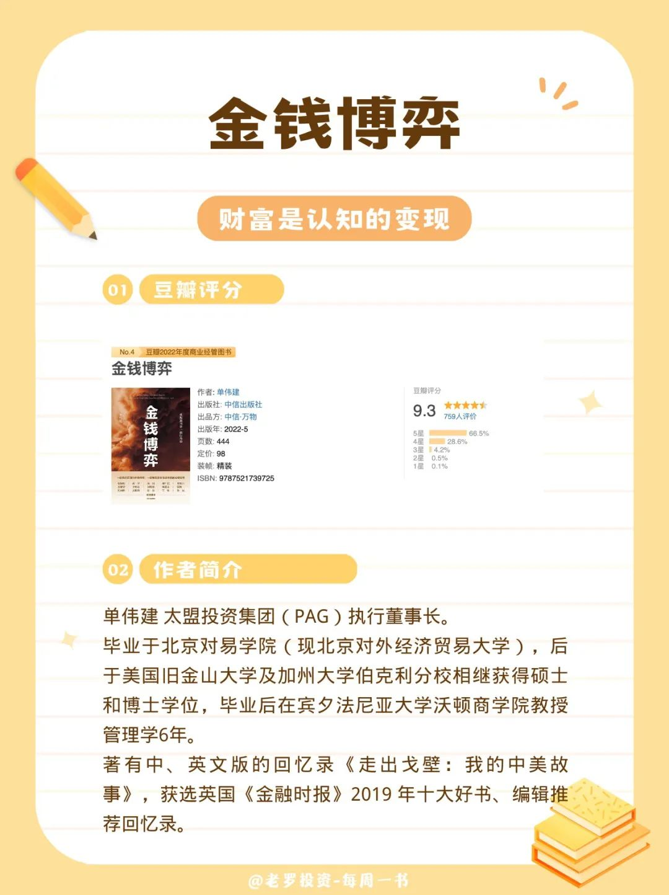
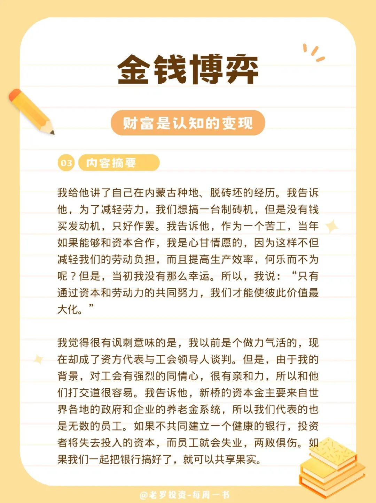
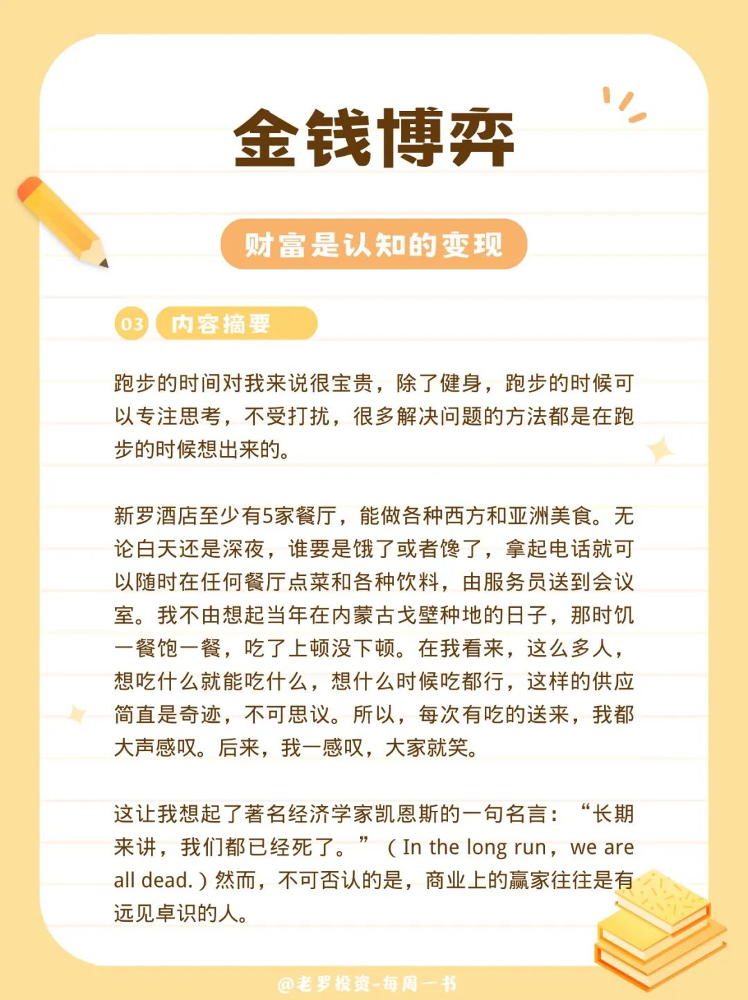

__微信公众号文章地址：[老罗读书第6期-金钱博弈](https://mp.weixin.qq.com/s/1O6oADprqcp3cBEzaFtS6A)__

### 1. 豆瓣评分&作者简介

#### 1.1 豆瓣评分

+ 9.3 分

#### 1.2 作者简介

单伟建 太盟投资集团（PAG）执行董事长。毕业于北京对易学院（现北京对外经济贸易大学），后于美国旧金山大学及加州大学伯克利分校相继获得硕士和博士学位，毕业后在宾夕法尼亚大学沃顿商学院教授管理学6年。

著有中、英文版的回忆录《走出戈壁：我的中美故事》，获选英国《金融时报》2019 年十大好书、编辑推荐回忆录。

### 2. 内容摘要

摧眉折腰事权贵，使我不得开心颜。

危机的源头是美国为了降低通货膨胀率，提高了利率。储蓄银行此前的长期贷款利率比较低，现在获得存款的利率增加了，存、贷之间产生了负利差，这导致银行大量赔钱，最终倒闭。

看着她们义无反顾地跳入冰冷的海浪中，我觉得她们代表了韩国老百姓在面对逆境和困难时的勇气、韧性与自豪感。我想这个国家终将从经济危机解脱出来，并变得更强。这也是为什么我们把宝押在韩国第一银行上。

如果我卖掉这家银行，我就完蛋了；如果不卖，国家就会一团糟。

我给他讲了自己在内蒙古种地、脱砖坯的经历。我告诉他，为了减轻劳力，我们想搞一台制砖机，但是没有钱买发动机，只好作罢。我告诉他，作为一个苦工，当年如果能够和资本合作，我是心甘情愿的，因为这样不但减轻我们的劳动负担，而且提高生产效率，何乐而不为呢？但是，当初我没有那么幸运。所以，我说：“只有通过资本和劳动力的共同努力，我们才能使彼此价值最大化。”

我觉得很有讽刺意味的是，我以前是个做力气活的，现在却成了资方代表与工会领导人谈判。但是，由于我的背景，对工会有强烈的同情心，很有亲和力，所以和他们打交道很容易。我告诉他，新桥的资本金主要来自世界各地的政府和企业的养老金系统，所以我们代表的也是无数的员工。如果不共同建立一个健康的银行，投资者将失去投入的资本，而员工就会失业，两败俱伤。如果我们一起把银行搞好了，就可以共享果实。

跑步的时间对我来说很宝贵，除了健身，跑步的时候可以专注思考，不受打扰，很多解决问题的方法都是在跑步的时候想出来的。

新罗酒店至少有5家餐厅，能做各种西方和亚洲美食。无论白天还是深夜，谁要是饿了或者馋了，拿起电话就可以随时在任何餐厅点菜和各种饮料，由服务员送到会议室。我不由想起当年在内蒙古戈壁种地的日子，那时饥一餐饱一餐，吃了上顿没下顿。在我看来，这么多人，想吃什么就能吃什么，想什么时候吃都行，这样的供应简直是奇迹，不可思议。所以，每次有吃的送来，我都大声感叹。后来，我一感叹，大家就笑。

这让我想起了著名经济学家凯恩斯的一句名言：“长期来讲，我们都已经死了。”（In the long run,we areall dead. ）然而，不可否认的是，商业上的赢家往往是有远见卓识的人。

### 3. 老罗书评

1998年亚洲金融危机爆发，韩国经济陷入困境，"国家破产"成为频繁出现的词汇。

多年过去了，大宇公司破产，三星等财团被欧美金融巨头强行接管。韩国政府和民众一直认为这是国际货币基金组织在韩国经济衰退时趁火打劫的行为。然而，事实真的如同电影《国家破产之日》所描绘的那样吗？韩国经济究竟存在着哪些问题？外国资本的紧急援助是否只是简单的财富掠夺？《金钱博弈》从不同的角度揭示了这场著名收购案的幕后故事。

这本书老罗 ⭐️⭐️⭐️⭐️⭐️ 五星推荐，非常值得阅读。

__微信公众号文章地址：[老罗读书第6期-金钱博弈](https://mp.weixin.qq.com/s/1O6oADprqcp3cBEzaFtS6A)__