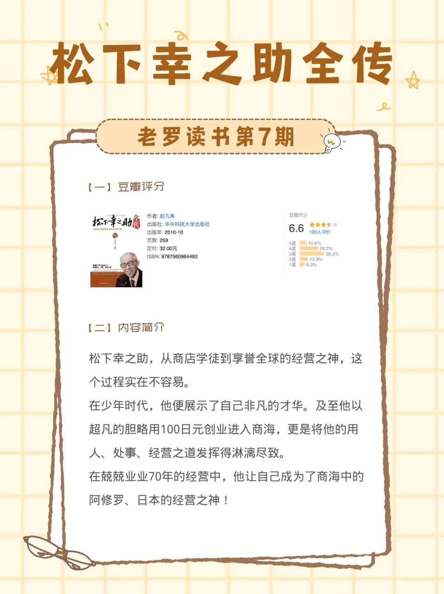
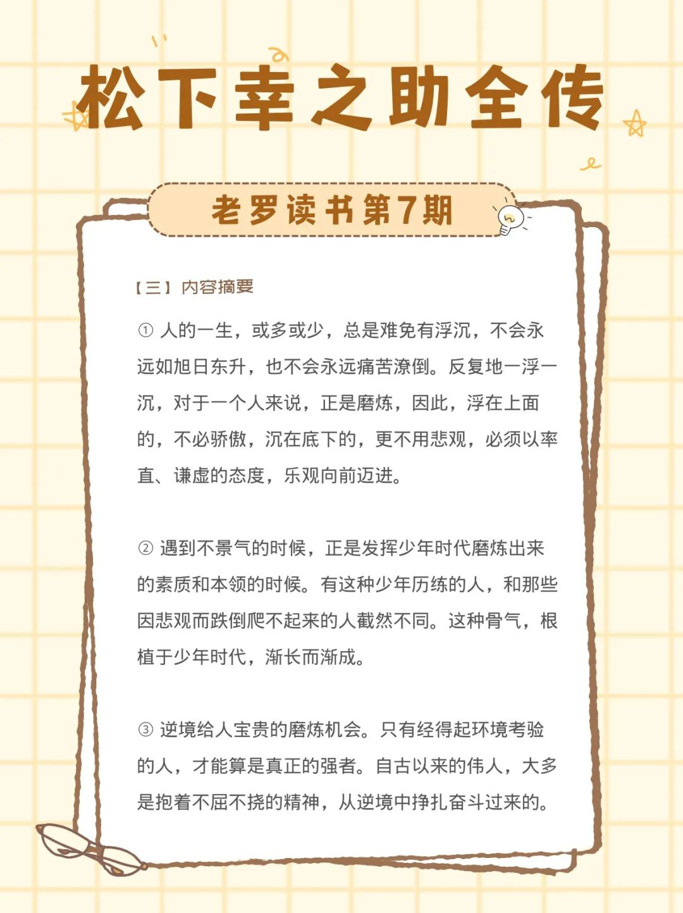
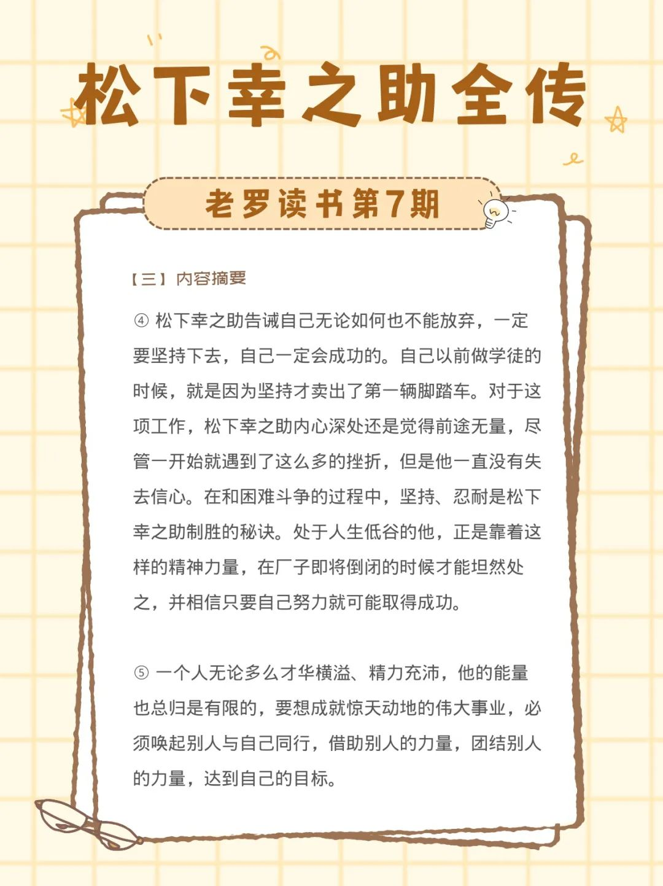
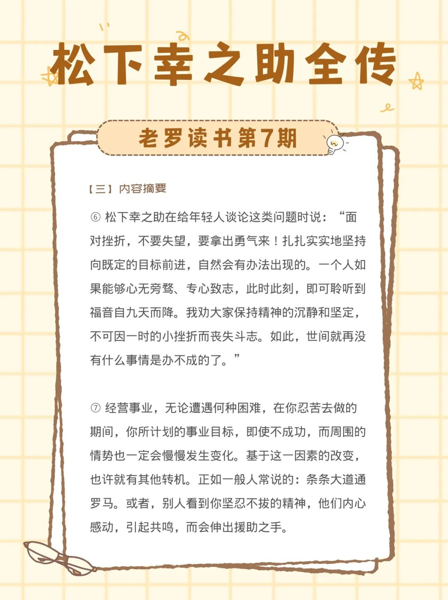
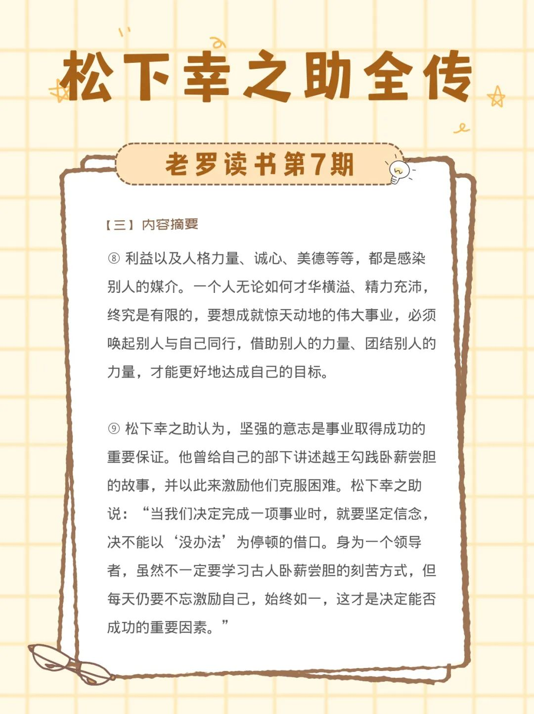
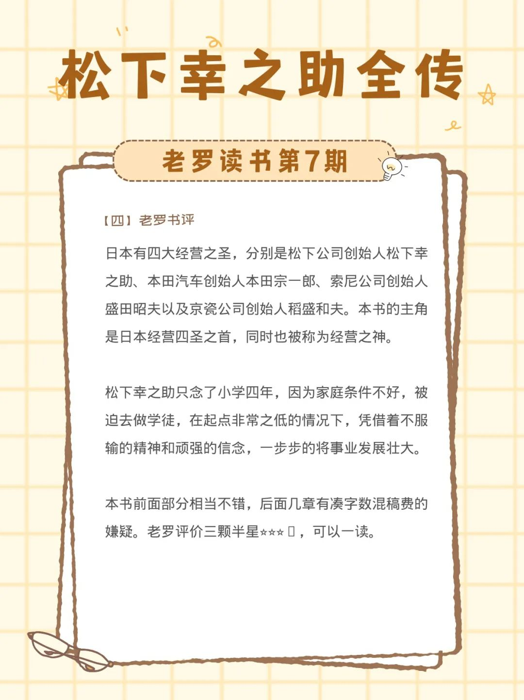

__微信公众号文章地址：[老罗读书第7期-松下幸之助全传](https://mp.weixin.qq.com/s/zAzVw_P9CBi75uw3LG5amA)__

### 1. 豆瓣评分&作者简介

#### 1.1 豆瓣评分

+ 6.6 分

#### 1.2 作者简介

松下幸之助，从商店学徒到享誉全球的经营之神，这个过程实在不容易。在少年时代，他便展示了自己非凡的才华。及至他以超凡的胆略用100日元创业进入商海，更是将他的用人、处事、经营之道发挥得淋漓尽致。在兢兢业业70年的经营中，他让自己成为了商海中的阿修罗、日本的经营之神！

### 2. 内容摘要

① 人的一生，或多或少，总是难免有浮沉，不会永远如旭日东升，也不会永远痛苦潦倒。反复地一浮一沉，对于一个人来说，正是磨炼，因此，浮在上面的，不必骄傲，沉在底下的，更不用悲观，必须以率直、谦虚的态度，乐观向前迈进。

② 遇到不景气的时候，正是发挥少年时代磨炼出来的素质和本领的时候。有这种少年历练的人，和那些因悲观而跌倒爬不起来的人截然不同。这种骨气，根植于少年时代，渐长而渐成。

③ 逆境给人宝贵的磨炼机会。只有经得起环境考验的人，才能算是真正的强者。自古以来的伟人，大多是抱着不屈不挠的精神，从逆境中挣扎奋斗过来的。

④ 松下幸之助告诫自己无论如何也不能放弃，一定要坚持下去，自己一定会成功的。自己以前做学徒的时候，就是因为坚持才卖出了第一辆脚踏车。对于这项工作，松下幸之助内心深处还是觉得前途无量，尽管一开始就遇到了这么多的挫折，但是他一直没有失去信心。在和困难斗争的过程中，坚持、忍耐是松下幸之助制胜的秘诀。处于人生低谷的他，正是靠着这样的精神力量，在厂子即将倒闭的时候才能坦然处之，并相信只要自己努力就可能取得成功。

⑤ 一个人无论多么才华横溢、精力充沛，他的能量也总归是有限的，要想成就惊天动地的伟大事业，必须唤起别人与自己同行，借助别人的力量，团结别人的力量，达到自己的目标。

⑥ 松下幸之助在给年轻人谈论这类问题时说：“面对挫折，不要失望，要拿出勇气来！扎扎实实地坚持向既定的目标前进，自然会有办法出现的。一个人如果能够心无旁骛、专心致志，此时此刻，即可聆听到福音自九天而降。我劝大家保持精神的沉静和坚定，不可因一时的小挫折而丧失斗志。如此，世间就再没有什么事情是办不成的了。”

⑦ 经营事业，无论遭遇何种困难，在你忍苦去做的期间，你所计划的事业目标，即使不成功，而周围的情势也一定会慢慢发生变化。基于这一因素的改变，也许就有其他转机。正如一般人常说的：条条大道通罗马。或者，别人看到你坚忍不拔的精神，他们内心感动，引起共鸣，而会伸出援助之手。

⑧ 利益以及人格力量、诚心、美德等等，都是感染别人的媒介。一个人无论如何才华横溢、精力充沛，终究是有限的，要想成就惊天动地的伟大事业，必须唤起别人与自己同行，借助别人的力量、团结别人的力量，才能更好地达成自己的目标。

⑨ 松下幸之助认为，坚强的意志是事业取得成功的重要保证。他曾给自己的部下讲述越王勾践卧薪尝胆的故事，并以此来激励他们克服困难。松下幸之助说：“当我们决定完成一项事业时，就要坚定信念，决不能以‘没办法’为停顿的借口。身为一个领导者，虽然不一定要学习古人卧薪尝胆的刻苦方式，但每天仍要不忘激励自己，始终如一，这才是决定能否成功的重要因素。”

### 3. 老罗书评

日本有四大经营之圣，分别是松下公司创始人松下幸之助、本田汽车创始人本田宗一郎、索尼公司创始人盛田昭夫以及京瓷公司创始人稻盛和夫。本书的主角更是日本经营四圣之首，也被称为日本经营之神。

松下幸之助只念了小学四年，因为家庭条件被迫去做学徒，在起点非常之低的情况下，凭借着不服输的精神和顽强的信念，一步步的将事业发展壮大。

本书前面部分相当不错，后面几章有凑字数混稿费的嫌疑。老罗评价三颗半星⭐️⭐️⭐️🌟，可以一读。

__微信公众号文章地址：[老罗读书第7期-松下幸之助全传](https://mp.weixin.qq.com/s/zAzVw_P9CBi75uw3LG5amA)__