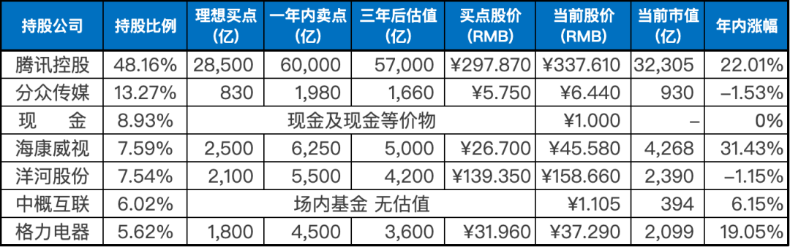
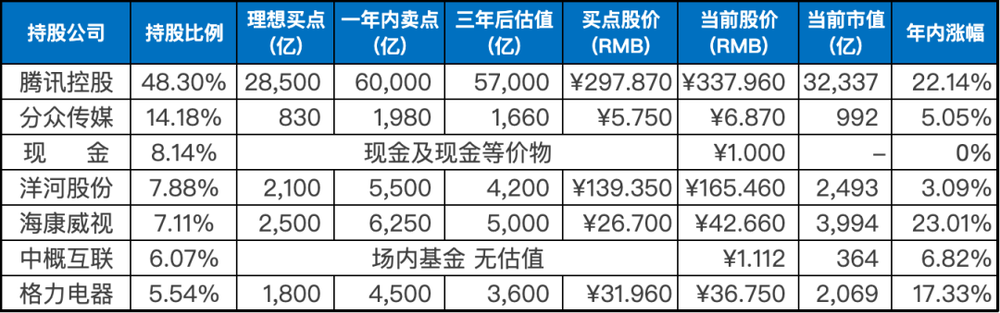

__微信公众号文章地址：[老罗实盘周记-20230408](https://mp.weixin.qq.com/s/habHSEHiuhjj3chZbAwr1A)__

```
老罗实盘周记，每周六更新。专注于股权投资、阅读、学习与个人成长，知行合一、日拱一卒、投资人生。微信公众号【老罗投资】，文章均首发于公众号。
```

### 1. 本周交易

+ 买入银华日利货币基金，买入价格：100.528人民币。

### 2. 目前持仓

目前持仓：腾讯控股48.16%，分众传媒13.27%，现金8.93%，海康微视7.59%，洋河股份7.54%，中概互联6.02%，格力电器5.62%。

其他还有少量万科A(000002)、恒瑞医药(600276)、宋城演义(300144)、京沪高铁(601816)，份额较少，作为观察仓不记录。

**注：港股已换算为人民币**



### 3. 上周数据



### 4. 持仓收益

本周：上证指数 +1.67%，深证成指 +2.06%，沪深300指数 +1.79%，中证500指数 +1.97%，恒生指数 -0.34%，恒生科技 -1.54%，老罗的持仓 <span class="green">-0.79%</span>。

截止到今日，老罗实盘今年收益率为 <span class="red">+11.51%</span>，沪深300今年收益率为 <span class="red">+6.50%</span>，小幅跑赢沪深300。

### 5. 重要事项

#### 5.1 茅台再次登顶胡润中国品牌价值榜

4月3日，胡润研究院发布《2022胡润中国品牌价值榜》，贵州茅台以10350亿连续第五次登顶“最具价值中国品牌”，较去年增长250亿元，增幅近2.48%。

这是胡润研究院连续第十七年发布胡润品牌榜，300强“最具价值中国品牌”上榜，总价值7万亿元。其中，酒类品牌共有32个，酒类前十品牌依次为贵州茅台、五粮液、国窖1573、汾酒、梦之蓝、青岛啤酒、雪花、习酒、古井贡、郎酒。

从区域分布来看，北京、上海和深圳仍然是上榜品牌最多的前三大城市，分别有70个、52个和32个，总计占300强一半以上。

从行业来看，金融仍然是上榜品牌最多的行业，有52个，比去年多14个；食品饮料第二，有38个，比去年多19个；酒类第三，有32个，比去年多12个。前三大行业总计占300强近四成。
300强中，有121个新上榜品牌，其中食品饮料品牌最多，有19个；其次是金融和酒类品牌，分别有15个和14个。

食品饮料、酒类依然是非常优秀的赛道，特别是茅台，属于大A股中BUG一般的存在，如果茅台的价格能回到1200左右，老罗肯定会进行买入操作。茅台去年10月底到过1316，属于非常便宜的价格，但老罗那会的资金都拿去买入小企鹅了，毕竟当时小企鹅的价格属于硬塞钱。

当然最后能不能买到，谁也没法预料，毕竟“市场先生”只能利用，不可预测。

#### 5.2 券商定向“降准”

证券行业又迎来利好。4月7日，中国结算发布消息称，在2022年4月已将股票类业务最低结算备付金缴纳比例自18%调降至16%的基础上，拟正式启动股票类业务最低结算备付金缴纳比例差异化调降工作，本次实现股票类业务最低备付缴纳比例由16%平均降至15%左右。

中国结算表示，在证监会的统一部署下，将积极稳妥组织全市场开展相关准备工作，预计需要2个月准备时间，正式实施时间将另行通知。

定向降准预计能释放200亿左右的资金，本次调降1%所带来的影响有限，更多是释放了积极的政策信号。

券商定向降准对老罗来说没有任何影响，了解即可。

#### 5.3 下周一主板注册制首批新股将上市交易

主板注册制首批10只新股将于周一上市交易，全面注册制下，沪深主板交易规则作出优化完善，与投资者熟知多年的交易规则存在一定差异。

投资者参与主板注册制下股票交易，需要高度关注、积极适应交易机制变化，充分了解相关风险点，审慎作出投资决策。

注册制下，主板新股上市前5个交易日内不设涨跌幅限制，对于存量股票和上市第6日后的股票，涨跌幅限制仍然保持10%不变。

全面注册制后，很多新股的PE被高估，动不动就几十倍的市盈率，破发的风险也愈发变大。所以在申购之前最好查下新股的估值，防止破发造成损失。

#### 5.4 下一步的买入计划

洋河股份股价跌到150元人民币以内分批买入，上限为仓位的25%。或者是分众传媒6元人民币以内分批买入，上限为仓位的15%。

如果这两家公司达不到买入价格，则继续躺平不动。

### 6. 本周读书

#### 6.1 《松下幸之助全传》

日本有四大经营之圣，分别是松下公司创始人松下幸之助、本田汽车创始人本田宗一郎、索尼公司创始人盛田昭夫以及京瓷公司创始人稻盛和夫。本书的主角更是日本经营四圣之首，也被称为日本经营之神。

松下幸之助只念了小学四年，因为家庭条件被迫去做学徒，在起点非常之低的情况下，凭借着不服输的精神和顽强的信念，一步步地将事业发展壮大。

本书前面部分相当不错，后面几章有凑字数混稿费的嫌疑。老罗评价三星半⭐️⭐️⭐️🌟，可以一读。

#### 6.2 《未来学大会》

波兰科幻大师斯坦尼斯瓦夫•莱姆代表作，豆瓣评分很高9.1分，但老罗没怎么看进去，可能创作的年代是1971年，当时令人惊艳的幻想，在如今看来普普通通罢了。

本书的主线：主角伊扬•蒂赫去参加第八届未来学大会，讨论如何解决人类面临的种种难题，不料却误服致幻药物，穿越到一个未来幻象中。那里的人们消灭了贫穷与疾病，平安喜乐地生活着，可蒂赫却始终觉得有什么地方不对劲……

老罗评价三颗星⭐️⭐️⭐️，可读可不读。

#### 6.3 《小林生活禅》

很治愈的小书，分为上下两册，一小时内就能看完。很赞同作者的快乐九字诀：没必要，无所谓，不至于。

老罗评价四颗星⭐️⭐️⭐️⭐️，值得一读。

#### 6.4 《太上感应篇》

《太上感应篇》是道教经典，内容主要是劝人遵守道德规范，时刻止恶修善，自利利他。行善积德福庇子孙，作恶受罚殃及子孙。积善之家，必有余庆；积不善之家，必有余殃。全书一共才1600余字，一口气就能读完，读完后值得反复思考。

老罗评价四颗星⭐️⭐️⭐️⭐️，值得一读。

#### 6.5 《半小时漫画史记》

半小时漫画系列的质量还是一如既往的稳定，这本《史记》从五帝时代一直讲述到战国时期，内容轻松，阅读起来毫无负担。史记本来就是故事会，读起来一点都不累。

老罗评价四颗星⭐️⭐️⭐️⭐️，值得一读。

### 7. 本周运动

本周运动一天，运动内容是跳绳，继续保持。

祝大家周末愉快！

```
老罗实盘周记，每周六更新。专注于股权投资、阅读、学习与个人成长，知行合一、日拱一卒、投资人生。微信公众号【老罗投资】，文章均首发于公众号。
免责声明：本公众号只作为本人的投资日志记录，本文中提及的个股都有腰斩或血本无归的风险，本人不做任何投资建议，投资请坚持独立思考。
```

__微信公众号文章地址：[老罗实盘周记-20230408](https://mp.weixin.qq.com/s/habHSEHiuhjj3chZbAwr1A)__