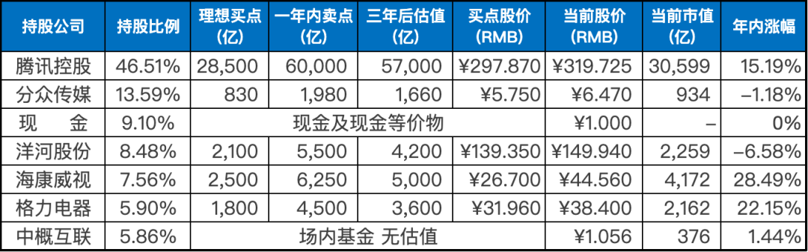
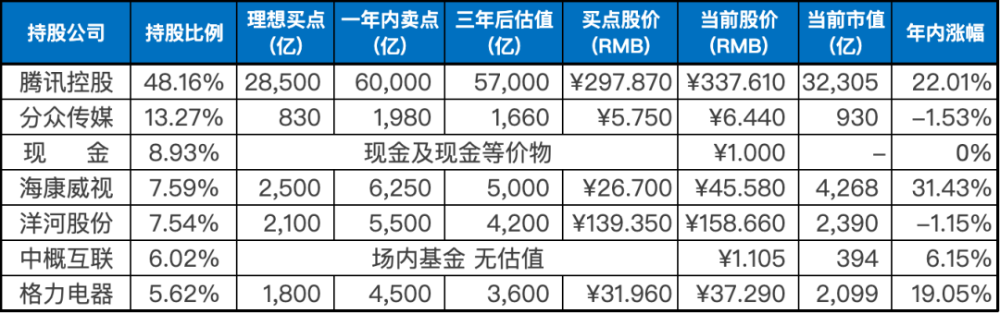

__微信公众号文章地址：[老罗实盘周记-20230415](https://mp.weixin.qq.com/s/kXwIkf8XmH0PqBdlNaLKCQ)__

```
老罗实盘周记，每周六更新。专注于股权投资、阅读、学习与个人成长，知行合一、日拱一卒、投资人生。微信公众号【老罗投资】，文章均首发于公众号。
```

### 1. 本周交易

+ 周四(4.13)新进少量资金买入洋河股份，买入价格为150元人民币。如果跌到140元，则会继续买入。

### 2. 目前持仓

目前持仓：腾讯控股46.51%，分众传媒13.59%，现金9.10%，洋河股份8.48%，海康微视7.56%，格力电器5.90%，中概互联5.86%。

其他还有少量万科A(000002)、恒瑞医药(600276)、宋城演义(300144)、京沪高铁(601816)，份额较少，作为观察仓不记录。

**注：港股已换算为人民币**



### 3. 上周数据



### 4. 持仓收益

本周：上证指数 +0.32%，深证成指 -1.40%，沪深300指数 -0.76%，中证500指数 -0.52%，恒生指数 +0.53%，恒生科技 -1.74%，老罗的持仓 <span class="green">-3.59%</span>。

截止到今日，老罗实盘今年收益率为 <span class="red">+7.92%</span>，沪深300指数今年收益率为 <span class="red">+5.69%</span>，优势越来越小了。

### 5. 重要事项

#### 5.1 海康威视发布2022年年报

海康威视今天发布了2022年度财报，营收达到831.66亿元，较上年同期增长2.14%。但归属于上市公司股东的净利润下降了23.59%，仅为128.37亿元。

此外，公司在研发方面持续加大投入，2022年研发投入达到98.14亿元，占销售额比例为11.8%，同比增长18.94%，这也是净利润下降的一个重要原因。可以预见在未来，海康将继续加大研发投入，推动技术创新和产品升级，提升自身核心竞争力。

2022年，海康威视的创新业务营收为150.70亿元，占总营收的18.12%，继续保持快速发展。

其中，智能家居业务营收为40.77亿元，机器人业务营收为39.16亿元。这些创新业务在公司业务中的份额正在逐渐增加，成为公司未来增长的重要动力。

值得一提的是，海康威视今年还宣布了新战略，将加快布局数字化转型和智能制造，加强创新驱动，致力于成为全球领先的智能安防解决方案提供商。

海康威视的年报非常坦诚，列出了10条风险因素（去年列了13条），包括地缘政治环境风险、全球经济下行风险、供应链风险、技术更新换代风险、法律合规风险、汇率波动风险、客户支付能力下降导致的资金风险、内部管理风险、网络安全风险和知识产权风险。这与去年基本上一致，卡脖子、制裁的风险仍然存在。

此外，海康威视还发布了2023年一季度财报。具体数据表现上，海康威视2023年一季度报显示，公司营收为162.01亿元，相较于去年同期下降1.94%。相对于2022年四季度的营收下降趋势，已经明显收敛。

海康威视经过董事会审议通过的利润分配预案为：以公司目前总股本 9,363,932,789 股为基数，向全体股东每 10 股派发现金红利 7.00 元（含税），不送红股，也不以资本公积转增股本。

老罗认为海康威视最困难的时候已经过去了，去年十一月27元左右的价格就是在送钱，可惜当时好机会太多，老罗囊中羞涩，没法大笔买买买，这也是大多数投资者最痛苦的事了。

这几个月海康涨得较多，现在并不便宜，老罗暂时也没有新的买入计划。

#### 5.2 腾讯最大股东继续减持

本周，南非大股东Prosus宣布将其持有的超过350亿港币的9600万股腾讯股份转移到香港中央结算系统以方便出售，以资助其自身的股份回购计划。腾讯当日股价(2023年4月12日)因此大跌5.15%。

老罗认为市场对这个消息的反应有些过度。首先，南非大股东的减持已经不是新鲜事，去年以来已经持续减持。其次，这9600万股仅相当于腾讯已发行股份数的1%左右，与其单日市值蒸发幅度高达5.15%的差距有些大。

减持这些股份之后，南非大股东仍将持有腾讯的25.90%股份，依然是腾讯的最大股东。南非大股东Prosus的投资组合中，腾讯的持股价值仍占近八成，因此他们需要谨慎处理股份，以避免导致腾讯股价大幅下跌。

Prosus和小股东的利益是一致的，他们不会通过大幅减持来压制腾讯的股价，以避免对自己的投资造成损失。

这次南非大股东Prosus的减持对腾讯的股价确实造成了一定的影响，但与此同时，南向资金在腾讯的持股也在加码，这一点也表明市场对腾讯的长期前景仍然持乐观态度。

### 6. 本周读书

#### 6.1 《实践论》

马克思主义者认为人类的生产活动是最基本的实践活动，是决定其他一切活动的东西。人的认识，主要得依赖于特质的生产活动，逐渐地了解自然的现象、自然的性质、自然的规律性、人和自然的关系。

教员不愧为教员，思想认识既深邃又简单易懂。

老罗五星⭐️⭐️⭐️⭐️⭐️推荐，值得反复研读。

#### 6.2 《温故一九四二》

这本书分为两部分，前半部分是小说原著，后半部分是电影《一九四二》剧本。看完就一个感觉，那时的老百姓苦，太苦了。引用书中一段：

> “姥姥你还记得1942年吗？”

> “那是哪一年？”

> “那年大旱饿死了好多人。”

> “不记得，饿死人的年头可多了！”

时代的每一粒尘土，落在每个人的头上，就是一座大山。

老罗四星⭐️⭐️⭐️⭐️推荐，值得一读。

#### 6.3 《朝花夕拾》

鲁迅的文章用的是成人视角，赤子之心。成年后回首少年事，写出了那种时间差异出来的质感。

一百年前的文章，正是文言文正在向白话文转变的时期，有几篇阅读起来还是有一定的门槛。

老罗四星⭐️⭐️⭐️⭐️推荐，值得一读。

### 7. 本周运动

本周徒步五公里一次，下周恢复运动。

祝大家周末愉快！

```
老罗实盘周记，每周六更新。专注于股权投资、阅读、学习与个人成长，知行合一、日拱一卒、投资人生。微信公众号【老罗投资】，文章均首发于公众号。
免责声明：本公众号只作为本人的投资日志记录，本文中提及的个股都有腰斩或血本无归的风险，本人不做任何投资建议，投资请坚持独立思考。
```

__微信公众号文章地址：[老罗实盘周记-20230415](https://mp.weixin.qq.com/s/kXwIkf8XmH0PqBdlNaLKCQ)__