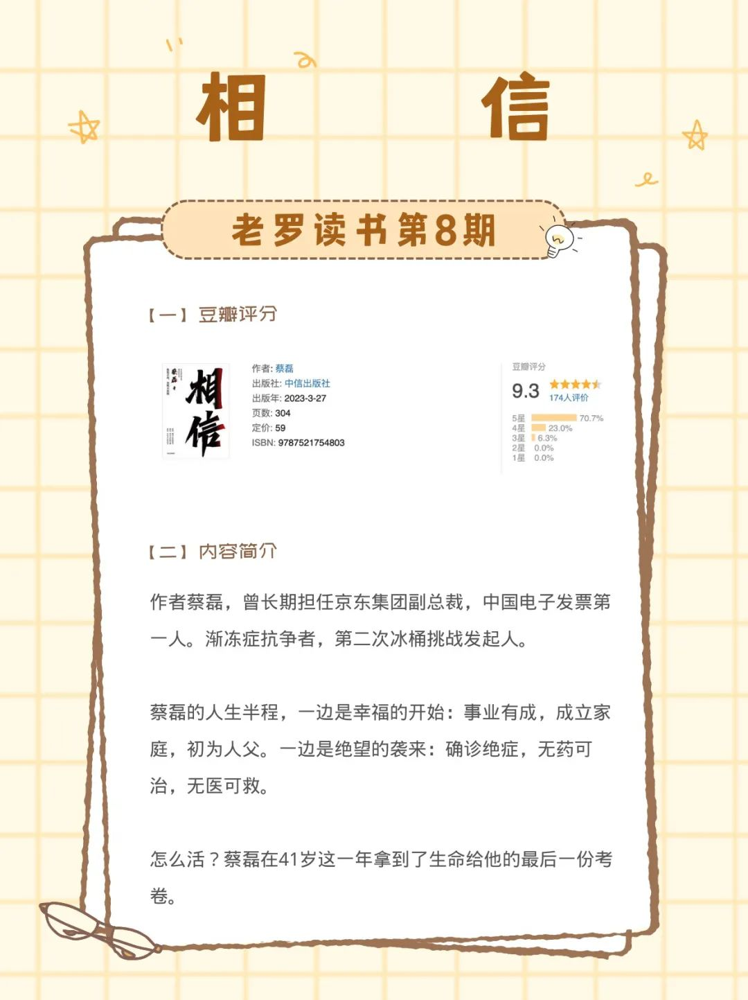
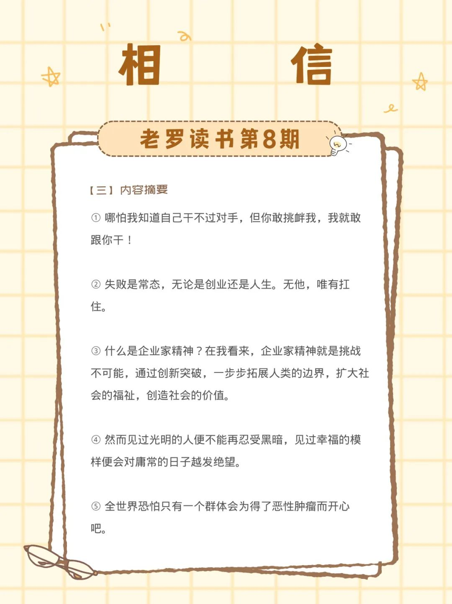
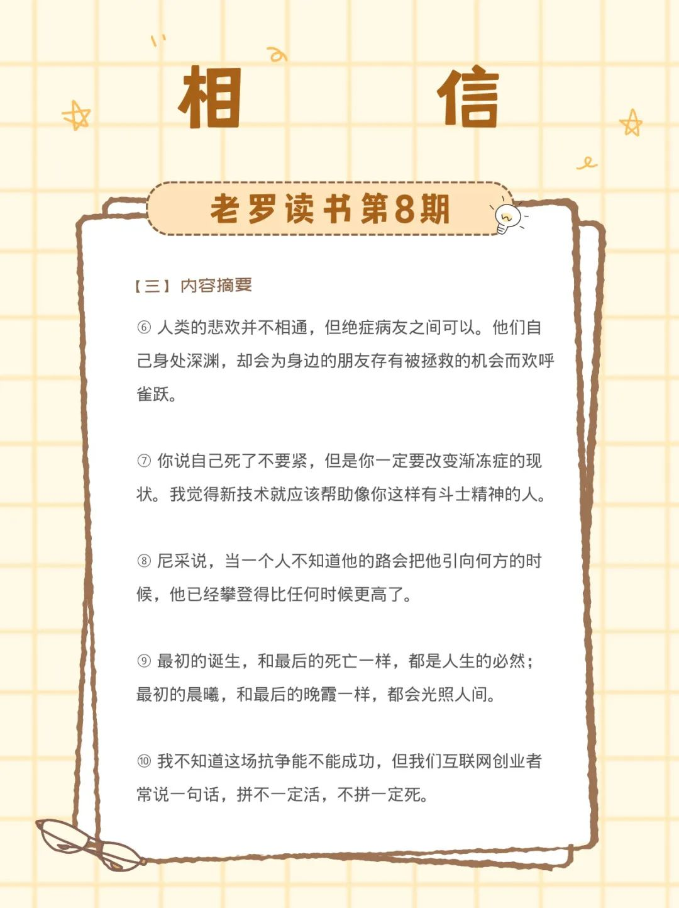
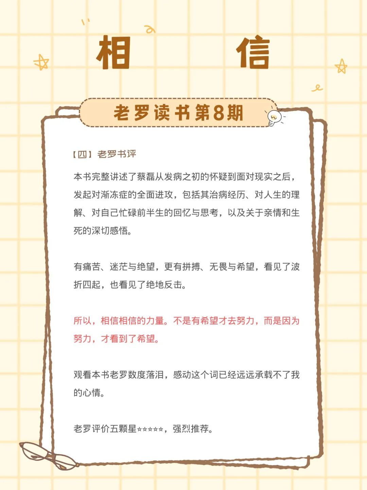

__微信公众号文章地址：[老罗读书第8期-相信](https://mp.weixin.qq.com/s/MGzsXNCS7Xgv-fHZXt7JgA)__

### 1. 豆瓣评分&作者简介

#### 1.1 豆瓣评分

+ 9.3 分

#### 1.2 作者简介

作者蔡磊，曾长期担任京东集团副总裁，中国电子发票第一人。渐冻症抗争者，第二次冰桶挑战发起人。

蔡磊的人生半程，一边是幸福的开始：事业有成，成立家庭，初为人父。一边是绝望的袭来：确诊绝症，无药可治，无医可救。

怎么活？蔡磊在41岁这一年拿到了生命给他的最后一份考卷。

### 2. 内容摘要

① 哪怕我知道自己干不过对手，但你敢挑衅我，我就敢跟你干！

② 失败是常态，无论是创业还是人生。无他，唯有扛住。

③ 什么是企业家精神？在我看来，企业家精神就是挑战不可能，通过创新突破，一步步拓展人类的边界，扩大社会的福祉，创造社会的价值。

④ 然而见过光明的人便不能再忍受黑暗，见过幸福的模样便会对庸常的日子越发绝望。

⑤ 全世界恐怕只有一个群体会为得了恶性肿瘤而开心吧。

⑥ 人类的悲欢并不相通，但绝症病友之间可以。他们自己身处深渊，却会为身边的朋友存有被拯救的机会而欢呼雀跃。

⑦ 你说自己死了不要紧，但是你一定要改变渐冻症的现状。我觉得新技术就应该帮助像你这样有斗士精神的人。

⑧ 尼采说，当一个人不知道他的路会把他引向何方的时候，他已经攀登得比任何时候更高了。

⑨ 最初的诞生，和最后的死亡一样，都是人生的必然；最初的晨曦，和最后的晚霞一样，都会光照人间。

⑩ 我不知道这场抗争能不能成功，但我们互联网创业者常说一句话，拼不一定活，不拼一定死。

### 3. 老罗书评

本书完整讲述了蔡磊从发病之初的怀疑到面对现实之后，发起对渐冻症的全面进攻，包括其治病经历、对人生的理解、对自己忙碌前半生的回忆与思考，以及关于亲情和生死的深切感悟。

有痛苦、迷茫与绝望，更有拼搏、无畏与希望，看见了波折四起，也看见了绝地反击。

所以，相信相信的力量。不是有希望才去努力，而是因为努力，才看到了希望。

观看本书老罗数度落泪，感动这个词已经远远承载不了我的心情。老罗评价五颗星⭐️⭐️⭐️⭐️⭐️，强烈推荐。

__微信公众号文章地址：[老罗读书第8期-相信](https://mp.weixin.qq.com/s/MGzsXNCS7Xgv-fHZXt7JgA)__