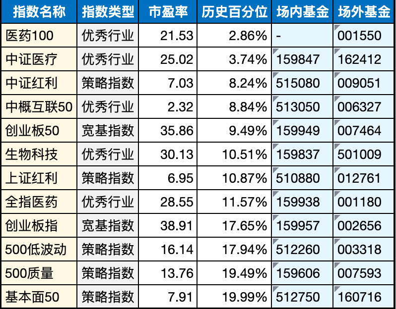

__微信公众号文章地址：[老罗基金估值-20230417](https://mp.weixin.qq.com/s/JYff2z5MVUhua7eYIWnFBQ)__

```
老罗基金估值，每周一更新。专注于股权投资、阅读、学习与个人成长，知行合一、日拱一卒、投资人生。微信公众号【老罗投资】，文章均首发于公众号。
```

### 1. 引子

最近我的朋友们经常问我关于基金投资相关的问题。

虽然我对基金的研究不是很多，但想起股神巴菲特曾经建议，普通投资者最好选择购买宽基指数基金，买指数基金就是买国运。

宽基指数基金相对比较稳健，而且基金净值估值也相对容易获得。

因此，我决定建立一个基金估值合集，每周一更新，并记录下我的每周定投。

### 2. 本周交易

+ 汇添富中证生物科技主题指数(LOF)A，定投500元。
+ 华宝中证医疗ETF联接(LOF)A，定投500元。
+ 天宏中证医药100指数A，定投500元。

### 3. 基金估值



```
老罗基金估值，每周一更新。专注于股权投资、阅读、学习与个人成长，知行合一、日拱一卒、投资人生。微信公众号【老罗投资】，文章均首发于公众号。
免责声明：本文中提及的基金都有较大波动风险，投资需谨慎。
```

__微信公众号文章地址：[老罗基金估值-20230417](https://mp.weixin.qq.com/s/JYff2z5MVUhua7eYIWnFBQ)__