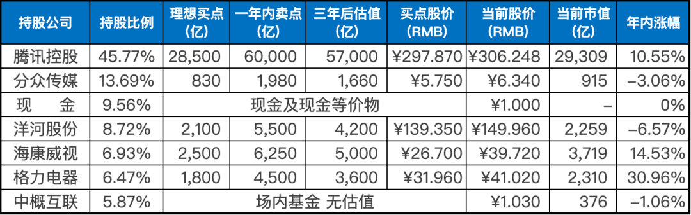

__微信公众号文章地址：[老罗实盘周记-20230422](https://mp.weixin.qq.com/s/ogdeTbF9t5BEsSBtk9uzww)__

```
老罗实盘周记，每周六更新。专注于股权投资、阅读、学习与个人成长，知行合一、日拱一卒、投资人生。微信公众号【老罗投资】，文章均首发于公众号。
```

### 1. 本周交易

无

### 2. 目前持仓

目前持仓：腾讯控股45.77%，分众传媒13.69%，现金9.56%，洋河股份8.72%，海康微视6.93%，格力电器6.47%，中概互联5.87%。

其他还有少量万科A(000002)、恒瑞医药(600276)、宋城演义(300144)、京沪高铁(601816)，份额较少，作为观察仓不记录。

**注：港股已换算为人民币**



### 3. 上周数据


### 4. 持仓收益

本周：上证指数 -1.11%，深证成指 -2.96%，沪深300指数 -1.45%，中证500指数 -2.81%，恒生指数 -1.78%，恒生科技 -4.66%，老罗的持仓 <span class="green">-3.30%</span>。

截止到今日，老罗实盘今年收益率为 <span class="red">+4.62%</span>，沪深300指数今年收益率为 <span class="red">+4.16%</span>，略胜沪深300指数。

### 5. 重要事项

#### 5.1 腾讯暂停股票回购

由于腾讯将于5月17日发布2023年一季度报告，回购计划已于4月13日停止，预计在一季度报告发布后恢复下一轮回购计划。

附上港交所股票回购规则：

(1) 回购价格不能高于过去5个交易日均价的5%，这是港交所为了防止发行人(公司)与二级市场交易者(散户)争夺利润，更多争夺底价的机制。当股价持续上涨供不应求时，不允许发行人加入其中二级市场与买家竞争。当供需平衡(股价稳定)且供大于求(股价下跌)时，只能涉及发行人作为新买者的回购。

(2) 董事会会议召开之日前一个月内、财报发布之日前一个月内不得回购，避免内幕交易。待财报发布后，回购可继续进行。

(3) 每次具体的回购，未来30日内不得发行新股融资和公告新股计划。

(4) 在回购港股后的下一个交易日之前，上市公司必须披露前一个交易日回购股份的价格和数量。

#### 5.2 恒瑞医药发布2022年财报与2023年一季报

昨晚恒瑞医药2022年业绩报告发布，营业收入为212.75亿元，同比下降17.87%，其中创新药销售收入为81.16亿元(含税86.13亿元)；归属于母公司所有者的净利润为39.06亿元，同比下降13.77%。

同日，恒瑞医药还发布了2023年一季度报告，实现营业收入54.92亿元，同比增长0.25%；归属于上市公司股东的净利润12.39亿元，同比增长0.17%。2023年一季度研发费用增加至11.49亿元，销售费用则有所减少。

医药行业市场前景广阔，随着中国人口老龄化趋势的加剧，出现万亿市值的企业是大概率事件。不过由于该行业的企业数量众多，市场竞争整体激烈，而且行业集中度相对较低，投资者需要谨慎选择。

医药行业目前估值较为便宜，但对我来说，它是一个“能力圈”之外的行业。因此，我选择了最简单的方法，即通过定投医药行业指数基金来获得行业平均收益，这对我来说已经很满意了。

#### 5.3 下一步的买入计划

洋河股价在150元时已经加仓过一次，如果股价再跌到140元人民币以下，计划再次分批买入，上限为仓位的25%。

计划在分众传媒股价低于6元人民币时，分批买入该股，并将买入上限控制在仓位的15%以内。

如果这两家公司的股价都无法达到买入的价格，那就继续保持观望状态，不做任何操作。

### 6. 本周读书

#### 6.1 《相信》

本书完整讲述了渐冻症患者蔡磊从发病之初的怀疑到面对现实之后，发起对渐冻症的全面进攻，包括其治病经历、对人生的理解、对自己忙碌前半生的回忆与思考，以及关于亲情和生死的深切感悟。

有痛苦、迷茫与绝望，更有拼搏、无畏与希望，看见了波折四起，也看见了绝地反击。所以，相信相信的力量。不是有希望才去努力，而是因为努力，才看到了希望。

观看本书感动这个词已经远远承载不了我的心情。老罗评价五颗星⭐️⭐️⭐️⭐️⭐️，强烈推荐。

#### 6.2 《我就是你啊》

学会有效沟通，是人际交往中不可或缺的技能。

这本书以讲故事的方式来传达如何处理人际关系中的难题，很有启发性。

在沟通中，有时候别人放狠话只是因为害怕，而我们自己的想法也会引起自己的害怕或愤怒。此时，平复情绪非常重要。

具体来说，第一步是平复自己的情绪，深呼吸，控制情绪。

第二步是平复对方的情绪，不做评判，不唱反调。

第三步是试着去理解对方，而不是让对方理解自己，问问为什么。

第四步是通过复述对方的话来表明自己已经理解对方的观点。

第五步是使用表并列的词汇提出自己的观点，而非将双方观点对立。

最后一步是提出解决方案，以达成共识。

老罗评价四星半⭐️⭐️⭐️⭐️✨，非常值得一读。

#### 6.3 《逃家小兔》

这本书属于亲子图书，适合和孩子一起看。

讲述的是一个小兔子心血来潮，想离家出走，一直走到找不到回家的路。

这种行为对很多家长来说并不陌生，就像我们家的孩子动不动就会闹别扭，甚至说出“我不爱妈妈了”的话。

面对孩子的这种无理挑衅，你又会怎么做呢？小兔子妈妈的做法简直是教科书一般。

老罗评价四颗星⭐️⭐️⭐️⭐️，值得一读。

### 7. 本周运动

本周工作太忙，无运动。

祝大家周末愉快！

```
老罗实盘周记，每周六更新。专注于股权投资、阅读、学习与个人成长，知行合一、日拱一卒、投资人生。微信公众号【老罗投资】，文章均首发于公众号。
免责声明：本公众号只作为本人的投资日志记录，本文中提及的个股都有腰斩或血本无归的风险，本人不做任何投资建议，投资请坚持独立思考。
```

__微信公众号文章地址：[老罗实盘周记-20230422](https://mp.weixin.qq.com/s/ogdeTbF9t5BEsSBtk9uzww)__