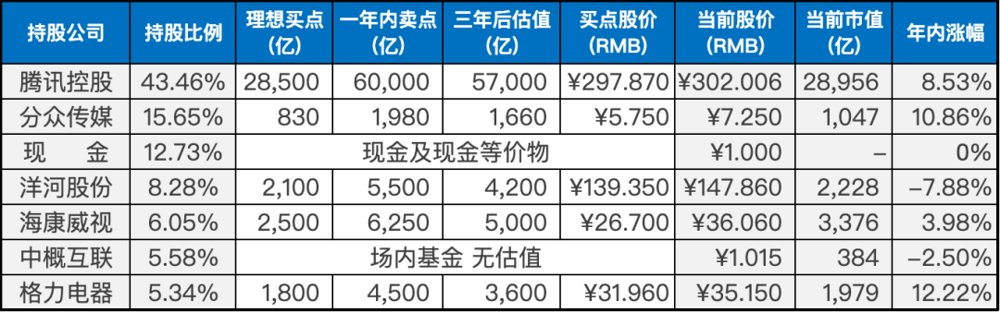

__微信公众号文章地址：[老罗实盘周记-20230506](https://mp.weixin.qq.com/s/USqRDIlT3X2zSyzCtibvaw)__

```
老罗实盘周记，每周六更新。专注于股权投资、阅读、学习与个人成长，知行合一、日拱一卒、投资人生。微信公众号【老罗投资】，文章均首发于公众号。
```

### 1. 本周交易

+ 新入的资金在周五买入银华日利货币基金(511880)，买入价格为100.717人民币。

### 2. 目前持仓

目前持仓：腾讯控股43.46%，分众传媒15.65%，现金12.73%，洋河股份8.28%，海康微视6.05%，中概互联5.58%，格力电器5.34%。

其他还有少量万科A(000002)、恒瑞医药(600276)、宋城演义(300144)、京沪高铁(601816)，份额较少，作为观察仓不记录。

**注：港股已换算为人民币**



### 3. 上周数据


### 4. 持仓收益

本周：上证指数 +0.34%，深证成指 -1.39%，沪深300指数 -0.30%，中证500指数 -0.65%，恒生指数 +0.78%，恒生科技 -0.15%，老罗的持仓 <span class="red">+0.57%</span>。

截止到今日，老罗实盘今年收益率为 <span class="red">+4.32%</span>，沪深300指数今年收益率为 <span class="red">+3.75%</span>，小胜沪深300指数。

### 5. 重要事项

#### 5.1 伯克希尔股东大会

今晚一年一度的全球投资者的朝圣之旅：2023年伯克希尔哈撒韦股东大会召开！93岁的巴菲特和99岁的芒格会碰撞出什么样的智慧火花？

伯克希尔哈撒韦2023年Q1营收853.93亿美元，去年同期为708.1亿美元，净利润为355亿美元，去年同期为54.6亿美元，大幅增长。

Q1投资和衍生品收益为347.58亿美元，去年同期亏损19.78亿美元。Q1回购A类和B类股大约花费了44亿美元。

截止到3月31日，约77%的股权投资集中在苹果、美国银行、美国运通、雪佛龙和可口可乐等公司。


#### 5.2 美联储加息25个基点

美国联邦储备委员会近日宣布连续第十次加息，将联邦基金利率目标区间上调25个基点至5%至5.25%。

今年第一季度，美国经济活动温和增长，就业增长强劲，失业率低位，但通胀率依然较高，家庭和企业的信贷条件收紧或对经济活动、就业和通胀造成压力，相关影响程度不确定。

美联储仍然高度关注通胀风险，主席鲍威尔在例会后的记者会上表示，稳定物价是美联储的责任，“要实现通胀率降至2%的目标，还有很长的路要走”。

也就是说未来可能还会有一到两次的加息？

#### 5.3 四月份PMI

4号公布的4月份中国制造业采购经理指数（PMI）为49.5，比3月下降了0.5个百分点，也是自2月以来首次下降至收缩区间。

这一趋势与国家统计局公布的制造业PMI一致，统计局最近公布的4月制造业PMI为49.2，比前值下降了2.7个百分点，也是自2023年以来首次低于荣枯线。

PMI低于50%，说明经济还未完全企稳，整体还比较脆弱，经济全面复苏依然任重道远。

#### 5.4 五一国内游创记录

文化和旅游部公布了2023年五一假期期间的文化和旅游市场情况。根据文化和旅游部数据中心的测算，全国共有2.74亿人次进行国内旅游，同比增长70.83%，按可比口径恢复至2019年同期的119.09%。

实现国内旅游收入1480.56亿元，同比增长128.90%，按可比口径恢复至2019年同期的100.66%。

今年的五一假期是近三年出游需求的集中释放，相信旅游行业会越来越景气。老罗看了下观察仓宋城演义，涨幅只有2.7%，和五一出行的火爆完全不匹配呀。

### 6. 本周读书

#### 6.1 《认知觉醒》

这本书是一本关于个人成长和认知科学的方法论，通过探索大脑构造、潜意识和元认知等思维规律，帮助人们了解自己并指导自己，从而获得长久而清晰的内在动力。

通过深度学习、关联和反馈等事物规律，可以帮助人们洞悉如何真正成事。

本书还回答了一些重要问题，比如如何彻底告别用“三分钟热情”和“打鸡血”的方式做事、如何保持极度专注，如何消除焦虑，如何提高学习能力等等。

书中的一个主要观点是，一个人真正的耐心不是苦哈哈地靠毅力支撑，而是需要具有长远目光。只有了解大脑规律，并知晓诸如复利效应、舒适区边缘、学习权重比、学习平台期、等等规律，才能大幅提升我们的耐心水平。

老罗评分四颗星⭐️⭐️⭐️⭐️，值得一读。

#### 6.2 《活在此时此刻》

这本回忆录以禅师的一生为主线，讲述了他在修行道路上的种种经历和体悟。通过讲述禅师的人生经历，这本书向我们传递了一种深刻的生命智慧，使我们能够更好地应对工作中的压力和内心的迷茫。

禅师所倡导的全神贯注和活在此时此刻的理念，是一种具有深远意义的修行方法。他认为，只有真正地活在当下，才能真正地体悟到生命的意义和价值。通过这种修行，我们可以逐渐放下内心的焦虑和迷茫，获得内在的平静和丰盛。

对于那些感到工作繁重、内心迷茫的人来说，这本书将是一份宝贵的礼物。它能够帮助我们更好地理解自己，认清内心的迷惘和焦虑，并通过禅修的方法获得内在的平静和安宁。

老罗评分四颗星⭐️⭐️⭐️⭐️，值得一读。

#### 6.3 《铸剑》

这本绘本是鲁迅先生的小说《铸剑》的改编。故事以“复仇”为主线，讲述了干将莫邪铸剑，惹怒君王，最终被处死。而干将莫邪之子长大后替父报仇，但未成功。

后来遇到了一神秘黑衣人，黑衣人以眉间尺的头颅为诱饵，割下君王头颅后自割头颅，三颗头颅在金鼎沸水中争斗，最终君王被弑，复仇得以成功。

本书用细腻的绘画将故事展现出来，通过阅读这本书，我们能深入了解鲁迅先生的文学经典。

老罗评分四颗星⭐️⭐️⭐️⭐️，值得一读。

#### 6.4 《微习惯》

自2012年末开始，作者斯蒂芬·盖斯每天至少做一个俯卧撑，这成为他第一个微习惯。

两年后，他实现了梦寐以求的健康身材，文章数量翻了4倍，读书量增加了10倍。微习惯策略的有效性远超过其他所有他尝试过的习惯策略，因此他写了这本书。

微习惯是一种非常微小的积极的行为，你需要每天强制自己去完成它。微习惯的目标是小到不可能失败，因此不会给你带来额外的负担，具有极强的欺骗性，因此是一种极具优势的养成习惯的策略。

如果你每天抽出几分钟时间，严格遵循微习惯的八个步骤，就能轻松、彻底地实现你一直梦寐以求的改变。

老罗近期也在进行实践中，设置的三个微习惯是每天学习1个英语单词，跳1个绳，看1分钟书，并配合打卡APP长期落地，看看长期效果如何。

本书老罗评分四颗星⭐️⭐️⭐️⭐️，值得一读。

#### 6.5 《雪花写作法》

这本书以寓言的形式，传授读者小说创作的“雪花写作法”，该方法包含10个步骤，利用“雪花分形”原理，不断将创作过程细化，帮助写作者更加清晰地构思小说内容。

作为小说写作指导书，本书将教授如何顺利地将心中故事转化为文字，并将其分解为简单易懂的步骤。

如果对写作感兴趣，这本书可以作为不错的指导。老罗评分三颗星⭐️⭐️⭐️，可以一读。

### 7. 本周运动

本周跳绳7次，徒步快走2次。上周体重创历史最高纪录，得管住嘴，迈开腿了。

祝大家周末愉快！

```
老罗实盘周记，每周六更新。专注于股权投资、阅读、学习与个人成长，知行合一、日拱一卒、投资人生。微信公众号【老罗投资】，文章均首发于公众号。
免责声明：本公众号只作为本人的投资日志记录，本文中提及的个股都有腰斩或血本无归的风险，本人不做任何投资建议，投资请坚持独立思考。
```

__微信公众号文章地址：[老罗实盘周记-20230506](https://mp.weixin.qq.com/s/USqRDIlT3X2zSyzCtibvaw)__