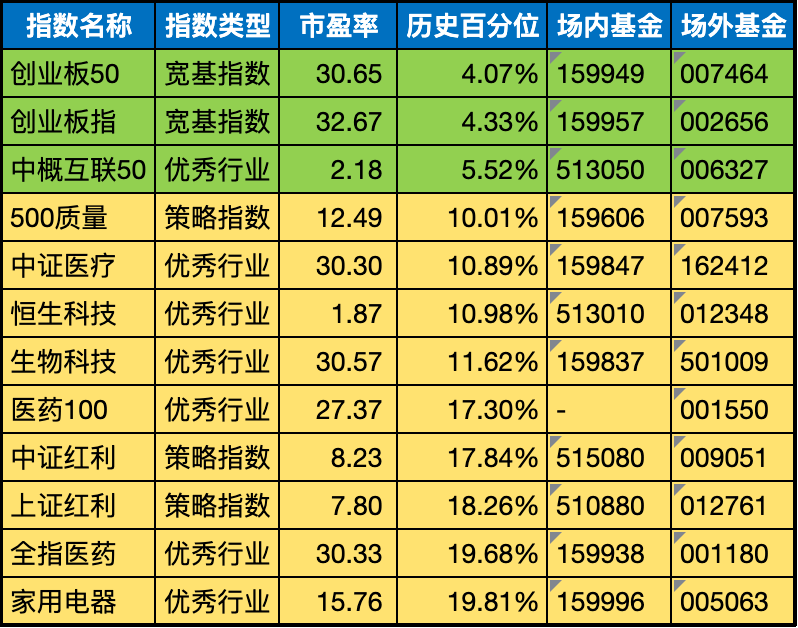

__微信公众号文章地址：[老罗基金估值-20230508](https://mp.weixin.qq.com/s/NneWWV5zOK935tMvn0AWKA)__

```
老罗基金估值，每周一更新。专注于股权投资、阅读、学习与个人成长，知行合一、日拱一卒、投资人生。微信公众号【老罗投资】，文章均首发于公众号。
```

### 1. 本周定投

+ (162412) 华宝中证医疗ETF联接(LOF)A，固定金额定投500元。
+ (501009) 汇添富中证生物科技主题指数(LOF)A，固定金额定投500元。

### 2. 基金估值

**下表为低估值指数基金(当前估值便宜适合定投)**



<p class="smile_curve_notice">
    提醒：指数基金定投，一定是3-5年不会使用的闲钱，长期坚持定投，才有可能获得较好收益。
</p>

### 3. 名词说明

+ 市盈率：市盈率（Price Earnings Ratio，简称P/E或PER），也称“本益比”、“股价收益比率”或“市价盈利比率（简称市盈率）”。市盈率是指股票价格除以每股收益(每股收益,EPS)的比率。简单说就是你全资收购这家公司，公司每年产生的利润，多少年可以回本。
+ 历史百分位：所谓历史百分位，就是把指数历史上最低估值和最高估值从0到100排序，看现在的估值在什么位置，位置低说明未来上升空间大，目前指数被低估。
+ 场内基金：场内基金就是指在交易所内进行买卖的基金。
+ 场外基金：而场外基金的申购赎回渠道就较多了，可以在银行、券商也可以在第三方理财平台。比如：支付宝、微信。

### 4. 关于基金估值合集

朋友们常问我有关于基金投资的问题，虽然我对基金的研究不算深入，但我记得股神巴菲特曾经建议普通投资者最好选择购买宽基指数基金。

买指数基金就相当于买国家的经济前景，就是买国运。

宽基指数基金相对比较稳健，而且基金净值数据也相对容易获取。因此，我决定建立一个基金估值合集，每周一更新，并记录我的每周定投情况。

```
老罗基金估值，每周一更新。专注于股权投资、阅读、学习与个人成长，知行合一、日拱一卒、投资人生。微信公众号【老罗投资】，文章均首发于公众号。
免责声明：本文中提及的基金都有较大波动风险，投资需谨慎。
```

__微信公众号文章地址：[老罗基金估值-20230508](https://mp.weixin.qq.com/s/NneWWV5zOK935tMvn0AWKA)__