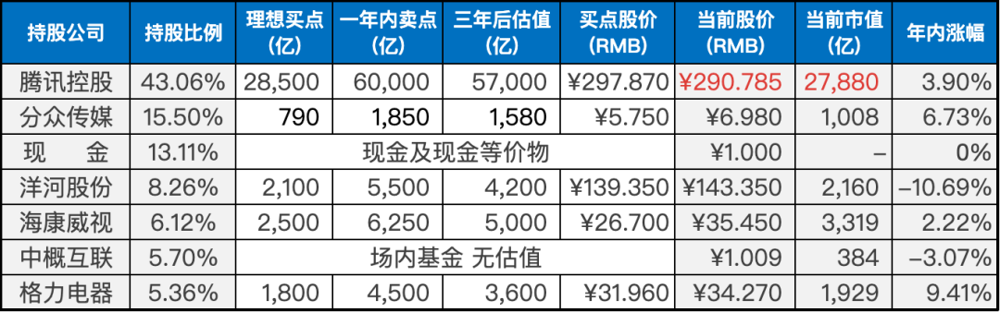
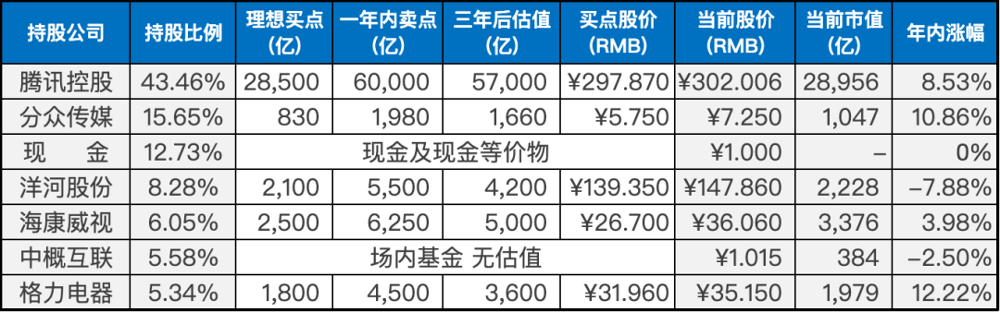
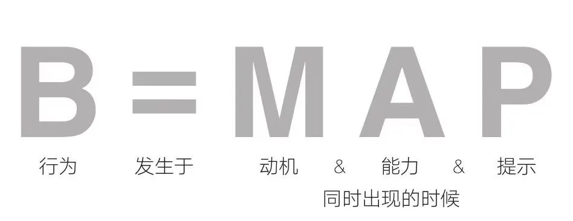

__微信公众号文章地址：[老罗实盘周记-20230513](https://mp.weixin.qq.com/s/4sl9IlW9DEBnbcY31HzRCw)__

```
老罗实盘周记，每周六更新。专注于股权投资、阅读、学习与个人成长，知行合一、日拱一卒、投资人生。微信公众号【老罗投资】，文章均首发于公众号。
```

### 1. 本周交易

+ 无

### 2. 目前持仓

目前持仓：腾讯控股43.06%，分众传媒15.50%，现金13.11%，洋河股份8.26%，海康微视6.12%，中概互联5.70%，格力电器5.36%。

其他还有少量万科A(000002)、恒瑞医药(600276)、宋城演义(300144)、京沪高铁(601816)，份额较少，作为观察仓不记录。

本周腾讯又到达买点股价，但当前持股比例过高，现在的价格并没有买入的计划，如果股价能跌到250人民币以下，可能会再少量买入。但感觉上可能性不太大，下周腾讯发布一季报后，腾讯大概率会恢复回购，一回购就......

**注：港股已换算为人民币**



### 3. 上周数据



### 4. 持仓收益

本周：上证指数 -1.86%，深证成指 -1.57%，沪深300指数 -1.97%，中证500指数 -1.76%，恒生指数 -2.11%，恒生科技 -0.55%，老罗的持仓 <span class="green">-3.31%</span>。

截止到今日，老罗实盘今年收益率为 <span class="red">+1.01%</span>，沪深300指数今年收益率为 <span class="red">+1.71%</span>，今年第三次跑输沪深300指数。

### 5. 重要事项

#### 5.1 伯克希尔股东大会摘要

关于伯克希尔股东大会的核心摘要，老罗摘录了一些自己印象比较深刻的内容：

1. 巴菲特：喜诗糖果虽然有101年的历史，但其魔力也不是无限的

> 每次伯克希尔股东大会都会被巴菲特提及的喜诗糖果，让巴菲特从烟蒂股投资进化到以合理价格买入优秀的企业。

> 喜诗糖果虽然有101年历史，但还是不能像可口可乐一样，做到全世界人民都喜欢。

2. 芒格：电影行业经营难题比较多

> 电影行业投资比较困难，属于芒格能力圈之外的行业，像我等这样的投资者，更应该远离电影行业。

3. 巴菲特高度肯定苹果公司，其在伯克希尔持仓占比已超过了能源业务

> 伯克希尔的第一大持仓公司，表现依然十分优秀，巴菲特更是赞不绝口。

4. 巴菲特：马斯克高估了自己，可他是天才

> 巴菲特：马斯克他真的很聪明，我想他的智商可能会超过170，但我不喜欢和他在一起。

5. 芒格：电动汽车即将大获成功，但我并不喜欢

> 电动汽车行业属于市场规模巨大，但同时投入巨大的行业，最终胜出的只会有少数几个企业，其他的只能成为历史的过客。

> 与电影行业一样，属于七尺跨栏，普通投资人还是尽量远离。

6. 芒格对人工智能持怀疑态度

> 人工智能对普通人的影响越来越大，特别是chatGPT的发布，对世界的影响是深远的。但芒格还是觉得用人可能更好，因为人工智能并不能取代很多领域的人才。

> 谁知道呢，这世界变化实在是太快了，也许几十年后，人类就不需要工作了，全部由AI与机器人生产、劳动。阿西莫夫的《银河帝国》中也有类似的描写，在机器人的帮助下，人类征服了全银河系。

7. 巴菲特：赚取超额收益的机会在降低，但总会有新技术创造新机会

> 赚取超额收益的机会在相对降低，但新技术、创新中依然存在机会。

8. 硅谷银行事件引发的蝴蝶效应会扰乱世界金融体系

> 每次金融危机，好像都离不开金融界的贪婪、无知。

9. 巴菲特：美联储解决不了财政问题

> 无限QE，贻害无穷，巴神对美联储也是看不下去了。

10. 伯克希尔的历史上没有一次情绪化投资决定

> 巴菲特：虽然在生活中谁都不想成为一个没有感情的人，但肯定想在做投资或商业决定时成为一个没有感情的人。

> 投资一定要避免情绪化，最好的方法就是将买入、卖出计划提前写下来，包括思考的过程，越详细越好。

11. 巴菲特：投资的秘诀是洞悉消费者的行为

> 好的企业，消费者是离不开的，并且能轻易影响消费者心智。如：苹果、茅台、腾讯。

> 投资者需要做的，就是找到这种企业，在出现合理价格的时候，下重注。

12. 巴菲特重申，格雷格·阿贝尔将接班

> 巴菲特与芒格搭档的伯克希尔年会，看一届少一届，且行且珍惜。

13. 巴菲特：伯克希尔的股票回购不会停

> 股票回购将同时对股东和公司自身的运营产生益处，如果资本足够并且股票价格很有吸引力，用回购来提升单股的内在价值，是管理层最合理的操作。

14. 巴菲特：给自己写讣告，并逆向行动，人生的路就清晰了

> 如果你想了解如何度过这一生，可以试着写下自己的讣告，然后从逆向的角度思考如何实现它。

> 讣告中可能会提到家人、事业、朋友、兴趣爱好等等方面，通过对这些方面的反思，可以更好地确定人生目标和价值观，并采取相应的行动。

> 同时也可以利用反向思考的方式，设想未来可能会遇到的困难和挑战，提前制订计划和应对措施。

> 这样的练习可以帮助我们更加理性、清晰地思考人生，为我们的未来提供更好的指导和方向。

15. 查理·芒格分享成功的秘诀：活到老学到老，并学会感恩

> 成功很简单，比如花钱要量入为出，花的钱要比赚的钱少；避免接近有负能量的人和活动；要活到老学到老，要学会感恩。

> 如果你能做到这一切，那你一定会成功。如果做不到，成功就需要更多的运气，当然，你一定不要把自己的命运都押宝在运气赌注上。

16. 巴菲特：我时常关注《聪明的投资者》在亚马逊的排名

> 一本经历了70多年也不过时的经典著作，它一直在亚马逊畅销榜上排在差不多第300名或第350名的位置，哪里再找一本书在其领域里具有这样持续的地位？投资者必看！

### 6. 本周读书

#### 6.1 《打开心智》

心智是人类独特的认知能力，它不仅决定了我们对外界的理解和思考方式，也影响了我们的情绪、行为和生活方式。

随着社会和科技的不断发展，我们需要不断更新自己的心智模式，以适应新的环境和挑战。

这需要我们不断地学习和反思，探索自己的认知偏差和盲区，以便更好地发挥我们的潜力，实现自我成长和进步。

老罗评分四颗星⭐️⭐️⭐️⭐️，值得一读。

#### 6.2 《福格行为模型》

这本书探讨了福格行为模型，作者福格博士剖析了驱动人类所有行为的三个关键要素：情感、观念和能力，并深入解析了每个要素在推动人类行为中的重要作用。

福格行为模型相当地简单，行为(Behavior)发生于动机(Motivation)、能力(Ability)、提示(Prompt)这三点同时出现的时候。



除此之外，福格博士还提供了激发每个要素以更好地推动行为改变的有效方法。

此外，该书还介绍了两个让福格行为模型更好地发挥作用的方法：通过设计情绪来影响行为，通过打造高频率小成功让小改变自然生长。

这些方法可以帮助读者更好地理解自己的行为和思考方式，以及实现自我改变和成长。

老罗评分四星半⭐️⭐️⭐️⭐️❤️，非常值得一读。

### 7. 本周运动

本周跳绳7次，徒步快走3次。本周体重减轻2公斤，下周继续。

祝大家周末愉快！

```
老罗实盘周记，每周六更新。专注于股权投资、阅读、学习与个人成长，知行合一、日拱一卒、投资人生。微信公众号【老罗投资】，文章均首发于公众号。
免责声明：本公众号只作为本人的投资日志记录，本文中提及的个股都有腰斩或血本无归的风险，本人不做任何投资建议，投资请坚持独立思考。
```

__微信公众号文章地址：[老罗实盘周记-20230513](https://mp.weixin.qq.com/s/4sl9IlW9DEBnbcY31HzRCw)__